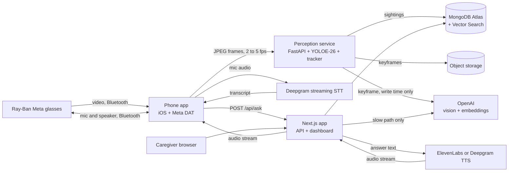

# Memory glasses (working title)

Smart glasses that remember where things are, for people living with dementia.

The wearer asks out loud, "Where are my keys?" About a second later the glasses answer, "Your keys are on the kitchen counter, next to the coffee maker. I saw them twenty minutes ago."

**Status: planning.** No code exists yet. This README is the build plan. Edit it freely. Building starts once the plan is signed off.

## The problem

Misplacing things and being unable to retrace steps is one of the Alzheimer's Association's ten early warning signs. It can happen many times a day. It's distressing, and it often turns into suspicion that someone stole the item. The caregiver ends up answering the same question again and again.

A camera that already sits on the person's face can watch where objects end up. The wearer doesn't tag anything, charge a tracker, or open an app. They ask a question out loud and get an answer.

## Goals

1. Answer "where is my X?" out loud in under one second at the median, measured from the moment the wearer stops talking.
2. Track everyday items with no tags and no setup by the wearer.
3. Give caregivers a dashboard that shows where things are, what the wearer asked, and how often.
4. Run the full demo without glasses, using a webcam and a headset, so hardware trouble can't sink the project.

Not in v1:

- Medical claims or diagnosis of any kind.
- Face recognition. It's on the stretch list and needs a consent story first.
- Turn-by-turn guidance to the item.
- Code running on the glasses. Ray-Ban Metas don't run third-party code.
- Languages other than English.

## What the Meta glasses can and can't do

This shapes the whole architecture, so it comes first.

- Ray-Ban Meta glasses don't run third-party code. Everything goes through a phone.
- Meta's Wearables Device Access Toolkit, DAT for short, is a Swift and Kotlin SDK. A phone app uses it to pull a video stream or a photo from the glasses. It's in developer preview, version 0.9 on iOS when this was written. Preview apps can't be published to the public, but they run on our own glasses, which is all a hackathon needs.
- Video tops out at 720p and 30 fps because it travels over Bluetooth. The SDK lowers both when bandwidth drops.
- Audio doesn't need the SDK. The glasses are a Bluetooth headset. Any phone or laptop paired to them can use their mics and speakers, and that includes a browser tab calling `getUserMedia`.
- The toolkit docs say nothing about hooking "Hey Meta". We need our own wake word, running on the phone.
- There's no web SDK for the camera. Meta's Web Apps target the Ray-Ban Display model and don't document camera access. A Next.js app alone can't see through the glasses, so we need a thin native app.
- The SDK ships MockDeviceKit, which fakes a pair of glasses. The phone app can be developed with no hardware.
- Access needs a Wearables Developer Center registration, the Meta AI app, developer mode on the glasses, and a supported country. Do this first. It's the one delay we can't code around.

This splits the work cleanly. Audio works with zero native code, and only video needs the iOS app. So we build and demo the whole product in a browser first, then swap in the glasses camera at the end.

| Capture path | Video from | Audio from | Used when |
|---|---|---|---|
| A. Browser simulator | laptop or phone camera | glasses over Bluetooth, or any headset | from hour one, and as the demo fallback |
| B. iOS app with DAT | glasses camera | glasses over Bluetooth | the real product |
| C. WhatsApp video call | glasses camera, via a call to a second account, screen-captured on a laptop | glasses | last resort if DAT access doesn't come through |

All three paths feed the same two endpoints, a frame WebSocket and `POST /api/ask`. Nothing downstream knows which path is live.

## Architecture



Three deployable pieces:

| Piece | Stack | Job |
|---|---|---|
| `apps/web` | Next.js App Router, TypeScript, Tailwind, shadcn/ui, MongoDB Node driver | Caregiver dashboard, REST API, the `/api/ask` voice endpoint, the browser simulator |
| `services/perception` | Python, FastAPI, Ultralytics YOLOE-26, ByteTrack, open_clip, pymongo | Takes frames, detects and tracks items, writes sightings, requests scene descriptions |
| `apps/ios` | Swift, Meta DAT, AVAudioEngine, Porcupine | Streams glasses frames, runs the wake word, streams mic audio to STT, plays the answer |

One design rule makes the latency goal reachable. **Do the expensive work when an item is seen, not when it's asked about.** The vision model call, the room classification and the embedding all happen at write time, in the background. By the time anyone asks, the answer is one indexed read away and the text is nearly written.

## What happens when the wearer asks a question

1. The wake word fires on the phone. The app plays a soft chime from a local file and opens the mic stream to Deepgram.
2. Deepgram streams interim transcripts and then a final one when the wearer stops talking.
3. The phone posts the final transcript to `/api/ask`.
4. The intent router tries the fast path. It matches "where" style phrasing and looks the item up in an in-memory alias map for that wearer.
5. Fast path hit: one `findOne` on `items` returns the denormalized last sighting. A template turns it into one or two sentences. No LLM runs.
6. Fast path miss: an OpenAI chat model with tools handles it. The tools are `find_item`, `search_memories` and `list_recent_items`. The reply streams token by token.
7. Answer text goes to the TTS provider. Audio chunks stream straight through the HTTP response to the phone.
8. The phone plays chunks as they arrive, out through the glasses speakers.
9. The server logs the question, the answer and a timestamp for every stage to `interactions`.

## Latency budget

Fast path, end of speech to first audio in the wearer's ear:

| Stage | Budget | Notes |
|---|---|---|
| End of speech to final transcript | 300 ms | Deepgram endpointing. The biggest single cost and the one we tune most |
| Intent match and item resolve | 5 ms | In-memory alias map, no network |
| MongoDB read | 30 ms | One `findOne`, app and cluster in the same region |
| TTS time to first audio | 250 ms | Vendors claim 75 to 90 ms. Independent benchmarks measure about 290 to 310 ms P50 |
| Network to phone, Bluetooth to glasses | 200 ms | Bluetooth alone is 100 ms or more and we can't change it |
| **Total** | **about 800 ms** | Targets: P50 under 1 s, P95 under 1.5 s |

Slow path adds 500 to 900 ms for the LLM's first sentence. Target is first audio in under 2 s.

How we hold the budget:

- Stream every hop. Streaming STT in, streamed LLM tokens, streamed TTS audio out, chunked playback on the phone. Nothing waits for a complete result.
- Skip the LLM on the fast path. Most questions will be "where is my X", and a template answers those.
- Precompute descriptions at sighting time, as described above.
- Denormalize the latest sighting onto the item document so the hot read is a single lookup.
- Keep connections warm. Reuse the MongoDB pool, keep a TTS connection open, and ping `/api/ask` when the wake word fires so the function is hot before the transcript lands.
- Flush LLM output to TTS at the first clause boundary. Don't wait for the full reply. ElevenLabs and Deepgram both take streamed text over WebSocket.
- Ask for 16 kHz mono audio. While the mic is open, Bluetooth drops to the hands-free profile, which is 16 kHz anyway. Higher bitrates cost bytes and buy nothing.
- Put everything in one region. Atlas in `us-east-1`, the Next.js functions in `iad1`, the perception box close by.
- Play the chime the moment speech ends. It costs nothing and tells the wearer they were heard. Silence reads as failure.
- Later, speculate on interim transcripts. Once an interim result contains a known item, start the lookup before the wearer finishes the sentence.
- Measure before tuning. Every interaction records per-stage timings, and `pnpm bench:tts` races the two TTS providers from the network we'll demo on.

One tension to watch. Short endpointing makes answers fast, but people with dementia often pause mid-sentence. Cut them off and the product fails at its one job. Start at 400 ms of silence and tune it with real speech, per wearer if needed.

## Text to speech: ElevenLabs or Deepgram

| | ElevenLabs Flash v2.5 | Deepgram Aura-2 |
|---|---|---|
| Vendor latency claim | about 75 ms model inference | about 90 ms to first byte, optimized |
| Independent P50 to first audio | about 288 ms | about 313 ms |
| Voice quality | warmer, more natural, large voice library, cloning | clear and a bit businesslike |
| Cost | higher | lower |
| Same vendor as our STT | no | yes |

A 25 ms gap is smaller than the jitter on conference Wi-Fi, so latency doesn't settle this. Voice does. An older listener who is already anxious should hear a warm, unhurried voice, and ElevenLabs is better at that.

We default to ElevenLabs Flash v2.5. Put both behind one `TTSProvider` interface with a `TTS_PROVIDER` env switch. Run the benchmark script on day one and flip the default if the numbers disagree with the table.

Speech to text is Deepgram streaming, Nova-3 or Flux. Flux has model-based end-of-turn detection, which may handle mid-sentence pauses better than a silence timer. Test both.

The fallback if the three-vendor chain gets flaky is OpenAI's Realtime API. `gpt-realtime-2` does STT, reasoning, tool calls and speech over one socket. We don't start there because the fast path needs no LLM at all, and because the voice choice matters.

## Perception pipeline

### Model

Stock YOLO trained on COCO knows 80 classes. It has phone, remote, cup, bottle, book and handbag. It has no keys, wallet, glasses, pill bottle, hearing aid or cane, which are the things people with dementia lose. So stock weights won't do.

We use **YOLOE-26**, the open-vocabulary YOLO in Ultralytics. You give it class names as text and it detects them with no retraining. After `set_classes` runs, the text embeddings fold into the detection head, so inference speed matches a normal YOLO.

Default prompt list, editable per wearer from the dashboard:

- Tracked items: keys, wallet, phone, eyeglasses, glasses case, TV remote, pill bottle, pill organizer, hearing aid, cane, purse, mug, water bottle, watch, charger.
- Context objects, used to describe location: couch, table, counter, bed, sink, TV, chair, door, refrigerator, microwave, nightstand, desk, shelf.

YOLOE also takes visual prompts. A caregiver photographs Dad's actual keys, and the model looks for that specific object. That's how we tell "my phone" from someone else's. It lands in milestone M4.

If open-vocabulary detection is weak on small items like keys, the fallback is a fine-tune. Shoot about 200 photos, label them in Roboflow, train YOLO26s for half an hour on a GPU.

### Frame handling

- Sample 2 to 5 fps. Objects at rest don't need 30.
- Drop blurry frames before inference using Laplacian variance. Head-mounted video is full of motion blur.
- Run at image size 960 or higher. Keys at arm's length are a few dozen pixels wide at 720p.
- Start with the small model and move to medium if recall is poor. An Apple Silicon laptop handles either at our frame rate.

### From detections to sightings

Writing every detection to the database would bury it. The service turns detections into sighting events.

1. ByteTrack assigns track IDs. A track counts once it survives 3 frames within a second, which kills one-frame false positives.
2. A confirmed track opens a sighting. The service picks the sharpest, most confident frame as the keyframe and queues a description job.
3. While the track lives, `lastSeenAt` updates every 2 seconds. If a better keyframe shows up, it replaces the old one.
4. When the track has been gone for 3 seconds, the sighting closes and its snapshot gets copied onto the item document.
5. Head turns break tracks constantly. A new track with the same label, in the same room, within 30 seconds of the last one merges into the existing sighting.

### Description job

Runs in the background and never blocks the frame loop. It sends the keyframe and the item's bounding box to an OpenAI vision model and gets structured output back:

```json
{
  "room": "kitchen",
  "surface": "counter",
  "relation": "next to the coffee maker",
  "state": "resting",
  "sentence": "on the kitchen counter, next to the coffee maker"
}
```

`state` is `resting`, `held` or `in_use`. Keys seen in the wearer's moving hand aren't anywhere useful, so answers prefer the last `resting` sighting.

The sentence gets embedded with `text-embedding-3-small` and stored on the sighting. If someone asks before the job finishes, the answer falls back to the room plus the nearest context object YOLO saw, such as "near the couch in the living room".

Vision calls are capped per item per minute so a cluttered desk can't run up the bill.

### Rooms

In v1 the vision model names the room type. In M4 a caregiver enrolls rooms by walking through the house with the dashboard open. The service embeds those frames with CLIP and stores them in `room_refs`. New keyframes get classified by a vector search against that collection, top 5, majority vote. That's cheap, it needs no LLM call, and it uses the names the family uses, like "the den".

## Data model

All collections carry `patientId`. Every query filters on it.

```js
// items: one per tracked thing. The hot path reads only this.
{
  _id, patientId,
  name: "keys",
  aliases: ["car keys", "house keys", "key ring"],
  detectorPrompts: ["keys", "key ring"],
  referenceImages: ["s3://..."],
  nameEmbedding: [/* 1536 */],
  lastSighting: { sightingId, sentence, room, state, lastSeenAt, thumbUrl },
  lastRestingSighting: { /* same shape */ },
  usualSpots: [{ sentence: "on the hook by the front door", share: 0.62 }]
}

// sightings: one per continuous period an item stayed in view
{
  _id, patientId, itemId, label: "keys",
  status: "open" | "closed",
  firstSeenAt, lastSeenAt,
  confidence, bbox: [x, y, w, h], frameSize: [1280, 720],
  room: { id, name: "kitchen", confidence: 0.91 },
  surface, relation, state,
  sentence: "on the kitchen counter, next to the coffee maker",
  nearbyObjects: ["coffee maker", "mug"],
  keyframeUrl, thumbUrl,
  sentenceEmbedding: [/* 1536 */],
  source: "glasses" | "simulator"
}

// rooms and room_refs: caregiver-enrolled rooms and their CLIP reference frames
{ _id, patientId, name: "the den", private: false }
{ _id, patientId, roomId, embedding: [/* 512 */], imageUrl }

// interactions: every question, with timings
{
  _id, patientId, askedAt, transcript,
  path: "fast" | "llm", itemId, answerText,
  timingsMs: { stt, intent, db, llmFirstToken, ttsFirstByte, total }
}

// patients, caregivers, devices: accounts, settings, device tokens
```

Indexes:

| Collection | Index | Serves |
|---|---|---|
| `items` | `{ patientId: 1, name: 1 }` | fast path lookup |
| `sightings` | `{ patientId: 1, itemId: 1, lastSeenAt: -1 }` | timelines, history |
| `sightings` | vector on `sentenceEmbedding`, filters `patientId`, `itemId`, `lastSeenAt` | open-ended questions |
| `room_refs` | vector on `embedding`, filter `patientId` | room classification |
| `interactions` | `{ patientId: 1, askedAt: -1 }` | question log |
| `sightings` | TTL or a nightly job | retention, default 30 days |

### Where vector search earns its place

"Where are my keys?" doesn't need it. That's an exact lookup, and an exact lookup is faster. Vector search does the fuzzy work.

- Open-ended questions. "What did I leave in the bedroom?" or "Where did I put that thing from the pharmacy?" embed the question and search `sentenceEmbedding`, filtered to the wearer and a time window.
- Hybrid search. Combine the vector query with Atlas full-text search over `sentence` using `$rankFusion`. That stage needs MongoDB 8.1 or later. On an older cluster, reciprocal rank fusion in app code is about ten lines.
- Room classification against `room_refs`.
- Episodic memory, a stretch goal. Periodic scene captions go in a `memories` collection and answer "what did I do this morning?"

Fuzzy item names skip Atlas entirely. "The thing that opens the car" should resolve to keys, but a wearer has maybe 30 items. Embed the phrase and compare against 30 cached vectors in memory. It takes microseconds and doesn't spend a search index. The free M0 tier caps search indexes, so check the limit before adding a third.

## What the glasses say

The wording matters as much as the speed. These rules follow standard dementia communication guidance: short sentences, one idea at a time, never argue, never test.

- Two sentences at most. Location first, then when.
- Use the family's words. If the caregiver named the room "the den", say "the den".
- Round the time. "A few minutes ago", "about an hour ago", "this morning". Nobody wants to hear "47 minutes ago".
- Never mention repetition. The tenth "where are my keys" gets the same calm answer as the first.
- No quizzing and no correcting. Never "do you remember?", never "you already asked".
- When the sighting is old, say so and offer the usual spot.
- When nothing's been seen, say that plainly and offer the usual spot.
- Speak slower than the default rate. The rate is a per-wearer setting.

```text
fresh   Your {item} {is/are} {sentence}. I saw {it/them} {relative_time}.
stale   I last saw your {item} {relative_time}, {sentence}. {It's/They're} often {usual_spot}.
unseen  I haven't seen your {item} yet today. {It's/They're} usually {usual_spot}.
```

`usualSpots` comes from a nightly aggregation over closed `resting` sightings, grouped by room and surface.

The LLM path gets the same rules in its system prompt, plus a hard cap on reply length.

## Caregiver dashboard

- **Items.** A card per item with a thumbnail, the location sentence and "seen 20 min ago". Click through to a timeline of sightings with keyframes.
- **Add an item.** Name, aliases and a few photos. Saving pushes the new prompt list to the perception service.
- **Rooms.** Enroll a room by walking through it. Mark a room private and nothing seen there gets stored.
- **Questions.** A log of what the wearer asked and what they heard. A chart of questions per day per item. A jump in repeated questions can flag a hard day. The dashboard states it as a count and nothing more. It isn't a diagnostic.
- **Live view.** The current frame with boxes drawn, for debugging and the demo.
- **Latency.** P50 and P95 per stage, read from `interactions`.
- **Settings.** Voice, speaking rate, wake word sensitivity, retention window.
- **`/sim`.** The browser simulator. Webcam and mic in, answer audio out. The same page is the demo fallback.

Live updates come from MongoDB change streams, relayed to the browser over server-sent events.

Auth in v1 is one caregiver login and one seeded wearer. Devices send a bearer token that maps to a `patientId`.

## API sketch

Next.js:

| Route | Does |
|---|---|
| `POST /api/ask` | Takes `{ transcript }`, streams answer audio. Answer text comes back in `X-Answer-Text`, timings in `Server-Timing` |
| `GET /api/stt/token` | Mints a short-lived Deepgram key so the client streams audio to Deepgram directly and skips a hop |
| `GET, POST /api/items`, `PATCH /api/items/:id` | Item CRUD and photo enrollment |
| `GET /api/sightings` | Filter by item and time range |
| `GET, POST /api/rooms` | Room CRUD and enrollment |
| `GET /api/interactions` | Question log and latency stats |
| `GET /api/stream` | Server-sent events fed by change streams |

Perception service:

| Route | Does |
|---|---|
| `WS /ws/frames` | Binary JPEG frames, each with a timestamp header |
| `WS /ws/debug` | Detections and annotated frames for the live view |
| `POST /config/classes` | Reloads the prompt list after a caregiver edits items |
| `GET /health` | Model loaded, current fps, queue depth |

Both services write to MongoDB. The document shapes above are the contract between them. `packages/shared` holds the zod schemas, and the Python side mirrors them as pydantic models.

## Privacy and safety

An always-on camera in someone's home is a serious thing, and the wearer may not be able to give informed consent. The family or a legal proxy has to. The design should deserve their trust.

- Frames get processed and thrown away. Only sighting keyframes are stored, downscaled.
- Faces in stored keyframes get blurred before upload.
- Private rooms store nothing. Bathrooms and bedrooms are private by default once rooms are enrolled.
- Retention defaults to 30 days, and the caregiver can shorten it.
- The wake word runs on the phone. No audio leaves the device until it fires. This is the main reason to prefer a local wake word over always-on cloud transcription.
- The glasses' capture LED stays lit while streaming. We don't try to hide it.
- Keyframes sit behind signed URLs. Atlas encrypts at rest. API keys stay on the server.
- Every query filters by `patientId`. Tests cover cross-tenant reads.
- The product isn't a medical device and says so.

One ethical question stays open. ElevenLabs can clone a family member's voice, and hearing a daughter's voice might be comforting. It might also confuse someone who then looks for her in the room. We don't build this without input from someone who works in dementia care.

## Repo layout

```text
hackmit26/
  README.md
  CLAUDE.md                  written when building starts
  apps/
    web/                     Next.js dashboard, API, /sim
    ios/                     Swift app, Meta DAT, wake word, audio
  services/
    perception/              FastAPI, YOLOE-26, tracker, description jobs
  packages/
    shared/                  zod schemas and types
  scripts/
    create-indexes.ts        Atlas indexes, vector ones included
    seed.ts                  demo wearer, items, fake sightings
    bench-tts.ts             races ElevenLabs against Deepgram
    replay.py                plays a recorded video into /ws/frames
  docs/
    decisions/               ADRs
```

pnpm workspaces for the JavaScript side, uv for Python.

## Environment variables

```bash
# MongoDB
MONGODB_URI=
MONGODB_DB=memory_glasses

# OpenAI. Model IDs live in env so we pick the current small, fast tier at build time
OPENAI_API_KEY=
OPENAI_CHAT_MODEL=
OPENAI_VISION_MODEL=
OPENAI_EMBEDDING_MODEL=text-embedding-3-small

# Speech
DEEPGRAM_API_KEY=
DEEPGRAM_STT_MODEL=
TTS_PROVIDER=elevenlabs          # or deepgram
ELEVENLABS_API_KEY=
ELEVENLABS_VOICE_ID=
ELEVENLABS_MODEL=eleven_flash_v2_5
DEEPGRAM_TTS_MODEL=
PICOVOICE_ACCESS_KEY=

# Storage for keyframes, any S3-compatible bucket
S3_ENDPOINT=
S3_BUCKET=
S3_ACCESS_KEY_ID=
S3_SECRET_ACCESS_KEY=

# Wiring
PERCEPTION_WS_URL=
DEVICE_TOKEN_SECRET=
AUTH_SECRET=
```

## Running it

Planned commands. None of them exist yet.

```bash
pnpm install
pnpm db:indexes                  # create Atlas indexes
pnpm db:seed                     # demo wearer and items
pnpm dev                         # Next.js on :3000
pnpm bench:tts                   # TTS provider race

cd services/perception
uv sync
uv run uvicorn app.main:app --port 8000
uv run python ../../scripts/replay.py fixtures/kitchen.mp4
```

## Testing

- Unit tests for the intent router, the answer templates, relative time wording and the sighting state machine. These are pure functions and the easiest place for bugs to hide. Vitest and pytest.
- A replay test. A recorded walkthrough video runs through the perception service, and the test asserts on the sightings it produces. This is the regression net for every detector or threshold change.
- A golden question set. About 30 phrasings of "where is my X", including slow and broken ones, with the expected item and path for each.
- A latency gate. The end-to-end script fails if fast path P50 goes over 1 s against seeded data.
- Tenant isolation tests on every API route.

## Build order

Hours assume a 24-hour hackathon and three or four people. Edit to fit the team.

| Milestone | Hours | Work | Done when |
|---|---|---|---|
| M0 Setup | 0 to 1 | Accounts and keys. Atlas cluster in `us-east-1`. Meta developer registration and glasses developer mode, started first. Repo skeleton, CLAUDE.md | Everyone can run an empty app |
| M1 Perception on a webcam | 1 to 5 | Frame WebSocket, YOLOE-26 with the prompt list, tracker, sighting state machine, MongoDB writes | Keys on a table produce one sane sighting document |
| M2 Voice loop in the browser | 1 to 6, parallel | `/sim` page, Deepgram streaming, `/api/ask` fast path, TTS streaming, timing logs, TTS benchmark | A spoken question against seeded data gets a spoken answer, P50 under 1 s |
| M3 Join | 6 to 8 | Real sightings answer real questions | Full demo works on a laptop |
| M4 Descriptions, rooms, vector search | 8 to 12 | Vision description job, embeddings, vector indexes, LLM path with tools, room enrollment, visual prompts | "What did I leave in the bedroom?" works |
| M5 Glasses | 1 to 16, parallel if someone knows iOS | DAT sample app, then frame streaming, audio routing, wake word | Same demo, through the glasses |
| M6 Dashboard | 12 to 18 | Items, timeline, question log, enrollment, live view | A caregiver can add an item and watch it get found |
| M7 Polish | 18 to 24 | Latency tuning, demo script, backup recording, docs | Two clean rehearsals |

M3 is the cut line. Past it we have a working demo and everything else makes it better. M5 carries the most risk, so it starts as early as there's a person free to take it.

### Demo script

1. Put keys on a counter while wearing the glasses. Walk away.
2. Ask "where are my keys?" The answer lands in about a second. The dashboard shows the sighting and its thumbnail.
3. A teammate moves the keys to a couch while the wearer watches. Ask again and hear the new spot.
4. Ask "where's my medicine?" to show fuzzy matching.
5. Show the question log and the latency panel.

## Risks

| Risk | Plan |
|---|---|
| Meta DAT access is slow or the SDK fights us | Paths A and C exist. Path A gets built first regardless |
| Open-vocabulary detection misses small items | Bigger image size, medium model, visual prompts, then the fine-tune fallback. Pick demo items that detect well |
| Bluetooth video is choppy, glasses battery drains fast | Low frame rate. Test DAT photo capture every few seconds as an alternative to continuous video. Measure battery on day one |
| Hackathon Wi-Fi blocks device-to-device traffic | Phone hotspot, or a Cloudflare tunnel in front of the perception service |
| Endpointing cuts off slow speakers | Tune the silence window, try Flux end-of-turn detection |
| Vision model invents a location | Structured output, low temperature, and the prompt gets YOLO's nearby objects as grounding. The caregiver sees the keyframe beside every sentence |
| Someone else moved the item | Answers always carry the time. Stale sightings trigger the stale template |
| iOS suspends the stream in the background | Keep the app in the foreground for the demo. Look at background modes after |
| Two items share a label | v1 treats the label as the identity. Visual prompts in M4 fix the common cases |
| Atlas free tier limits | Two vector indexes in v1. Check the cap and the server version before relying on `$rankFusion` |

## Stretch goals

- Run YOLO on the phone with Core ML. Frames never leave the device and only sighting events go upstream. This is the right production design for privacy, bandwidth and battery.
- "Who is this?" for enrolled family members, with consent.
- Medication. "Did I take my pills?", answered from pill organizer sightings and hand interaction.
- Put-down detection. Hand and object overlap marks the moment an item gets set down, which beats "last seen".
- Episodic memory. "What did I do this morning?"
- Caregiver alerts, for example when the wallet hasn't been seen in two days.
- Guidance. "You're getting closer."
- Reminders spoken at set times.

## Open decisions

Things to settle before building. Edit this list.

1. Product name. The wake word depends on it, and good wake words have three or more syllables.
2. Team size and skills. Does anyone know Swift? If nobody does, M5 shrinks to path C.
3. Which glasses we have, and whether developer mode is already on.
4. Where the perception service runs. A teammate's laptop, or a cloud GPU such as Modal.
5. ElevenLabs or Deepgram as the default voice. The benchmark informs it, but the voice itself should decide.
6. Wake word, push-to-talk, or both. Porcupine is the plan. A button in the phone app is the fallback.
7. Auth. One hardcoded caregiver for the demo, or a real provider.
8. Keyframe storage. S3-compatible bucket is the plan, GridFS is the no-new-account fallback.
9. Deploy target for the web app. Vercel is the default. MongoDB Atlas is also available through the Vercel Marketplace.

## References

- [Meta Wearables Device Access Toolkit announcement](https://developers.meta.com/blog/introducing-meta-wearables-device-access-toolkit/)
- [Meta wearables developer FAQ](https://developers.meta.com/wearables/faq/)
- [DAT for iOS](https://github.com/facebook/meta-wearables-dat-ios) and [DAT for Android](https://github.com/facebook/meta-wearables-dat-android)
- [UploadVR on the DAT preview, with the 720p and 30 fps limits](https://www.uploadvr.com/meta-wearables-device-access-toolkit-public-preview/)
- [Meta on Web Apps for display glasses](https://developers.meta.com/blog/build-for-display-glasses/)
- [Ultralytics YOLOE docs](https://docs.ultralytics.com/models/yoloe) and the [YOLO26 paper](https://arxiv.org/abs/2606.03748)
- [TTS latency benchmark covering ElevenLabs and Deepgram](https://gradium.ai/content/tts-latency-benchmark-2026)
- [Deepgram's own comparison with ElevenLabs](https://deepgram.com/learn/deepgram-vs-elevenlabs)
- [MongoDB hybrid search with `$rankFusion`](https://www.mongodb.com/docs/atlas/atlas-vector-search/hybrid-search/vector-search-with-full-text-search/)
- [OpenAI Realtime API guide](https://developers.openai.com/api/docs/guides/realtime)
