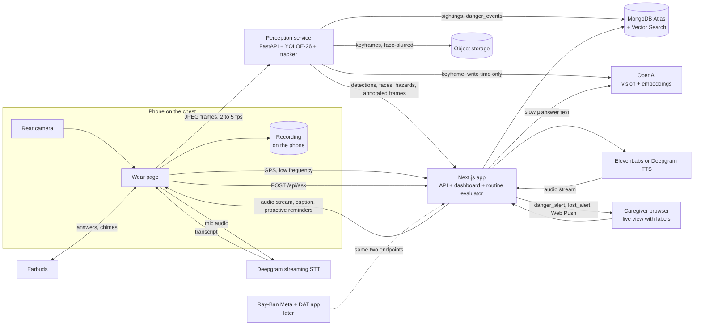

# Memory glasses (working title)

A wearable camera that remembers where things are, notices when someone's about to forget something, and watches for danger, for people living with dementia.

The wearer asks out loud, "Where are my keys?" About a second later they hear, "I last saw your keys on the kitchen counter, next to the coffee maker, about twenty minutes ago." They don't have to ask, either: the system reminds them to take their evening medication before bed, and to grab their keys as they head for the door. If the camera sees a hand near a hot stove, or the wearer leaves the approved area alone, the caregiver's phone gets an immediate alert with sound. The caregiver can also enroll photos of family members and other caregivers so the system recognizes who's around.

The product belongs on glasses, and Ray-Ban Meta was the platform we planned around. We can't get a pair for the hackathon, and a 3D-printed VR headset was tried on paper and dropped. So this build runs on a phone worn on the chest. Its rear camera faces forward and streams what's in front of the wearer, the phone records that view, and answers come back as speech in the wearer's ear. The live view with item labels shows on the caregiver dashboard. Ray-Ban Meta stays in the plan as a second client on the same contract, for when we have the hardware.

**Status: early build.** The database is built: `packages/db` holds the MongoDB schemas, validators, indexes, and repositories, tested against a real MongoDB. The API routes read and write through it behind a caregiver login and device tokens. `/wear` is the chest page: a dim screen where a tap anywhere asks a question. Speech to text runs on Deepgram when `DEEPGRAM_API_KEY` is set and falls back to the browser's recognizer when it isn't. `POST /api/ask` answers from the item snapshots. With `ELEVENLABS_API_KEY` and `ELEVENLABS_VOICE_ID` set, the answer streams back as 24 kHz PCM from ElevenLabs Flash v2.5 behind the `TTSProvider` seam in `apps/web/src/lib/server/tts/`, the phone plays it chunk by chunk and polls the interaction for the caption, and `pnpm bench:tts` measures time to first audio; without a key the route returns JSON and the browser's speech synthesis speaks it at the wearer's rate. Either way the answer is shown as a caption and playback timing goes back to the server. The page streams 1280 px JPEG frames to the perception socket at 3 fps when capture is resumed, and speaks queued caregiver messages. `/sim` runs the same client on a flat page with hold-to-ask and a typed question. The caregiver dashboard is built for phones and desktops: items, item detail and editing, questions, live status, messages, rooms, latency, settings. `apps/ios` is a Capacitor shell that loads the deployed web app ([ADR 0004](docs/decisions/0004-ios-shell-with-capacitor.md)). `services/perception` is a skeleton: its frame socket authenticates and answers each frame with empty detections, and its database write path is built and tested, but no detector runs, and `/ws/debug` isn't built, so the dashboard live view has no video yet. Face matching, danger detection, geofencing, and the routine/reminder engine described below are freshly scoped for this MVP and nothing for them is built yet. This README is still the build plan, so edit it freely.

## The problem

Misplacing things and being unable to retrace steps is one of the Alzheimer's Association's ten early warning signs. It can happen many times a day. It's distressing, and it often turns into suspicion that someone stole the item. The caregiver ends up answering the same question again and again.

A camera the person already wears can watch where objects end up. The wearer doesn't tag anything, charge a tracker, or open an app. They ask a question out loud and get an answer.

## Goals

1. Answer "where is my X?" out loud in under one second at the median, measured from the moment the wearer stops talking.
2. Track everyday items with no tags and no setup by the wearer.
3. Record what the chest camera sees, and show that live view with item labels on the caregiver dashboard.
4. Give caregivers a dashboard that shows where things are, what the wearer asked, and how often.
5. Remind the wearer, unprompted, before they'd otherwise forget: medication before bed, keys before the door, and other caregiver-defined routines.
6. Recognize caregiver-enrolled faces, so the system knows who's with the wearer, and alert the caregiver immediately if the wearer looks to be in danger (a hand near a hot stove) or out of the approved area alone.
7. Keep every wearer/caregiver pair's data separate behind real accounts, so the same deployment can serve more than one family.
8. Run the full demo without the chest mount, using a laptop webcam or a phone held in the hand, so a broken mount can't sink the project.

The hackathon MVP is three validated objects, one enrolled instance per category, phone browser capture from the chest, local recording, push-to-talk, spoken answers in earbuds, basic keyframe descriptions, exact item lookup, one TTS provider, a minimal dashboard with the live view, face matching against a handful of enrolled people, one hazard-object danger check, a geofence-based lost alert, and a caregiver-defined routine or two (one time-based, one leaving-the-house). Get the loop working on a flat page by hour eight, then put the phone on the chest. Item labels on the dashboard live view follow in M5. Room enrollment, visual enrollment beyond faces, semantic search, the LLM question path, and uploaded recordings are optional follow-ons; their sections below describe the roadmap, not requirements for the core demo.

Not in v1:

- Medical claims or diagnosis of any kind. A pill organizer sighting or a completed medication routine does not prove medication was taken.
- Automatic emergency response. Danger and lost alerts go to the caregiver, who decides whether to act; nothing in this system calls 911 or anyone else on its own.
- Turn-by-turn guidance to the item.
- World-anchored AR. Labels sit in screen space over the dashboard's live video. Pinning a marker to a spot in the room needs camera pose from ARKit or ARCore, which means a native app.
- Ray-Ban Meta support. We have no hardware. The contract leaves room for it.
- A native phone app. The chest client is a web page until the browser stops being enough.
- Languages other than English.
- Identifying anyone who isn't a caregiver-enrolled family member or caregiver. An unrecognized face is described as "someone unfamiliar," never matched against a database we don't control and don't have consent for.

## The chest camera: a phone on a harness

This shapes the whole architecture, so it comes first.

The wearer straps a phone to their chest with a harness and a phone clamp, the kind sold for filming bike rides. The rear camera faces forward and tilts down a little, so it sees the table, the counter, and the wearer's hands. A web page, `/wear`, streams frames to the perception service and records video on the phone. The wearer looks at the world with their own eyes and hears answers through earbuds.

What this buys us:

- No SDK, no developer program, no pairing. `getUserMedia` opens the camera in any phone browser.
- 1080p frames instead of the glasses' 720p, which goes straight at the small-item problem.
- Hands in view. A chest camera tilted down sees items being picked up and set down, which is what put-down detection needs.
- A steadier picture than a head camera. The torso turns less than the head.
- Nothing blocks the wearer's sight, so they can walk around normally. This is the first rig a person with dementia could reasonably wear.
- Recording. `MediaRecorder` writes the camera stream to a file on the phone.
- Nothing to print. A phone chest harness is off-the-shelf, and a teammate can wear it in a minute.

What it costs:

- The camera sees where the torso points, not where the eyes look. An item on a high shelf, or well outside the wide field of view, can still be out of frame.
- The wearer can't see the screen well while it's on their chest, so every answer and notification has to work as speech.
- The phone has to stay unlocked with the page open, because browsers stop the camera when the screen locks. The screen stays on the whole time, so heat and battery are the limits.
- Walking makes the phone bounce, and a loose clamp tilts it. Blurry frames get dropped, so a bouncy mount means missed sightings.

### What the mount needs

- A chest harness with a phone clamp that holds the phone in landscape, rear camera out, tilted 15 to 30 degrees down. Check that the clamp doesn't cover the camera lenses.
- A short cable to a power bank in a pocket.
- Wired or Bluetooth earbuds, one ear is enough. The phone speaker works in a quiet room, but see the iPhone audio note under the audio contract.
- A "camera on" notice on the harness strap. A phone has no capture light facing bystanders.
- A 3D-printed clip is the alternative if we'd rather print than buy. Keep its files in `hardware/chest-mount/`.

### What the page has to do

`/wear` replaces `/headset`. It keeps the camera, wake lock, recorder, feed watchdog, and push-to-talk hooks, and drops the stereo view and eye calibration.

- Open the rear camera with `getUserMedia`, at 1080p if the phone allows it. Newer iPhones list each rear lens as its own camera, and [one forum report](https://developer.apple.com/forums/thread/776460) has the picture jumping between lenses when something gets close, even with a device ID set. List the cameras after permission is granted, try each rear entry, and keep the one whose view holds steady with an object at arm's length. Save the choice by label as well as ID, because Safari can change device IDs between visits.
- Use the 0.5x ultrawide lens, fixed. From chest height its wide field already covers the counter, the wearer's hands, and the faces of people standing in front of them in one shot, so this isn't an M0 open question the way it would be with the main lens's narrower view. The tradeoff is fewer pixels on a small item at a distance; if a validated object's recall is too low, re-test the main lens for that item specifically.
- Keep the screen on with the Screen Wake Lock API, and take the lock again whenever the page comes back. Without it the screen locks and the camera stops.
- Keep the screen dim and mostly black. OLED screens spend almost nothing on black pixels, and a bright screen on the chest only adds heat. The page shows the last answer as a caption the wearer can glance down at, plus capture and recording state.
- The whole screen is the push-to-talk button: tap to start, and the turn ends on its own when speech-to-text detects the end of the question. Tap again to cancel. A Bluetooth clicker in the hand does the same through `keydown`.
- Grab frames for the perception service from the `<video>`, downscaled to 1280 px wide JPEG. One camera stream feeds the frame upload and the recorder.
- Pause stops frame uploads and recording. Capture starts paused, and the wearer or a teammate resumes it before the phone goes on the chest.
- Watch for a stalled feed. If no new video frame arrives for a second, play a tone in the earbuds and tell the dashboard, since nobody is looking at the phone's screen.

| Capability | Android Chrome | iPhone Safari |
|---|---|---|
| Rear camera and mic | yes | yes |
| Screen wake lock | yes | yes from iOS 16.4, and in home screen web apps from 18.4 |
| `MediaRecorder` | yes, WebM | yes, MP4 with H.264 and AAC. WebM from Safari 18.4 |
| Camera keeps running with the screen locked | no | no |
| Answer audio while the mic is open | not documented, test it | drops to the earpiece unless handled. On the chest the earpiece is inaudible, so use earbuds |

Checked on 2026-09-19 against caniuse, the WebKit blog, and WebKit's bug tracker. The iPhone limits matter less than they did in the headset, because nobody needs fullscreen, but the earpiece problem matters more. Whichever phone it is, record the model, OS, and browser version with the M0 smoke test, and treat the table as assumptions until that test passes.

### What a phone browser needs from the network

Camera and mic access need a secure context, and an HTTPS page can't open a `ws://` socket. So the phone needs `https://` for the web app and `wss://` for the perception service from the first test. Use the Vercel deployment, or a tunnel to `pnpm dev`, and put a tunnel in front of the perception service. A LAN IP won't work.

### Capture paths

| Capture path | Video from | Audio from | Used when |
|---|---|---|---|
| A. Flat page, `/sim` | laptop webcam, or a phone held in the hand | laptop or phone mic and speaker | from hour one, and as the demo fallback |
| B. Chest page, `/wear` | rear camera of the phone on the chest | phone mic, earbuds for answers | the hackathon demo |
| C. Ray-Ban Meta through a native DAT app | glasses camera | glasses over Bluetooth | later, when we have glasses. See "Ray-Ban Meta, the second platform" |

All three paths feed the same two endpoints, a frame WebSocket and `POST /api/ask`. Nothing downstream knows which path is live. Paths A and B run the same client code with a different view, so build the loop on A and move the phone to the chest once it works.

## Architecture



Two deployable pieces for the hackathon, and a third later:

| Piece | Stack | Job |
|---|---|---|
| `apps/web` | Next.js App Router, TypeScript, Tailwind, shadcn/ui, MongoDB Node driver | The `/wear` chest page, the flat `/sim` fallback, the caregiver dashboard, the REST API, the `/api/ask` voice endpoint, the routine evaluator, and Web Push for danger/lost alerts |
| `services/perception` | Python, FastAPI, Ultralytics YOLOE-26, ByteTrack, pymongo, a face embedding model | Takes frames, detects and tracks items, matches faces against enrolled people, checks hand/hazard overlap, sends detections to the dashboard live view, writes sightings and danger events, requests scene descriptions |
| `apps/ios` | Capacitor 8 (Swift Package Manager), later Swift, ARKit, Meta DAT, AVAudioEngine | Today a WKWebView that loads the deployed web app from `CAP_SERVER_URL`, grants the camera and mic to that origin only, and keeps the screen on. Native capture with the screen locked, hardware-button push-to-talk, a local wake word, and the Ray-Ban Meta client get added here in Swift. See ADR 0004 |

One design rule makes the latency goal reachable. **Do the expensive work when an item is seen, not when it's asked about.** Vision descriptions and optional room classification/embeddings happen at write time in the background. Once enrichment finishes, the answer is one indexed read away. Earlier questions get a conservative pending-description answer.

## What happens when the wearer asks a question

1. Push-to-talk starts the mic stream to Deepgram; release requests finalization. On the chest, the wearer taps anywhere on the phone's screen or presses a Bluetooth clicker. On `/sim` it's a button or the spacebar. A local wake word is optional later. A chime in the earbuds acknowledges the start of listening.
2. Accumulate finalized transcript segments until the turn ends. For Nova-style streaming, `is_final` alone does not mean the question is complete; handle `speech_final` and explicit finalization separately. A Flux adapter must map its own turn events to the same client state machine.
3. The client posts the completed transcript and a unique `requestId` to `/api/ask`.
4. The intent router matches location questions and resolves an item using a wearer-scoped alias map. Cache misses reload safely; aliases are invalidated after configuration changes.
5. One indexed `findOne` returns the latest item snapshot. A template uses current observation state, description readiness, and uncertainty to produce at most two sentences. No LLM runs.
6. MVP fast-path miss: ask which tracked item the wearer means. Later, an LLM may use read-only `find_item`, `search_sightings`, and `list_recent_items` tools. Tenant authorization comes from the session, never from model-supplied IDs.
7. Answer text goes to the chosen TTS provider. The response starts with an interaction ID header, then streams audio to the client.
8. The client plays buffered audio chunks, reports playback timing, and polls the interaction endpoint for text and final server timings. The phone screen and the dashboard show that text as a caption.
9. The server records status, answer, and timing stages. Cancellation and failed or partial playback are explicit outcomes.

## Latency budget

Fast-path planning estimates, end of speech to the first spoken answer in the wearer's ear. Chimes do not count:

| Stage | Budget | Notes |
|---|---|---|
| End of speech to completed turn | 450 ms | Initial hands-free silence window is 400 ms plus an estimated 50 ms for finalization; measure push-to-talk separately |
| Intent match and item resolve | 5 ms | In-memory alias map, no network |
| MongoDB read | 30 ms | One `findOne`, app and cluster in the same region |
| TTS time to first audio | 300 ms | Measure our voice, output format, provider, and network; inference claims are not end-to-end latency |
| Remaining transport and playback | 200 ms | Request upload, audio download, buffering, and speaker or earbud routing; validate on demo hardware |
| **Total** | **about 985 ms** | Aspirational P50 under 1 s, P95 under 1.5 s; almost no margin until measured |

The optional slow path targets first spoken audio in under 2 s; measure rather than assuming a fixed LLM overhead. Stage percentiles do not add up to an end-to-end percentile.

Also measure capture-to-queryable-observation and capture-to-queryable-description latency. Initial demo targets are P95 under 2 s and 5 s respectively. Return uncertainty while enrichment is pending. Track correct-location answers, wrong-location answers, and abstentions separately: a fast incorrect answer fails the demo. Record capture sequence numbers, server receipt times, and client playback times. Use monotonic clocks for durations and account for clock skew between devices; verify audible onset using a loopback recording on the demo phone's speaker or earbuds.

Labels on the dashboard live view lag the camera by several hundred milliseconds at 2 to 5 fps. A label drawn where the keys were half a second ago is worse than no label, so each detection carries its frame's sequence number and the live view drops anything older than 500 ms.

How we hold the budget:

- Stream every hop. Streaming STT in, streamed LLM tokens, streamed TTS audio out, chunked playback on the phone. Nothing waits for a complete result.
- Skip the LLM on the fast path. Most questions will be "where is my X", and a template answers those.
- Precompute descriptions at sighting time, as described above.
- Denormalize the latest sighting onto the item document so the hot read is a single lookup.
- Reuse MongoDB pools and provider connections where the runtime allows. Caches and warm connections are per process and may disappear. Do not send dummy questions to `/api/ask` to warm it.
- Flush LLM output to TTS at the first clause boundary. Don't wait for the full reply. ElevenLabs and Deepgram both take streamed text over WebSocket.
- Normalize STT input to 16 kHz mono after checking the actual capture format. Bluetooth profiles and sample rates vary by device and OS; do not assume the capture or playback format.
- Put everything in one region. Atlas in `us-east-1`, the Next.js functions in `iad1`, the perception box close by.
- Acknowledge completed turns locally if useful, but log chimes separately from spoken answers.
- Later, speculate on interim transcripts. Once an interim result contains a known item, start the lookup before the wearer finishes the sentence.
- Measure before tuning. Every interaction records per-stage timings, and `pnpm bench:tts` measures the chosen provider from the demo network; compare a second provider only if implemented.

One tension to watch. Short endpointing makes answers fast, but people with dementia often pause mid-sentence. Cut them off and the product fails at its one job. Start at 400 ms of silence and tune it with real speech, per wearer if needed.

## Text to speech: ElevenLabs or Deepgram

| | ElevenLabs Flash v2.5 | Deepgram Aura-2 |
|---|---|---|
| Vendor latency claim | about 75 ms model inference | about 90 ms to first byte, optimized |
| Independent P50 to first audio | about 288 ms | about 313 ms |
| Voice quality | warmer, more natural, large voice library, cloning | clear and a bit businesslike |
| Cost | higher | lower |
| Same vendor as our STT | no | yes |

These published figures are reference points, not a controlled comparison on our hardware. Voice quality is subjective; evaluate intelligibility and an unhurried speaking rate with the selected voice.

Start with ElevenLabs Flash v2.5 behind a small `TTSProvider` interface. Implement one provider for the MVP. Add Deepgram only if testing exposes a concrete problem or time remains. Benchmark identical text and record format, voice, warm/cold connections, sample count, P50, and P95.

Start with Deepgram Nova-3 streaming and push-to-talk. Evaluate Flux later if hands-free pauses are a problem; provider-specific events stay inside the STT adapter.

The fallback if the three-vendor chain gets flaky is OpenAI's Realtime API. `gpt-realtime-2` does STT, reasoning, tool calls and speech over one socket. We don't start there because the fast path needs no LLM at all, and because the voice choice matters.

## Perception pipeline

### Model

Stock YOLO trained on COCO knows 80 classes. It has phone, remote, cup, bottle, book and handbag. It has no keys, wallet, glasses, pill bottle, hearing aid or cane, which are the things people with dementia lose. So stock weights won't do.

We use **YOLOE-26**, the open-vocabulary YOLO in Ultralytics. You give it class names as text and it detects them with no retraining. Prompt preparation and export can reduce overhead, but benchmark our prompt count, input size, and hardware. Pin the package/checkpoint versions and pre-download model assets, including the text encoder, before the demo.

Candidate prompt list. M0 selects three reliable demo objects, one enrolled instance per category, and a small context list. Dashboard editing comes later:

- Tracked items: keys, wallet, phone, eyeglasses, glasses case, TV remote, pill bottle, pill organizer, hearing aid, cane, purse, mug, water bottle, watch, charger.
- Context objects, used to describe location: couch, table, counter, bed, sink, TV, chair, door, refrigerator, microwave, nightstand, desk, shelf.

YOLOE visual prompts can improve recognition of objects resembling an example. They do not establish ownership or persistent identity. Visual enrollment is optional after M3 and requires evaluation with similar-looking objects. Ambiguity triggers clarification or abstention, never silent assignment to the enrolled item.

If small-item detection fails the recorded walkthrough, first try a larger input/model and select reliable demo objects. Fine-tuning is an optional experiment: collection, labeling, training, and held-out evaluation may exceed the hackathon. Neither 200 images nor 30 minutes of training guarantees adequate recall.

### Frame handling

- Sample 2 to 5 fps. Objects at rest don't need 30.
- Drop blurry frames before inference using Laplacian variance. Body-worn video blurs every time the wearer walks.
- Run at image size 960 or higher. Keys at arm's length are a few dozen pixels wide at 720p, which was the glasses' ceiling. The phone isn't capped there. Capture at 1080p, send JPEGs 1280 px wide, and test whether full 1080p frames buy recall on the smallest item.
- The page grabs frames from its `<video>`. Sampling costs one `drawImage` per frame and no second camera stream.
- The perception service answers each frame on the same socket with that frame's sequence number and its detections for tracked items. The dashboard live view draws labels from those and drops stale ones.
- Benchmark sustained throughput, recall, memory, and thermal behavior on the actual laptop before moving to medium. Upscaling cannot recover detail absent from the source frame.
- Keep at most one pending frame per device, replacing it with the newest frame under load. Log drops and frame age instead of accumulating stale video.
- Use a versioned frame envelope with session ID, sequence number, capture time, dimensions, and byte length. Authenticate the socket, limit sizes/rates, and reject duplicates or expired frames. Reconnect with backoff and a new session; do not replay old camera buffers.

### From detections to sightings

1. ByteTrack IDs are local to a capture session, not persistent identities. Confirm repeated evidence over a configurable window, initially three usable frames within two seconds. Test both 2 and 5 fps with dropped frames.
2. A confirmed track opens a sighting and immediately updates the item's latest-observation snapshot, even while the description is pending. Select a keyframe and enqueue enrichment.
3. Refresh the snapshot while visible, initially every 500 ms when a usable frame arrives. Newer held/moving evidence immediately invalidates confidence in the old resting location; retain that location as history, not the default answer.
4. Close after three seconds without usable observations. Closing is bookkeeping, not the trigger for making a location queryable. Split sightings when the support surface, room, or motion state changes.
5. Do not merge on label, room, and time alone. MVP track breaks preserve separate sightings. Later merging needs evidence of the same instance and unchanged location; uncertainty is acceptable.
6. Apply item updates with an atomic observation-version condition. Order observations using server-normalized capture time and session sequence, not job completion time. Description jobs carry sighting ID, keyframe revision, and observation version. Late results may enrich history but cannot overwrite a newer item snapshot or attach old text to a new frame.

Use unique event IDs and idempotent upserts. Persist description-job state in MongoDB with bounded retries, backoff, worker leases, and terminal failure status; the existing perception worker can process it without another queue service. Bound queued jobs and coalesce obsolete keyframes. Return uncertainty if enrichment fails.

### Description job

Runs in the background and never blocks the frame loop. It sends the keyframe and the item's bounding box to an OpenAI vision model and gets structured output back:

```json
{
  "room": "kitchen",
  "surface": "counter",
  "relation": "next to the coffee maker",
  "state": "resting",
  "sentence": "on the kitchen counter, next to the coffee maker"
}
```

`state` is `resting`, `held`, `moving`, `in_use`, or `unknown`. Room may be `unknown`; surface and relation may be null. A single still image may not establish motion or resting state. Structured output validates shape, not truth: combine temporal evidence with visible context and omit unsupported details. Newer held/moving evidence supersedes the old resting answer.

Basic descriptions are part of M1/M3. Before enrichment finishes, use only independently established details; otherwise say "I saw your keys, but I could not tell where they were." Do not infer a room solely from a nearby object.

In the optional semantic-search phase, embed item name, aliases, room, surface, relation, and state together, for example "keys; car keys; kitchen counter; next to coffee maker; resting". Record the embedding model/version. Location-only sentences lack item semantics needed for fuzzy retrieval.

Vision calls are capped per item per minute so a cluttered desk can't run up the bill.

### Rooms

The MVP vision model may name a room type or return `unknown`. Optional room enrollment stores CLIP reference frames under family-provided names. Evaluate similarity thresholds, margins between competing rooms, and temporal consistency; top-five majority vote alone must not force unfamiliar scenes into known rooms. Classification of uploaded frames is descriptive and cannot enforce pre-upload privacy.

## Faces, danger, and routines

These three features moved from stretch goals to MVP scope. They share one property the rest of the perception pipeline doesn't have: each one can page a caregiver immediately, out of band from the dashboard's normal poll. That path reuses the notification/device-token plumbing built for caregiver messages, just with new `notifications.kind` values (`danger_alert`, `lost_alert`, `proactive_reminder`) and no caregiver keystroke in the loop.

### Face matching

The caregiver app enrolls people, not just items: a name, a relation ("daughter", "home health aide"), and a few reference photos, taken and uploaded with that person's own consent, the same way the item cards work but for faces. The perception service embeds each reference photo once at enrollment and stores the embedding, then runs a face detector on sampled keyframes (not every frame; this is a background enrichment step like the vision description job, not a fast-path cost) and compares any detected face against the wearer's enrolled set. A match above threshold, with a clear margin over the next-best candidate, attaches a `personId` and name to the sighting. Below threshold, or with a close second candidate, the face is recorded as "someone unfamiliar" and nothing more; the system never guesses a name it isn't confident of, and it never checks a face against anything outside the caregiver's own enrolled set.

This is for two things, and only two: giving the wearer's dashboard a "who was with you" record, and giving the danger/lost logic below a way to tell "alone" from "with someone the family knows." It is not a general stranger-recognition system, and the "Not in v1" list above is explicit that unenrolled faces stay anonymous.

### Danger detection

A second open-vocabulary prompt list, parallel to the tracked-item list, names hazards: stove burner, open flame, boiling pot, knife. The tracker treats a hazard the same way it treats an item, except a hazard sighting is checked against the wearer's hand position (from the same frame's detections, or a lightweight pose estimate if plain bounding-box overlap proves too noisy in testing) rather than logged as a location. A hand overlapping a hazard box for more than a short confirmation window, initially the same three-usable-frames rule the tracker uses for items, opens a `danger_events` record and fires an immediate push notification to every caregiver device, with a distinct sound from the ordinary notification chime. The dashboard's live view highlights the hazard and the hand together so a caregiver checking in can see exactly what triggered it.

One hazard type is the M1 target: a hot stove or pot, chosen because it's demonstrable and because it's the scenario in the prompt this feature exists to answer. Treat every other hazard as a later addition once that one is measured for false positive rate on a real stovetop. A danger alert is a "worth checking" signal, not a diagnosis or a 911 call; the caregiver decides what to do; see "Not in v1" and "Privacy and safety."

### Lost detection

Vision alone can't tell a caregiver the wearer left the house; there's no camera in the yard. So "lost" is a geofence, not a detection: the caregiver sets an approved area's center and radius on the dashboard, `/wear` requests location permission alongside camera and mic, and the phone reports position with the browser Geolocation API's `watchPosition` at a low frequency (battery, not precision, is the constraint here). Leaving the geofence, or the phone's location or connectivity going stale for longer than a configured window, fires a `lost_alert` push to the caregiver. It's a coarse signal on purpose: it exists to shorten the time before a caregiver notices, not to track the wearer continuously for its own sake, and the geofence and its radius are visible to the wearer and family, not a covert feature.

### Proactive reminders

Every reminder so far in this README is caregiver-authored and manually queued (`notifications`, kind `caregiver_message` or `reminder`). Proactive reminders add a `routines` collection the caregiver edits once and the system evaluates on its own:

```js
// routines: caregiver-defined rules the wearer never has to trigger by asking
{
  _id, patientId, active: true,
  name: "Evening medication",
  trigger: { kind: "time", at: "21:00" } |
           { kind: "leaving", itemName: "keys", windowMinutes: 10 },
  text: "Don't forget your evening medication.",
  lastFiredAt, cooldownMinutes: 120 // one nag per evening, not one per minute of not-yet-done
}
```

A lightweight evaluator, run as a scheduled job alongside the description-job worker rather than a new service, checks due `time` routines against whether the expected event already happened (an interaction, a sighting, or nothing to check against for a routine with no sensor tie-in) and checks `leaving` routines against whether the named item has been seen recently while the wearer is near the door. That last check needs "near the door" to mean something: the simplest version is a caregiver-enrolled "door" room, matched the same way other rooms are. A fired routine does two things at once: it speaks the reminder to the wearer immediately, the same as an answer, and it queues a `proactive_reminder` notification so the caregiver's dashboard and push both show it happened. `cooldownMinutes` keeps a persistent problem, like keys that are never picked up, from turning into a nag loop, which the tone rules under "What the wearer hears" explicitly rule out.

M1's target is one of each trigger kind, chosen for how easy they are to demo: a fixed bedtime reminder, and a keys-by-the-door check.

## Data model

Both services derive `patientId` from an authenticated caregiver session or scoped device credential, never an untrusted request body. Every tenant-owned collection and cache is scoped to it. Apply ownership checks to reads, writes, storage URLs, debug streams, configuration, STT token minting, queued jobs, and optional model tools. Rate-limit token minting and inference.

```js
// items: one per tracked thing. The hot path reads only this.
{
  _id, patientId,
  name: "keys",
  aliases: ["car keys", "house keys", "key ring"],
  detectorPrompts: ["keys", "key ring"],
  referenceImages: ["s3://..."],
  nameEmbedding: [/* 1536 */],
  lastSighting: { sightingId, observationVersion, keyframeRevision, sentence, room, state, lastSeenAt, thumbKey, descriptionStatus },
  lastRestingSighting: { /* historical; newer held/moving evidence supersedes it */ },
  locationStatus: "observed" | "moved" | "uncertain",
  usualSpots: [{ sentence: "on the hook by the front door", share: 0.62 }]
}

// sightings: one per continuous period an item stayed in view
{
  _id, patientId, itemId, label: "keys",
  status: "open" | "closed",
  firstSeenAt, lastSeenAt, expiresAt,
  sessionId, eventId, observationVersion, keyframeRevision,
  descriptionStatus: "pending" | "ready" | "failed",
  confidence, bbox: [x, y, w, h], frameSize: [1280, 720],
  room: { id, name: "kitchen", confidence: 0.91 },
  surface, relation, state,
  sentence: "on the kitchen counter, next to the coffee maker",
  nearbyObjects: ["coffee maker", "mug"],
  keyframeKey, thumbKey, // mint signed URLs on authorized reads
  searchText, sentenceEmbedding: [/* 1536; optional */], embeddingModel,
  source: "chest" | "simulator" | "glasses" // the code still says "headset"; rename it
}

// rooms and room_refs: caregiver-enrolled rooms and their CLIP reference frames
{ _id, patientId, name: "the den", private: false }
{ _id, patientId, roomId, embedding: [/* 512 */], imageKey, expiresAt }

// interactions: every question, with timings
{
  _id, patientId, requestId, askedAt, transcript, expiresAt,
  status: "generating" | "streaming" | "complete" | "failed" | "cancelled",
  path: "fast" | "llm", itemId, answerText,
  timingsMs: { stt, intent, db, llmFirstToken, ttsFirstByte, clientFirstPlayback, total },
  playbackReportedAt // absent until client telemetry arrives
}

// notifications: caregiver messages, reminders, and the three system-generated
// kinds below, all waiting to be spoken and/or pushed. Captions and sighting
// notifications are built on the client and never stored here.
{
  _id, patientId, createdAt, expiresAt,
  kind: "caregiver_message" | "reminder" | "proactive_reminder" | "danger_alert" | "lost_alert",
  text: "Lunch is at noon.",
  showAt, // reminders only
  status: "queued" | "shown" | "expired",
  shownAt,
  routineId, dangerEventId // set on the two kinds that reference another record
}

// recordings: optional, after M3. Only exists once recordings leave the phone.
{
  _id, patientId, sessionId, startedAt, endedAt, expiresAt,
  mimeType, width, height, hasAudio: false,
  chunks: [{ seq, startedAt, durationMs, key, bytes }] // mint signed URLs on authorized reads
}

// people: caregiver-enrolled faces, for face matching. Not general stranger recognition.
{
  _id, patientId, name: "Dana", relation: "daughter",
  referenceImages: ["s3://..."], // taken with that person's own consent
  faceEmbeddings: [/* one per reference photo */],
  consentedAt, consentedBy // the caregiver who enrolled them, and when
}

// danger_events: a hand overlapping a hazard for longer than the confirmation window
{
  _id, patientId, hazardLabel: "stove burner",
  firstSeenAt, lastSeenAt, expiresAt, status: "open" | "closed",
  bbox, frameSize, keyframeKey, // for the dashboard's live-view highlight
  acknowledgedAt, acknowledgedBy // set once a caregiver has seen it
}

// routines: caregiver-defined rules the wearer never has to trigger by asking
{
  _id, patientId, active: true, name: "Evening medication",
  trigger: { kind: "time", at: "21:00" } | { kind: "leaving", itemName: "keys", windowMinutes: 10 },
  text: "Don't forget your evening medication.",
  lastFiredAt, cooldownMinutes: 120
}

// patients: one wearer profile per family, owned by the caregiver who created it
{ _id, name, geofence: { lat, lng, radiusMeters } | null, settings, configVersion }

// caregivers: real accounts, not the single seeded login v0 used
{ _id, patientId, email, passwordHash, name, createdAt }

// devices: a patient's paired phones (/wear, /sim), each with its own scoped token
{ _id, patientId, label, tokenHash, pairedAt, lastSeenAt }
```

The built schemas live in `packages/db/src/schema/`, one zod schema per collection, and `pnpm db:setup` installs each one as a MongoDB validator that rejects bad writes from either service ([ADR 0002](docs/decisions/0002-mongodb-schema-from-zod.md)). They follow the sketch above, with these differences:

- Every id is an ObjectId, and references are ObjectIds too.
- `items.lookupKeys` holds the normalized name and aliases. A unique index over active items keeps each spoken name on one item, and the fast path resolves a transcript with one `$in` query on it. `items.plural` picks "it was" or "they were", and `items.active: false` archives an item.
- `items.observationVersion` is the compare-and-set counter for snapshot writes. `locationStatus` is derived when read, from the snapshot's state and description status, rather than stored.
- Snapshots carry `expiresAt`, so a read can drop an expired one without looking up its sighting.
- `items.updatedAt` marks caregiver edits only; snapshot writes leave it alone. A save can send the value its form loaded as `expectedUpdatedAt` and gets a 409 instead of overwriting a newer save.
- `patients.settings` holds the caregiver settings, and `patients.configVersion` goes up on every item, room, or settings write.
- Three collections the sketch leaves out: `capture_sessions`, one per frame socket connection, paused or live, for the dashboard badge; `description_jobs`, the keyframe queue with leases, retries, and supersession; and `meta`, the schema fingerprint `db:setup` last applied.
- `caregivers` is one row per real account. A caregiver owns exactly one `patientId` in the MVP; a `caregiver_patients` join table for multiple caregivers per wearer, or one caregiver watching several wearers, is a follow-on and not required for the demo. There's no cross-pair sharing anywhere in the schema: every query, index, and background job is keyed on `patientId`, so a second family's data is structurally unreachable from the first family's session or device token, not just filtered out by convention.
- `devices` rows are created by redeeming a short-lived pairing code the caregiver generates on the dashboard, not by sharing the caregiver's login. `/wear` and `/sim` prompt for that code once, on first run, and store the resulting device token the same way they already store the camera choice.

Indexes, as declared in `packages/db/src/registry.ts`:

| Collection | Index | Serves |
|---|---|---|
| `items` | unique `{ patientId: 1, lookupKeys: 1 }` where `active: true` | fast path lookup; one spoken name per active item |
| `items` | `{ patientId: 1, name: 1 }` | item list |
| `sightings` | unique `{ patientId: 1, eventId: 1 }` | idempotent ingestion |
| `sightings` | `{ patientId: 1, itemId: 1, lastSeenAt: -1 }` | timelines, history |
| `sightings` | `{ patientId: 1, lastSeenAt: -1 }` | recent sightings, room and time questions |
| `sightings` | `{ lastSeenAt: 1 }` where `status: "open"` | closing sightings left open by a crash |
| `sightings` | vector on `sentenceEmbedding`, filters `patientId`, `itemId`, `lastSeenAt` | open-ended questions, optional |
| `sightings` | Atlas Search on `searchText` | the text half of `$rankFusion`, optional |
| `room_refs` | vector on `embedding`, filter `patientId` | room classification, optional |
| `room_refs` | `{ patientId: 1, roomId: 1 }` | a room's reference frames |
| `interactions` | unique `{ patientId: 1, requestId: 1 }` | request deduplication |
| `interactions` | `{ patientId: 1, askedAt: -1 }` | question log, latency percentiles |
| `description_jobs` | `{ status: 1, runAfter: 1 }` | claiming due jobs and expired leases |
| `description_jobs` | unique `{ sightingId: 1, keyframeRevision: 1 }` | one job per keyframe, superseding older ones |
| `description_jobs` | `{ patientId: 1, status: 1 }` | per-wearer queue bound, pause cancelling queued work |
| `capture_sessions` | `{ patientId: 1, startedAt: -1 }` | capture state badge |
| `rooms` | unique `{ patientId: 1, normalizedName: 1 }` | one room per name |
| `notifications` | `{ patientId: 1, status: 1, showAt: 1 }` | the wear page's poll, optional |
| `recordings` | `{ patientId: 1, startedAt: -1 }` | recordings list, optional |
| `devices` | `{ patientId: 1, createdAt: -1 }` | a wearer's devices |
| `caregivers` | unique `{ email: 1 }` | login |
| `people` | `{ patientId: 1, name: 1 }` | face enrollment list |
| `danger_events` | `{ patientId: 1, status: 1, lastSeenAt: -1 }` | open hazards, dashboard alert badge |
| `routines` | `{ patientId: 1, active: 1 }` | the routine evaluator's per-wearer scan |
| every collection with `expiresAt` | TTL a day after `expiresAt` | backstop only; `pnpm db:sweep` is the cleanup job, and reads filter expired records at once |

The three search indexes are exactly the free tier's limit.

### Where vector search earns its place

"Where are my keys?" doesn't need it. That's an exact lookup, and an exact lookup is faster. Vector search is optional after M3 and does the fuzzy work. The MVP needs no vector indexes.

- Structured room/time questions. "What did I leave in the bedroom?" first uses room/time filters and latest observations per item, excluding items subsequently seen elsewhere. Say "I saw…" unless placement is established.
- Semantic questions. "Where did I put that thing from the pharmacy?" searches enriched item/location text, filtered to the wearer and time window. Weak or closely matched candidates trigger clarification.
- Hybrid search. Combine the vector query with Atlas full-text search over `searchText` using `$rankFusion`. That stage needs MongoDB 8.1 or later. On an older cluster, app-side fusion is optional and requires its own evaluation.
- Room classification against `room_refs`.
- Episodic memory, a stretch goal. Periodic scene captions go in a `memories` collection and answer "what did I do this morning?"

Fuzzy item names skip Atlas entirely. "The thing that opens the car" should resolve to keys, but a wearer has maybe 30 items. Embed the phrase and compare against 30 cached vectors in memory. The local comparison is cheap, but generating a query embedding adds network latency that must be measured. It needs no search index. The free M0 tier caps search indexes, so check the limit before adding a third.

## What the wearer hears

Everything reaches the wearer as speech in the earbuds. The wording matters as much as the speed. These rules follow standard dementia communication guidance: short sentences, one idea at a time, never argue, never test.

- Two sentences at most. Location first, then when.
- Use the family's words. If the caregiver named the room "the den", say "the den".
- Round the time. "A few minutes ago", "about an hour ago", "this morning". Nobody wants to hear "47 minutes ago".
- Never mention repetition. The tenth "where are my keys" gets the same calm answer as the first.
- No quizzing and no correcting. Never "do you remember?", never "you already asked".
- Always describe an observation, not a guaranteed current location. Initially label observations older than 15 minutes as stale; this configurable demo threshold does not establish correctness.
- Offer a usual spot only when explicitly configured or supported by enough history. Omit the suggestion otherwise.
- Newer held/moving evidence supersedes an old resting location. Unknown location, ambiguous identity, and pending descriptions have explicit uncertainty wording.
- Speak slower than the default rate. The rate is a per-wearer setting.

```text
fresh    I last saw your {item} {sentence}, {relative_time}.
stale    I last saw your {item} {sentence}, {relative_time}.
held     I last saw your {item} in your hand, {relative_time}.
moved    I saw your {item} being moved. I could not tell where {it/they} ended up.
unknown  I saw your {item}, but I could not tell where {it/they} {was/were}.
unseen   I haven't seen your {item} in my available history.
ambiguous Which {item} do you mean?
```

An optional second sentence may suggest a known usual spot. `usualSpots` is empty in the MVP unless configured. Later aggregation must retain sample counts and avoid counting fragmented tracks as independent placements; do not infer a usual spot from sparse history.

The LLM path gets the same rules in its system prompt, plus a hard cap on reply length.

### What the screens show

The phone's screen faces the wearer from their chest. They can glance down at it, but nothing depends on that.

| Element | Where | Milestone |
|---|---|---|
| Answer caption, the spoken sentence word for word | phone and dashboard | M2 |
| Listening mark, capture and recording state | phone and dashboard | M2 |
| Live view with item labels, detections under 500 ms old | dashboard | M5 |
| Sighting notification, "keys seen on the counter" | dashboard only; speaking it would nag the wearer | M5 |
| Caregiver message or reminder | spoken, then shown as a caption | optional, M6 |

- Voice first. The vision research note cites a [2026 JMIR Aging survey](https://doi.org/10.2196/81840) where older adults with cognitive impairment preferred audio to visual information.
- The phone screen stays dark apart from large, high-contrast text: one caption at a time, held long enough to read twice, then faded.
- Label tracked items only on the live view. Boxes on every chair and mug make it harder to read.
- Caregiver messages and reminders follow the speech rules above and never interrupt an answer.
- System trouble gets calm words, "I need a moment", and the caregiver sees the real error on the dashboard.

## Caregiver dashboard

MVP by M3: read-only item cards, latest question/answer, latency, and capture/pause status. Enrollment, timelines, charts, and room controls are optional later work.

- **Items.** A card per item with a thumbnail, the location sentence and "seen 20 min ago". Click through to a timeline of sightings with keyframes.
- **Add an item.** Name, aliases and a few photos. Saving pushes the new prompt list to the perception service.
- **People.** Enroll a family member or caregiver: name, relation, a few reference photos taken with that person's consent. Saving pushes the new face embeddings to the perception service, the same way an item's photos push a prompt list.
- **Rooms.** Enroll a room by walking through it. Mark rooms private for the later on-device privacy gate; do not present server-side labels as a pre-upload privacy guarantee. One enrolled room, the "door," feeds the leaving-the-house routine trigger.
- **Alerts.** Danger events and lost/out-of-area alerts, newest first, each with its keyframe and an acknowledge action. These also arrive as a push notification with a distinct sound the moment they fire; this tab is the log, not the only way to see them.
- **Routines.** Add and edit the time-based and leaving-the-house reminders described under "Faces, danger, and routines," and see when each last fired.
- **Questions.** A log of what the wearer asked and what they heard. A chart of questions per day per item. A jump in repeated questions can flag a hard day. The dashboard states it as a count and nothing more. It isn't a diagnostic.
- **Live view.** What the chest camera sees, with item labels, recognized faces, sighting notifications, and the last answer. This is the AR view, and on a laptop it's how the judges watch the demo.
- **Messages.** Optional. Send a short message on demand, separate from the caregiver's own configured routines. The voice reads it to the wearer.
- **Recordings.** Optional. Lists recordings once they leave the phone. Until then a recording is a file on the phone.
- **Latency.** P50 and P95 per stage, read from `interactions`.
- **Settings.** Voice, speaking rate, whether recording is allowed, wake word sensitivity, retention window, and the geofence center/radius for lost alerts.
- **`/wear`.** The chest page. Camera, frame upload, tap-anywhere push-to-talk, local recording, a dim caption screen, and a setup panel for lens choice, pause, and pairing to a patient.
- **`/sim`.** The same client on a flat page. Webcam and mic in, answer audio out, the caption over the video. It's for laptop development and it's the demo fallback.

MVP updates poll authenticated endpoints every two seconds, except danger and lost alerts, which push immediately (see "Faces, danger, and routines"). Later change streams plus SSE for everything else require reconnect/resume handling, connection cleanup, and deployment-aware timeouts. Vercel streamed responses still have duration limits; a function is not a permanent relay.

Auth is real accounts, not the single env-var login v0 used: a caregiver signs up, and the first login creates their patient (wearer) profile. Everything scopes to that `patientId`, and nothing in the schema, an index, or a query lets one caregiver's session or one patient's device token reach another pair's data, so the same deployment serves many families without cross-talk. Devices don't share the caregiver's login; the caregiver generates a short-lived pairing code on the dashboard, and `/wear` or `/sim` redeems it once, on first run, for a device token scoped to that `patientId`. That token, not a bearer copy of the caregiver's session, is what the phone sends after that.

## API sketch

Next.js:

| Route | Does |
|---|---|
| `POST /api/ask` | Takes `{ transcript, requestId }`, returns `X-Interaction-Id` and `Server-Timing` before the body; deduplicates by wearer and request ID. With a TTS provider configured the body is streamed `audio/pcm` (s16le, mono, 24 kHz, declared in `X-Audio-*` headers) and the text is polled from `GET /api/interactions/:id`; with none, or when the provider refuses the request, it returns the interaction as JSON |
| `POST /api/auth/signup`, `POST /api/auth/login`, `POST /api/auth/logout` | Real caregiver accounts. Signup creates the caregiver and their patient profile together; login sets a signed session cookie scoped to that `patientId` |
| `POST /api/devices/pair` | Redeems a caregiver-generated pairing code for a device token scoped to the caregiver's `patientId`. What `/wear` and `/sim` call on first run instead of sharing the caregiver's login |
| `GET /api/health` | Unauthenticated. Whether the database answers and its validators are current |
| `GET /api/stt/token` | Mints a short-lived Deepgram key so the client streams audio to Deepgram directly and skips a hop. 503 without `DEEPGRAM_API_KEY`, and the page uses the browser's recognizer |
| `GET, PATCH /api/settings` | The wearer's settings. The wear page reads speaking rate and recording permission; the caregiver edits them |
| `GET /api/capture` | Whether the chest camera is live, paused, or offline, from the newest capture session |
| `GET /api/perception/token` | Mints a short-lived token for the frame socket. A browser can't set headers on a WebSocket, so the page sends it as the first message |
| `GET, POST /api/items`, `PATCH /api/items/:id` | Item CRUD and photo enrollment |
| `GET /api/sightings` | Filter by item and time range |
| `GET, POST /api/rooms`, `PATCH /api/rooms/:id` | Room CRUD, the private flag, and later enrollment |
| `GET, POST /api/people`, `PATCH /api/people/:id` | Face enrollment CRUD: name, relation, reference photos; saving pushes new embeddings to the perception service |
| `GET /api/danger-events`, `POST /api/danger-events/:id/acknowledged` | List open/closed hazard events; the caregiver acknowledges one from the dashboard |
| `GET, POST /api/routines`, `PATCH /api/routines/:id` | CRUD for the time-based and leaving-the-house reminder rules the routine evaluator checks |
| `GET /api/interactions` | Question log and latency stats |
| `GET /api/interactions/:id` | Poll authorized answer text, status, and final server timings |
| `POST /api/interactions/:id/playback` | Record client playback/turn timings, labeled as client-reported telemetry |
| `GET /api/notifications`, `POST /api/notifications/:id/shown` | The device polls for the next queued caregiver message, due reminder, or fired routine, then marks it shown. Danger and lost alerts also arrive this way as a fallback, but don't wait for the poll: see push, next |
| `POST /api/notifications` | The caregiver queues a message or a reminder by hand; the routine evaluator and the danger/lost checks queue the other three kinds automatically |
| `POST /api/push/subscribe` | Registers a caregiver or wearer device's Web Push subscription, so `danger_alert` and `lost_alert` notifications page immediately instead of waiting for the next poll |
| `POST /api/recordings`, `POST /api/recordings/:id/chunks` | Optional. Registers a recording and returns a signed upload URL per chunk. Not needed while recordings stay on the phone |

Perception service:

| Route | Does |
|---|---|
| `WS /ws/frames` | Binary JPEG frames in, with the versioned session/sequence/timestamp envelope. JSON out per frame: `{ seq, detections: [{ itemId, label, bbox, confidence }] }` with boxes normalized to the frame |
| `WS /ws/debug` | Detections and annotated frames for the dashboard live view |
| `POST /config/classes` | Reloads the prompt list after a caregiver edits items |
| `GET /health` | Model loaded, current fps, queue depth |

Audio contract: initially stream raw signed 16-bit little-endian PCM, mono, 24 kHz, with format metadata fixed before the response body starts. Normalize provider output on the server. The browser uses a bounded AudioWorklet buffer; a later native app schedules PCM buffers with AVAudioEngine. Validate this in M2, including byte alignment, underruns, cancellation, and interruption by a new question. Disconnects cancel upstream work where possible; failed or partial playback is not success. Duplicate requests return the existing interaction ID/status without starting another provider request or replaying a consumed live stream.

iPhone Safari needs care here. WebKit picks the audio session from the media calls a page makes, and an open mic puts it in play-and-record, where answer audio can come out of the earpiece at low volume. [One developer's write-up](https://samueleddy.com/writing/ios-safari-audio-sessions/) of a Safari voice mode lands on four fixes. Play answers through an `AudioContext`, which the AudioWorklet path already does. Resume that context inside the push-to-talk touch. Open the mic when the touch starts and stop its tracks when it ends, so the session is back in playback before the answer arrives. Set `navigator.audioSession.type` where it exists. Test all of it on the demo phone in M0, with the camera running, because the camera stream has to survive the mic opening and closing. On the chest the earpiece is a foot from the ear, so an answer routed there is silent: plan on earbuds for the demo either way.

Headers cannot contain final slow-path text or end-to-end timings before those values exist. Fetch them by interaction ID. `Server-Timing` may contain only stages completed before headers are sent; client telemetry supplies actual playback timing.

Both services write to MongoDB. Version the shared contract and generate JSON Schema from one canonical definition for cross-language validation. Shared fixtures must pass both Zod and Pydantic validation, avoiding independently drifting schemas. Perception owns sightings and latest-observation fields; web owns caregiver configuration and interactions. Configuration reloads are tenant-scoped and versioned; alias changes invalidate caches.

## Privacy and safety

An always-on camera in someone's home is a serious thing, and the wearer may not be able to give informed consent. The family or a legal proxy has to. The design should deserve their trust.

- The MVP runs in an explicitly approved demo area with a visible capture/pause control. Capture starts paused; reconnects require explicit resumption. Pause before leaving that area. Automatic private-room exclusion is not an MVP capability.
- State the actual flow: raw frames reach the selected perception host in memory. Face matching against the enrolled `people` set happens there, in memory, before any blurring; only selected, downscaled, face-blurred keyframes may then reach object storage or the external vision provider. Blurring on that host does not mean raw frames never left the capture device. Exclude raw frames from logs and error reporting.
- Face matching only ever compares against the caregiver's own `people` collection: photos of specific family members and caregivers, each enrolled with that person's consent. It is never sent to, or checked against, a third-party face-recognition API or any database outside this system. A face that doesn't match stays an anonymous "someone unfamiliar" detection; nothing computes or stores an identity for it.
- A danger alert is evidence worth a caregiver's attention, not a confirmed emergency. Hazard detection will have false positives and false negatives; nothing in this system pages emergency services, and the demo script and any real deployment both keep a human deciding what to do next. Log false positives during testing so the hazard prompt list and the confirmation window can be tuned.
- Lost-alert geofencing needs a new permission beyond camera and mic: continuous location, which is its own battery and privacy cost on top of an always-on camera. Ask for it separately, explain what it's for, and let the family see and change the geofence itself, since a covert location feature undermines the trust this whole section is about. Keep location history only as long as the lost-alert window needs it, under the same retention policy as everything else.
- A future automatic privacy gate must run on the capture device before any upload, including debug frames and thumbnails. Private or unknown rooms block transmission and storage until cleared locally. Server-side room recognition cannot enforce this. Bathrooms and bedrooms default to private when that gate is implemented.
- Debug live view is authenticated, opt-in, transient, and disabled while paused. Pause stops uploads and cancels/drops queued frames and description work; it cannot retract data already sent externally. Document provider retention settings before any real-home use.
- Retention defaults to 30 days. A retryable cleanup job removes expired sightings, keyframes, thumbnails, embeddings, interactions, and related jobs, clears item snapshots pointing to removed sightings, and recomputes derived usual spots. Apply a stated retention policy to enrollment images too. Exclude expired data from reads immediately rather than relying on delayed TTL deletion. Storage lifecycle rules are a backstop; document backup/provider retention separately.
- Audio leaves the device only during push-to-talk or after a future local wake word fires. Show listening state and provide an immediate stop control.
- A phone has no capture light facing bystanders, and Ray-Ban Metas do. The harness carries a visible "camera on" notice, and the phone screen and dashboard show capture and recording state. We don't try to hide the camera.
- Recording is off by default and the caregiver setting has to allow it. In the MVP the file stays on the phone and nothing uploads it. The phone screen shows a recording mark the whole time. Pause stops the recording along with everything else. Recordings follow the same retention window as sightings, and a recording that leaves the phone needs the same signed-URL access and the same cleanup job.
- Record video without the mic track by default. Massachusetts punishes secret recording of conversations, and the demo happens in Massachusetts. If audio is ever recorded, everyone in the room hears that it's on.
- Recordings are raw frames. They skip the face blur that keyframes get. That's the reason they stay on the phone until there's a consent story for uploading them.
- Store object keys and mint short-lived signed URLs after authorization. Use encrypted transport/storage and server-side provider keys. Device credentials are scoped, revocable, and expiring.
- Test tenant isolation on both services, including writes, sockets, storage URLs, configuration, caches, token minting, and jobs. Real signup means real strangers can create accounts; every one of them gets the same isolation guarantees as the seeded demo pair, and none of them can enumerate, pair a device into, or read another family's `patientId`.
- Present the demo as an assistive prototype with no diagnosis or medication-adherence conclusions. A pill organizer sighting does not prove medication was taken.

The chest phone adds its own risks:

- A phone runs warm with the camera, screen, and radio on, and it sits against the body. Check its temperature after twenty minutes on the harness.
- A clamp can let go. Use a lanyard or strap tether so a dropped phone doesn't hit the floor.
- It films everyone in front of the wearer, at chest height. The "camera on" notice stays visible, and capture pauses outside the demo area.

One ethical question stays open. ElevenLabs can clone a family member's voice, and hearing a daughter's voice might be comforting. It might also confuse someone who then looks for her in the room. We don't build this without input from someone who works in dementia care.

## Repo layout

```text
hackmit26/
  README.md
  CLAUDE.md                  repo layout, commands, gotchas
  apps/
    web/                     Next.js dashboard, API, /wear, /sim
    ios/                     Capacitor shell that loads the web app; native features and the Ray-Ban DAT client later
  services/
    perception/              FastAPI, YOLOE-26, tracker, description jobs
  packages/
    shared/                  wire contract: API bodies, the frame socket protocol, signed tokens
    db/                      stored-document schemas, collection registry, repositories, retention
  hardware/
    chest-mount/             mount notes, and print files if we print the clip
  scripts/
    db-setup.ts              syncs collections, validators, and indexes; --search for vector ones
    seed.ts                  demo wearer, caregiver, items, fake sightings
    db-sweep.ts              deletes records past retention
    bench-tts.ts             benchmarks the chosen TTS provider; optional comparison
    replay.py                plays a folder of JPEG frames into /ws/frames
  docker-compose.yml         local MongoDB 8.0 with Atlas Search
  docs/
    decisions/               ADRs
```

pnpm workspaces for the JavaScript side, uv for Python.

## Environment variables

```bash
# MongoDB. Locally: `pnpm db:up`, then mongodb://localhost:27017/?directConnection=true
MONGODB_URI=
MONGODB_DB=memory_glasses
OPENAI_EMBEDDING_DIMENSIONS=1536   # vector index widths for `pnpm db:setup --search`
ROOM_EMBEDDING_DIMENSIONS=512

# The one caregiver login. `pnpm db:seed` creates a caregiver with this email
CAREGIVER_EMAIL=caregiver@example.com
CAREGIVER_PASSWORD=

# Signing secrets, 32+ characters each: openssl rand -base64 32
AUTH_SECRET=
DEVICE_TOKEN_SECRET=               # perception needs the same value

# OpenAI. Model IDs live in env so we pick the current small, fast tier at build time
OPENAI_API_KEY=
OPENAI_CHAT_MODEL=
OPENAI_VISION_MODEL=
OPENAI_EMBEDDING_MODEL=text-embedding-3-small

# Speech
DEEPGRAM_API_KEY=
DEEPGRAM_STT_MODEL=
TTS_PROVIDER=elevenlabs          # or deepgram
ELEVENLABS_API_KEY=
ELEVENLABS_VOICE_ID=
ELEVENLABS_MODEL=eleven_flash_v2_5
DEEPGRAM_TTS_MODEL=
PICOVOICE_ACCESS_KEY=

# Storage for keyframes, any S3-compatible bucket
S3_ENDPOINT=
S3_BUCKET=
S3_ACCESS_KEY_ID=
S3_SECRET_ACCESS_KEY=

# Wiring. The phone page opens the frame socket itself, so this is the public wss:// URL
NEXT_PUBLIC_PERCEPTION_WS_URL=
```

## Running it

```bash
pnpm install
pnpm db:up                       # local MongoDB in Docker, or point MONGODB_URI at Atlas
pnpm db:setup                    # collections, validators, indexes; rerun after schema changes
pnpm db:seed                     # demo wearer, caregiver login, items with sightings
pnpm dev                         # Next.js on :3000; sign in at /login
pnpm test                        # vitest, against MongoDB
pnpm bench:tts                   # chosen-provider latency benchmark

cd services/perception
uv sync
uv run uvicorn app.main:app --port 8000
uv run pytest
uv run python ../../scripts/replay.py --help

# The phone needs https:// and wss://. Tunnel both dev servers, one command per terminal.
cloudflared tunnel --url http://localhost:3000
cloudflared tunnel --url http://localhost:8000
```

`next dev` blocks dev assets for hostnames it doesn't know. `apps/web/next.config.ts` allows `*.trycloudflare.com`. Add the hostname there if you use a different tunnel. Open `/wear` on the phone from the tunnel URL, sign in once, tap Start, resume capture, and clip the phone into the chest harness. On iPhone, Add to Home Screen gives the page the whole screen. A recording made on the phone is also a replay fixture: copy the file off and feed it to `replay.py`.

The iOS app wraps the same page. It needs Xcode, and the server URL is baked in at sync time:

```bash
cd apps/ios
CAP_SERVER_URL=https://<tunnel-or-vercel-host> pnpm sync   # rerun when the URL changes
pnpm open                                                  # Xcode; pick a device and run
pnpm build:sim                                             # simulator build without signing
```

See `apps/ios/README.md` for signing and limits.

## Testing

What runs today: `pnpm test` runs the zod contract fixtures and the database tests, and `uv run pytest` in `services/perception` runs the write path, protocol, and token tests. Both suites use a real MongoDB with the generated validators, so start one with `pnpm db:up` first. The list below is the plan for the rest.

- Unit tests for intent routing, answer templates, relative time, and the sighting state machine using Vitest and pytest.
- Replay annotated walkthroughs with expected identity, location changes, and uncertainty. Cover pickup from a resting spot, similar objects, questions while an item remains visible, pending/failed descriptions, unknown rooms, dropped frames, reconnects, duplicate events, and jobs finishing out of order. Assert that old jobs never overwrite newer evidence. Record wrong-location answers and abstentions, not just detection counts.
- A golden set of about 30 questions, including aliases, unknown items, and ambiguous references. Recorded speech cases include slow speech and mid-sentence pauses.
- Report P50/P95 and sample count on a fixed replay/speech set, separating cold/warm and push-to-talk/hands-free runs. Measure speech-end to spoken answer and capture to queryable observation/description. Seeded reads isolate API performance but do not prove end-to-end success. Keep network-dependent benchmarks separate from deterministic unit-test gates.
- Audio integration checks cover finalized segments versus complete turns, playback on the demo phone's browser with the camera running, interruption, provider failures, and no chime counted as answer audio.
- Chest checks run on the demo phone in the harness. The camera frames the table and the wearer's hands while standing and sitting. Walking doesn't blur every frame. Labels older than 500 ms never draw on the live view. A stalled feed plays the tone and shows on the dashboard. Wake lock holds for twenty minutes. Recording starts, shows its mark, stops on pause, and produces a playable file. A tap on the chest starts a question. Answers are audible in the earbuds with the mic in use. Log the phone's temperature and battery at the start and end of a twenty minute run.
- Tenant isolation checks on API routes, sockets, background jobs, caches, and storage access.
- Privacy/retention checks cover pause, queued-job cancellation, expiry filtering, deletion retries, and removal of denormalized snapshots and images.
- Contract fixtures validate identical payloads in Python and TypeScript. Pin dependencies/model assets and run a clean startup before rehearsal.

## Build order

Hours assume a 24-hour hackathon and three or four people. Edit to fit the team.

| Milestone | Hours | Work | Done when |
|---|---|---|---|
| M0 Setup and feasibility | 0 to 1 | Accounts, repo skeleton, real caregiver signup/login and device pairing, model downloads. Get the chest harness, earbuds, and a power bank. Put both dev servers behind tunnels and smoke-test camera, lens choice, mic, earbud playback, and wake lock on the demo phone. Record a walkthrough with that phone and select three reliable objects | Phone capture and inference run over HTTPS; two independently signed-up caregiver/wearer pairs stay isolated from each other; the mount is in hand; chosen objects, phone model, and browser limits are recorded |
| M1 Perception and descriptions | 1 to 6 | Bounded ingestion, tracker, versioned sightings, immediate item updates, basic keyframe descriptions, privacy/pause flow | A real object has a queryable location; pickup invalidates its old resting answer |
| M1b Faces and danger | 1 to 8, parallel | Face enrollment on the dashboard, embedding + match in the perception service, one hazard prompt (stove/pot) with hand-overlap confirmation, `danger_events`, and the immediate Web Push path to the caregiver | An enrolled face is matched on a live frame; a hand held near the test hazard fires a caregiver push within a couple seconds |
| M2 Voice and minimal dashboard | 1 to 6, parallel | Push-to-talk `/sim`, one STT/TTS provider, exact lookup, PCM playback, interaction polling, captions, cards and timings. Alongside it, turn `/headset` into `/wear`: drop the stereo view, add tap-anywhere push-to-talk and the dim caption screen | Seeded questions produce audible answers in earbuds and client playback timings on the phone |
| M2b Routines and lost alerts | 4 to 9, parallel | `routines` CRUD, the time and leaving-the-house evaluator, geofence setting on the dashboard, phone `watchPosition` reporting, the `lost_alert` push | A fixed bedtime reminder speaks on schedule; leaving the geofence pages the caregiver |
| M3 Join | 6 to 8 | Real sightings/descriptions answer real questions; test movement and immediate queries | Three objects work end to end on path A with the demo phone as the camera, with honest uncertainty and measured accuracy/latency |
| M4 Reliability | 8 to 12 | Dropped frames, retries, late jobs, ambiguous items, privacy/retention checks, pause and failure UX | Replay checks pass; stale evidence never replaces newer observations |
| M5 Chest camera | 8 to 16 | Mount angle, tap-to-talk while worn, the dashboard live view with labels, faces, and sighting notifications, the twenty minute heat and battery run | The M3 loop works with the phone on a teammate's chest while they walk around, or path A remains the demo |
| M6 Optional extension | 12 to 18, only after core checks pass | Choose one: semantic questions, visual enrollment beyond faces, more hazard types, or a richer dashboard. Wake word, room enrollment beyond the door, and recording upload compete for this time | The chosen feature passes an evaluation without destabilizing M3 |
| M7 Polish | 18 to 24 | Freeze features, measure accuracy/latency, demo script, backup recording, docs | Two clean rehearsals including the path A fallback |

M3 is the cut line. If it slips, drop M6, and if M1b or M2b are still shaky, demo them on path A with a single scripted trigger rather than cutting them entirely; they're MVP scope now, not stretch. Do not try to build every roadmap feature. Reserve the final six hours for reliability and rehearsal. The subsecond target is aspirational until measured; do not shorten endpointing at the expense of understanding the question.

### Demo script

1. A teammate wears the phone on their chest in the approved demo area. The dashboard live view faces the judges on a laptop. Resume capture, and the wearer puts a validated object on a counter. If the mount didn't pass M5, hold the phone in the hand on path A.
2. Ask where it is, including once while it remains visible. The wearer hears "I last saw…" with a time in the earbuds, and the judges see the same words and the thumbnail on the dashboard.
3. Pick it up and ask again. Confirm the system does not confidently send the wearer back to the counter. Put it on a new surface and ask after enrichment.
4. Ask about an unseen item to demonstrate uncertainty. Show an enrolled alias; demonstrate semantic matching only if that optional feature passed evaluation.
5. Have an enrolled teammate step into frame and show the live view label their face. Hold a hand near the test hazard and show the caregiver's phone getting a push alert within a couple seconds.
6. Trigger the leaving-the-house routine by walking the phone toward the enrolled "door" without the demo keys, and hear the reminder spoken. Show the routines and alerts tabs, then the geofence setting, then walk the phone out of it and show the lost alert land.
7. Show the labels and sighting notifications on the live view if M5 shipped them. Stop the recording and play the file back. Then show the question log, speech/sighting latency, and pause control. Rehearse the same sequence on path A.

## Risks

| Risk | Plan |
|---|---|
| The chest camera misses where the item went | Tilt the mount down so hands and tabletops are in frame, try the ultrawide, and demo on surfaces in front of the wearer |
| Answers go to the earpiece on iPhone and nobody hears them | Earbuds, plus the four audio fixes under the audio contract. Prefer an Android phone if there's a choice |
| Walking blurs frames | Laplacian filter drops them; the wearer pauses when setting something down, which is when it matters |
| The wearer can't find the screen to tap | Tap anywhere works, and a Bluetooth clicker that sends arrow or Enter keys is the backup. Camera shutter remotes usually send volume-up, which a page never sees |
| Open-vocabulary detection misses small items | Bigger image size, medium model, visual prompts, then the fine-tune fallback. Pick demo items that detect well |
| The phone overheats or drains on the chest | Dark screen, 2 to 5 fps uploads, a power bank cable. Run the twenty minute test on day one |
| Hackathon Wi-Fi is slow or blocks traffic | Tunnels are already in the path. By our estimate, 1280 px JPEGs at 3 fps need about half a megabyte a second up. Drop to 2 fps or 960 px, or move the phone to a hotspot |
| Endpointing cuts off slow speakers | Tune the silence window, try Flux end-of-turn detection |
| Vision model invents a location | Ground details in visible evidence, allow unknown fields, evaluate wrong-location answers, and abstain when unsupported. Structured output alone is not factual validation |
| Someone else moved the item | Answers always carry the time. Stale sightings trigger the stale template |
| The phone suspends the page | Wake lock, a home screen web app, and no app switching during the demo. A screen lock or an incoming call stops the camera, so turn on Do Not Disturb. Take the camera and the lock again when the page comes back |
| Two items share a label | One instance per category in the controlled MVP scene; ambiguity triggers clarification. Visual prompts require independent identity evaluation |
| Atlas free tier limits | MVP needs no vector indexes. Check limits and supported operators before optional search work |
| Backlogs yield stale answers | Drop old frames, coalesce jobs, and guard item updates by observation version |
| Room classifier misses private areas | MVP uses manual pause; automatic exclusion requires an on-device pre-upload gate |
| Face matching false-positives a family member, or misses one in poor light | Require a clear margin over the second-best candidate, not just a threshold; fall back to "someone unfamiliar" rather than guess; test enrollment photos across lighting conditions |
| Hazard detection false-positives constantly and the caregiver starts ignoring alerts | Tune the confirmation window and hand-overlap threshold against a real stovetop before the demo; one well-tested hazard beats four noisy ones |
| GPS is inaccurate or slow indoors, and the geofence fires spuriously | Size the geofence radius generously and require the phone to be outside it for a sustained window, not one noisy reading, before firing `lost_alert` |
| A pairing code leaks or a device token is reused across families | Short expiry on pairing codes, one redemption each, and the same tenant-isolation tests applied to every new route |

## Ray-Ban Meta, the second platform

The product still belongs on glasses, and Ray-Ban Meta is the pair we planned around. Supporting them later means one more client on the frame socket and `/api/ask`. Nothing server-side changes. What we found before the switch:

- Ray-Ban Meta glasses don't run third-party code. Everything goes through a phone app.
- Meta's Wearables Device Access Toolkit, DAT for short, is a Swift and Kotlin SDK. A phone app uses it to pull a video stream or a photo from the glasses. It was in developer preview, version 0.9 on iOS, when we checked. Preview apps can't be published to the public, but they run on the developer's own glasses.
- Video tops out at 720p and 30 fps because it travels over Bluetooth. The SDK lowers both when bandwidth drops.
- Audio uses the Bluetooth headset path rather than DAT. Test mic selection, speaker routing, and simultaneous video and audio on the real phone and glasses. Pairing alone doesn't prove the capture path works.
- There's no web SDK for the camera. Meta's Web Apps target the Ray-Ban Display model and don't document camera access. So unlike the chest phone, the glasses need the native `apps/ios` app.
- The toolkit docs say nothing about hooking "Hey Meta". Push-to-talk or a local wake word it is.
- The SDK ships MockDeviceKit, which fakes a pair of glasses, so the app can be written before hardware arrives.
- Access needs a Wearables Developer Center registration, the Meta AI app, developer mode on the glasses, and a supported country. Start that paperwork well before the glasses show up.

Ray-Ban Meta has no display, which the chest build already plans around: everything the wearer needs is spoken. The Ray-Ban Display model has a small screen and runs Web Apps, which might carry a caption. Check that once we have one.

## Stretch goals

- Run the detector on the phone. In the page that means ONNX Runtime Web, in a native app Core ML. Frames never leave the device and only sighting events go upstream. This is the right production design for privacy, bandwidth and battery.
- World-anchored labels. A native shell with ARKit or ARCore knows where the phone is in the room, so a label stays on the keys while the wearer turns, and an arrow can point at an item that's out of view.
- Upload recordings for caregiver review, face-blurred, once there's a consent story for it.
- The Ray-Ban Meta client, described above.
- Medication-related object location only. Do not infer ingestion or adherence from organizer sightings or hand interaction.
- Put-down detection. Hand and object overlap marks the moment an item gets set down, which beats "last seen".
- Episodic memory. "What did I do this morning?"
- More caregiver alert types, for example when the wallet hasn't been seen in two days, or more hazard classes beyond the one M1b targets.
- Guidance. "You're getting closer." With world-anchored labels it can be an arrow as well as a voice.
- Multiple caregivers per wearer, or one caregiver watching several wearers, via the `caregiver_patients` join table the data model leaves as a follow-on.
- A continuous location trail for the caregiver, instead of the MVP's binary inside/outside-the-geofence check.

## Open decisions

Things to settle before building. Edit this list.

1. Product name. "Memory glasses" names the product, not the chest phone. If wake word work is selected later, test candidate phrases for false and missed activations.
2. Team size and skills. Who owns the mount and the demo hardware? Swift only matters for the later native shell and the Ray-Ban client.
3. Which phone goes on the chest. An Android phone avoids the iPhone earpiece problem. It has to fit the clamp without the clamp covering the lenses.
4. Where the perception service runs. A teammate's laptop, or a cloud GPU such as Modal.
5. ElevenLabs or Deepgram as the default voice. The benchmark informs it, but the voice itself should decide.
6. Whether a local wake word fits after M3. Tap-to-talk on the chest is the MVP decision.
7. Auth implementation for real caregiver signup and scoped devices. Hash passwords properly (argon2/bcrypt, never rolled by hand), never commit secrets, and never ship an unauthenticated public endpoint. One caregiver per patient is the MVP; multiple caregivers per patient is a follow-on, not a v1 requirement.
8. Keyframe storage. S3-compatible bucket is the plan, GridFS is the no-new-account fallback.
9. Deploy target for the web app. Vercel is the default, and its HTTPS URL is also the easiest way onto the phone. MongoDB Atlas is also available through the Vercel Marketplace.
10. Mount. Buy a phone chest harness, or print a clip for a strap.
11. ~~Main lens or ultrawide.~~ Decided: the 0.5x ultrawide, fixed, so one shot covers the counter, the hands, and faces at chest height. Revisit per item only if a validated object's recall is too low.
12. Whether a recording ever keeps the mic track. The default is video only.
13. Face embedding model. Something small enough to run alongside YOLOE-26 on the same box without blowing the frame budget; benchmark before committing.
14. How consent is captured for an enrolled face, beyond "the caregiver clicked enroll." At minimum the enrollment flow should say, in plain words, what the photo is used for.
15. Hazard list beyond the M1 stove/pot target, and whether hand-overlap heuristics are reliable enough or a per-frame VLM safety check is needed instead. Decide after measuring the first hazard's false-positive rate.
16. Whether the geofence needs a grace period (a few minutes outside it) before firing `lost_alert`, to avoid paging the caregiver every time the wearer sits on the porch.

## References

Phone browser:

- [caniuse on Screen Wake Lock](https://caniuse.com/wake-lock) and [WebKit bug 254545](https://bugs.webkit.org/show_bug.cgi?id=254545), fixed for home screen web apps in iOS 18.4
- [WebKit features in Safari 18.4](https://webkit.org/blog/16574/webkit-features-in-safari-18-4/), which added WebM to `MediaRecorder`
- [A write-up on iOS Safari audio sessions for a voice mode](https://samueleddy.com/writing/ios-safari-audio-sessions/) and the [W3C Audio Session draft](https://www.w3.org/TR/audio-session/)
- [iOS 16.3 exposing every rear lens to `enumerateDevices`](https://dominikschilling.de/notes/ios-access-all-back-cameras-mediadevices-api/) and [an Apple forum thread on lens switching in `getUserMedia`](https://developer.apple.com/forums/thread/776460)
- [Next.js `allowedDevOrigins`](https://nextjs.org/docs/app/api-reference/config/next-config-js/allowedDevOrigins)
- [Massachusetts recording law, from the Digital Media Law Project](https://www.dmlp.org/legal-guide/massachusetts-recording-law)

Ray-Ban Meta:

- [Meta Wearables Device Access Toolkit announcement](https://developers.meta.com/blog/introducing-meta-wearables-device-access-toolkit/)
- [Meta wearables developer FAQ](https://developers.meta.com/wearables/faq/)
- [DAT for iOS](https://github.com/facebook/meta-wearables-dat-ios) and [DAT for Android](https://github.com/facebook/meta-wearables-dat-android)
- [UploadVR on the DAT preview, with the 720p and 30 fps limits](https://www.uploadvr.com/meta-wearables-device-access-toolkit-public-preview/)
- [Meta on Web Apps for display glasses](https://developers.meta.com/blog/build-for-display-glasses/)

Models, speech, and data:

- [Ultralytics YOLOE docs](https://docs.ultralytics.com/models/yoloe) and the [YOLO26 paper](https://arxiv.org/abs/2606.03748)
- [TTS latency benchmark covering ElevenLabs and Deepgram](https://gradium.ai/content/tts-latency-benchmark-2026)
- [Deepgram's own comparison with ElevenLabs](https://deepgram.com/learn/deepgram-vs-elevenlabs)
- [Deepgram endpointing and turn completion](https://developers.deepgram.com/docs/endpointing)
- [Vercel function limits, including streamed response duration](https://vercel.com/docs/functions/limitations)
- [MongoDB hybrid search with `$rankFusion`](https://www.mongodb.com/docs/atlas/atlas-vector-search/hybrid-search/vector-search-with-full-text-search/)
- [OpenAI Realtime API guide](https://developers.openai.com/api/docs/guides/realtime)
