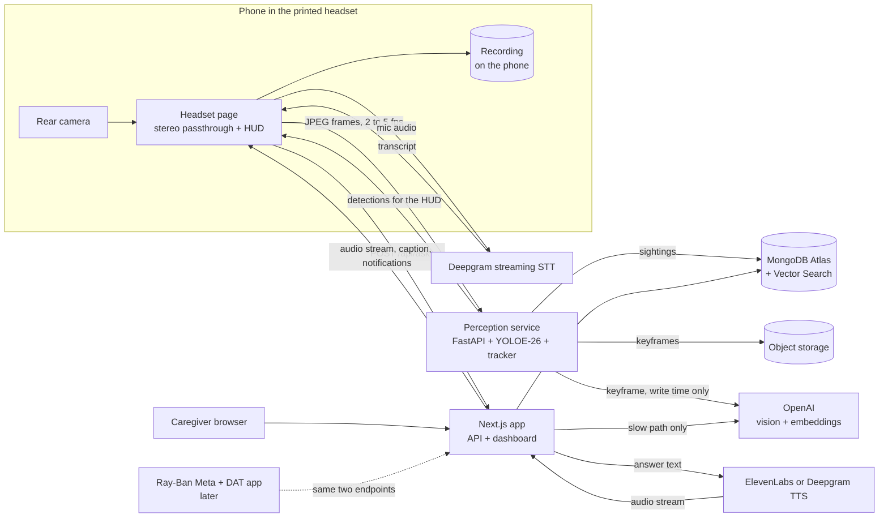

# Memory glasses (working title)

A wearable camera that remembers where things are, for people living with dementia.

The wearer asks out loud, "Where are my keys?" About a second later they hear, "I last saw your keys on the kitchen counter, next to the coffee maker, about twenty minutes ago." The same sentence appears in their view.

The product belongs on glasses, and Ray-Ban Meta was the platform we planned around. We can't get a pair for the hackathon. So this build runs on a phone inside a 3D-printed headset. The phone's rear camera is the wearer's eyes. Its screen shows that camera feed live, with labels and notifications drawn on top, and it can record what it sees. Ray-Ban Meta stays in the plan as a second client on the same contract, for when we have the hardware.

**Status: early build.** `apps/web` has the dashboard shell, stub API routes that return 501, and a Mongo client helper. The `/headset` page works on its own: stereo passthrough from the rear camera, eye calibration saved on the phone, wake lock, local video recording, a stalled-feed card, and a HUD with test captions and test labels. Push-to-talk opens and closes the mic, but no audio reaches speech to text yet, so nothing answers a question. `/sim` runs the same client on a flat page. This README is still the build plan, so edit it freely.

## The problem

Misplacing things and being unable to retrace steps is one of the Alzheimer's Association's ten early warning signs. It can happen many times a day. It's distressing, and it often turns into suspicion that someone stole the item. The caregiver ends up answering the same question again and again.

A camera that already sits on the person's face can watch where objects end up. The wearer doesn't tag anything, charge a tracker, or open an app. They ask a question out loud and get an answer.

## Goals

1. Answer "where is my X?" out loud in under one second at the median, measured from the moment the wearer stops talking.
2. Track everyday items with no tags and no setup by the wearer.
3. Show the wearer a live view through the phone, with the answer, item labels, and notifications drawn over it. Let the phone record that view.
4. Give caregivers a dashboard that shows where things are, what the wearer asked, and how often.
5. Run the full demo without the printed headset, using a laptop webcam or a phone held in the hand, so a failed print can't sink the project.

The hackathon MVP is three validated objects, one enrolled instance per category, phone browser capture, stereo passthrough with a caption HUD, local recording, push-to-talk, basic keyframe descriptions, exact item lookup, one TTS provider, and a minimal dashboard. Get the loop working on a flat page by hour eight, then move it into the headset. Item labels and sighting notifications follow in M5. Room enrollment, visual enrollment, semantic search, the LLM question path, caregiver messages, and uploaded recordings are optional follow-ons; their sections below describe the roadmap, not requirements for the core demo.

Not in v1:

- Medical claims or diagnosis of any kind.
- Face recognition. It's on the stretch list and needs a consent story first.
- Turn-by-turn guidance to the item.
- World-anchored AR. Labels sit in screen space over the video. Pinning a marker to a spot in the room needs camera pose from ARKit or ARCore, which means a native app.
- True stereo or depth. One camera feeds both eyes.
- Ray-Ban Meta support. We have no hardware. The contract leaves room for it.
- A native phone app. The headset client is a web page until the browser stops being enough.
- Languages other than English.

## The headset: a phone in a printed shell

This shapes the whole architecture, so it comes first.

The rig is a Google Cardboard with a camera hole. A 3D-printed shell holds a phone a few centimeters from the wearer's eyes, and two lenses let the eyes focus on the screen. The phone's rear camera looks out through a cutout. A web page shows the camera feed twice, once per eye, and draws the HUD over both copies. The wearer sees the room through the phone.

What this buys us over the glasses:

- No SDK, no developer program, no pairing. `getUserMedia` opens the camera in any phone browser.
- More pixels. The glasses stream tops out at 720p over Bluetooth. A phone camera gives the same page 1080p or more, which goes straight at the small-item problem.
- A display. Glasses could only talk. The headset can caption the answer, label items, and show a notification.
- Recording. `MediaRecorder` writes the camera stream to a file on the phone.
- One device. Camera, mic, speaker, screen, and network are all the phone.

What it costs:

- The wearer sees the world through one camera, with no depth, a narrower view than their eyes, and a visible delay. That's fine for a standing or seated demo in a cleared area. It's not something to walk around a house in, and we don't put it on a person with dementia. It stands in for glasses.
- The touchscreen is behind plastic. Push-to-talk needs a finger slot in the shell, a Bluetooth clicker, or a wake word.
- A phone running its camera, screen, and radio inside a closed box gets hot and drains fast.
- The shell takes hours to print. Start it at hour zero.

### What the print needs

- Two biconvex lenses with a 45 mm focal length, the Google Cardboard spec. Cardboard v1 used 25 mm diameter and v2 used 34 to 37 mm. Match the diameter to the shell design. A shell with no lenses can't be focused at this distance, so buy or salvage the lenses before printing anything.
- A cutout for the rear camera cluster, wide enough that the shell's edge stays out of the widest lens.
- A finger slot under the phone so a thumb can reach the screen. The whole screen is the push-to-talk button.
- A divider between the eyes, so each eye sees only its half of the screen.
- Vents behind the phone and a gap for a charging cable.
- A strap, face padding, and a nose cutout.
- A "camera on" notice on the outside. A phone has no capture light facing bystanders.

Keep the STL, slicer settings, and lens measurements in `hardware/headset/`.

### What the page has to do

- Open the rear camera with `getUserMedia`, at 1080p if the phone allows it. Newer iPhones list each rear lens as its own camera, and [one forum report](https://developer.apple.com/forums/thread/776460) has the picture jumping between lenses when something gets close, even with a device ID set. List the cameras after permission is granted, try each rear entry, and keep the one whose view holds steady with an object at arm's length. Save the choice by label as well as ID, because Safari can change device IDs between visits.
- Choose the lens in M0. The main lens puts more pixels on small items. The ultrawide looks closer to life size through the headset. Detection wins, and the demo wearer can live with a zoomed view.
- Draw the feed once per eye. Start with two `<video>` elements that share one `MediaStream`, side by side, each cropped to its half. That costs no JavaScript per frame. Move to a WebGL pass with barrel distortion only if the lens warping bothers people. The Cardboard v2 coefficients, 0.34 and 0.55, are the starting values.
- Calibrate per phone and per shell. The distance between the two image centers has to match the distance between the lens centers, about 60 to 64 mm, not half the screen width. A zoom control sets how large the world looks. Both are sliders, saved on the device.
- Draw the HUD in both eye views at the same position, so the eyes fuse it into one image.
- Keep the screen on with the Screen Wake Lock API. The browser drops the lock when the page is hidden, so take it again when the page comes back.
- Hide the browser chrome. See the table below for what each phone allows.
- Grab frames for the perception service from the same `<video>`, downscaled to 1280 px wide JPEG. One camera stream feeds the passthrough, the frame upload, and the recorder.
- Pause stops frame uploads and recording. It doesn't stop the passthrough, because that would blind the wearer. Capture starts paused, and the resume control sits on the setup panel, so it's set before the phone goes in the shell.
- Watch for a stalled feed. If no new video frame arrives for a second, the wearer is looking at a frozen room. Cover the view with a "please take off the headset" card and play a tone.

| Capability | Android Chrome | iPhone Safari |
|---|---|---|
| Rear camera and mic | yes | yes |
| Fullscreen API | yes, with orientation lock | no, iPad only. Add the page to the home screen and run it as a web app |
| Screen wake lock | yes | yes from iOS 16.4, and in home screen web apps from 18.4 |
| `MediaRecorder` | yes, WebM | yes, MP4 with H.264 and AAC. WebM from Safari 18.4 |
| WebXR | partial, `immersive-ar` on ARCore phones | no |
| Answer audio while the mic is open | not documented, test it | drops to the earpiece unless handled, see the audio contract |

Checked on 2026-09-19 against caniuse, the WebKit blog, and WebKit's bug tracker. Every limit in the table is on the iPhone side. If the team has an Android phone with a decent camera, put that one in the headset. Whichever phone it is, record the model, OS, and browser version with the M0 smoke test, and treat the table as assumptions until that test passes.

### What a phone browser needs from the network

Camera and mic access need a secure context, and an HTTPS page can't open a `ws://` socket. So the phone needs `https://` for the web app and `wss://` for the perception service from the first test. Use the Vercel deployment, or a tunnel to `pnpm dev`, and put a tunnel in front of the perception service. A LAN IP won't work.

### Capture paths

| Capture path | Video from | Audio from | Wearer sees | Used when |
|---|---|---|---|---|
| A. Flat page, `/sim` | laptop webcam, or a phone held in the hand | laptop or phone mic and speaker | the video with the same HUD, unsplit | from hour one, and as the demo fallback |
| B. Headset page, `/headset` | rear camera of the phone in the shell | phone mic and speaker, or earbuds | stereo passthrough with the HUD | the hackathon demo |
| C. Ray-Ban Meta through a native DAT app | glasses camera | glasses over Bluetooth | nothing, audio only | later, when we have glasses. See "Ray-Ban Meta, the second platform" |

All three paths feed the same two endpoints, a frame WebSocket and `POST /api/ask`. Nothing downstream knows which path is live. Paths A and B are the same client code with a different renderer, so build the loop on A and move it into the headset once the print is done.

## Architecture



Two deployable pieces for the hackathon, and a third later:

| Piece | Stack | Job |
|---|---|---|
| `apps/web` | Next.js App Router, TypeScript, Tailwind, shadcn/ui, MongoDB Node driver | The `/headset` wearer view, the flat `/sim` fallback, the caregiver dashboard, the REST API, the `/api/ask` voice endpoint |
| `services/perception` | Python, FastAPI, Ultralytics YOLOE-26, ByteTrack, pymongo; open_clip later | Takes frames, detects and tracks items, sends detections back for the HUD, writes sightings, requests scene descriptions |
| `apps/ios`, later | Swift, ARKit, Meta DAT, AVAudioEngine | A native shell for the headset once the browser runs out: world-anchored labels, volume-button push-to-talk, a local wake word. Also the Ray-Ban Meta client |

One design rule makes the latency goal reachable. **Do the expensive work when an item is seen, not when it's asked about.** Vision descriptions and optional room classification/embeddings happen at write time in the background. Once enrichment finishes, the answer is one indexed read away. Earlier questions get a conservative pending-description answer.

## What happens when the wearer asks a question

1. Push-to-talk starts the mic stream to Deepgram; release requests finalization. In the headset, push-to-talk is a touch anywhere on the screen through the finger slot. On `/sim` it's a button or the spacebar. A local wake word is optional later. A local chime and a listening mark on the HUD acknowledge the start of listening.
2. Accumulate finalized transcript segments until the turn ends. For Nova-style streaming, `is_final` alone does not mean the question is complete; handle `speech_final` and explicit finalization separately. A Flux adapter must map its own turn events to the same client state machine.
3. The client posts the completed transcript and a unique `requestId` to `/api/ask`.
4. The intent router matches location questions and resolves an item using a wearer-scoped alias map. Cache misses reload safely; aliases are invalidated after configuration changes.
5. One indexed `findOne` returns the latest item snapshot. A template uses current observation state, description readiness, and uncertainty to produce at most two sentences. No LLM runs.
6. MVP fast-path miss: ask which tracked item the wearer means. Later, an LLM may use read-only `find_item`, `search_sightings`, and `list_recent_items` tools. Tenant authorization comes from the session, never from model-supplied IDs.
7. Answer text goes to the chosen TTS provider. The response starts with an interaction ID header, then streams audio to the client.
8. The client plays buffered audio chunks, reports playback timing, and polls the interaction endpoint for text and final server timings. The HUD shows that text as a caption while the audio plays and for a few seconds after.
9. The server records status, answer, and timing stages. Cancellation and failed or partial playback are explicit outcomes.

## Latency budget

Fast-path planning estimates, end of speech to the first spoken answer in the wearer's ear. Chimes do not count:

| Stage | Budget | Notes |
|---|---|---|
| End of speech to completed turn | 450 ms | Initial hands-free silence window is 400 ms plus an estimated 50 ms for finalization; measure push-to-talk separately |
| Intent match and item resolve | 5 ms | In-memory alias map, no network |
| MongoDB read | 30 ms | One `findOne`, app and cluster in the same region |
| TTS time to first audio | 300 ms | Measure our voice, output format, provider, and network; inference claims are not end-to-end latency |
| Remaining transport and playback | 200 ms | Request upload, audio download, buffering, and speaker or earbud routing; validate on demo hardware |
| **Total** | **about 985 ms** | Aspirational P50 under 1 s, P95 under 1.5 s; almost no margin until measured |

The optional slow path targets first spoken audio in under 2 s; measure rather than assuming a fixed LLM overhead. Stage percentiles do not add up to an end-to-end percentile.

Also measure capture-to-queryable-observation and capture-to-queryable-description latency. Initial demo targets are P95 under 2 s and 5 s respectively. Return uncertainty while enrichment is pending. Track correct-location answers, wrong-location answers, and abstentions separately: a fast incorrect answer fails the demo. Record capture sequence numbers, server receipt times, and client playback times. Use monotonic clocks for durations and account for clock skew between devices; verify audible onset using a loopback recording on the demo phone's speaker or earbuds.

The headset adds two delays that have nothing to do with speech. Passthrough delay runs from camera to screen. Keep the `<video>` element on the direct path and never route passthrough frames through JavaScript. Detection age runs from capture to drawn label, and it's several hundred milliseconds at 2 to 5 fps. A label drawn where the keys were half a second ago is worse than no label. So each detection carries its frame's sequence number, and the HUD drops anything older than 500 ms. Measure both on the demo phone.

How we hold the budget:

- Stream every hop. Streaming STT in, streamed LLM tokens, streamed TTS audio out, chunked playback on the phone. Nothing waits for a complete result.
- Skip the LLM on the fast path. Most questions will be "where is my X", and a template answers those.
- Precompute descriptions at sighting time, as described above.
- Denormalize the latest sighting onto the item document so the hot read is a single lookup.
- Reuse MongoDB pools and provider connections where the runtime allows. Caches and warm connections are per process and may disappear. Do not send dummy questions to `/api/ask` to warm it.
- Flush LLM output to TTS at the first clause boundary. Don't wait for the full reply. ElevenLabs and Deepgram both take streamed text over WebSocket.
- Normalize STT input to 16 kHz mono after checking the actual capture format. Bluetooth profiles and sample rates vary by device and OS; do not assume the capture or playback format.
- Put everything in one region. Atlas in `us-east-1`, the Next.js functions in `iad1`, the perception box close by.
- Acknowledge completed turns locally if useful, but log chimes separately from spoken answers.
- Later, speculate on interim transcripts. Once an interim result contains a known item, start the lookup before the wearer finishes the sentence.
- Measure before tuning. Every interaction records per-stage timings, and `pnpm bench:tts` measures the chosen provider from the demo network; compare a second provider only if implemented.

One tension to watch. Short endpointing makes answers fast, but people with dementia often pause mid-sentence. Cut them off and the product fails at its one job. Start at 400 ms of silence and tune it with real speech, per wearer if needed.

## Text to speech: ElevenLabs or Deepgram

| | ElevenLabs Flash v2.5 | Deepgram Aura-2 |
|---|---|---|
| Vendor latency claim | about 75 ms model inference | about 90 ms to first byte, optimized |
| Independent P50 to first audio | about 288 ms | about 313 ms |
| Voice quality | warmer, more natural, large voice library, cloning | clear and a bit businesslike |
| Cost | higher | lower |
| Same vendor as our STT | no | yes |

These published figures are reference points, not a controlled comparison on our hardware. Voice quality is subjective; evaluate intelligibility and an unhurried speaking rate with the selected voice.

Start with ElevenLabs Flash v2.5 behind a small `TTSProvider` interface. Implement one provider for the MVP. Add Deepgram only if testing exposes a concrete problem or time remains. Benchmark identical text and record format, voice, warm/cold connections, sample count, P50, and P95.

Start with Deepgram Nova-3 streaming and push-to-talk. Evaluate Flux later if hands-free pauses are a problem; provider-specific events stay inside the STT adapter.

The fallback if the three-vendor chain gets flaky is OpenAI's Realtime API. `gpt-realtime-2` does STT, reasoning, tool calls and speech over one socket. We don't start there because the fast path needs no LLM at all, and because the voice choice matters.

## Perception pipeline

### Model

Stock YOLO trained on COCO knows 80 classes. It has phone, remote, cup, bottle, book and handbag. It has no keys, wallet, glasses, pill bottle, hearing aid or cane, which are the things people with dementia lose. So stock weights won't do.

We use **YOLOE-26**, the open-vocabulary YOLO in Ultralytics. You give it class names as text and it detects them with no retraining. Prompt preparation and export can reduce overhead, but benchmark our prompt count, input size, and hardware. Pin the package/checkpoint versions and pre-download model assets, including the text encoder, before the demo.

Candidate prompt list. M0 selects three reliable demo objects, one enrolled instance per category, and a small context list. Dashboard editing comes later:

- Tracked items: keys, wallet, phone, eyeglasses, glasses case, TV remote, pill bottle, pill organizer, hearing aid, cane, purse, mug, water bottle, watch, charger.
- Context objects, used to describe location: couch, table, counter, bed, sink, TV, chair, door, refrigerator, microwave, nightstand, desk, shelf.

YOLOE visual prompts can improve recognition of objects resembling an example. They do not establish ownership or persistent identity. Visual enrollment is optional after M3 and requires evaluation with similar-looking objects. Ambiguity triggers clarification or abstention, never silent assignment to the enrolled item.

If small-item detection fails the recorded walkthrough, first try a larger input/model and select reliable demo objects. Fine-tuning is an optional experiment: collection, labeling, training, and held-out evaluation may exceed the hackathon. Neither 200 images nor 30 minutes of training guarantees adequate recall.

### Frame handling

- Sample 2 to 5 fps. Objects at rest don't need 30.
- Drop blurry frames before inference using Laplacian variance. Head-mounted video is full of motion blur.
- Run at image size 960 or higher. Keys at arm's length are a few dozen pixels wide at 720p, which was the glasses' ceiling. The phone isn't capped there. Capture at 1080p, send JPEGs 1280 px wide, and test whether full 1080p frames buy recall on the smallest item.
- The page grabs frames from the same `<video>` that feeds the passthrough. Sampling costs one `drawImage` per frame and no second camera stream.
- The perception service answers each frame on the same socket with that frame's sequence number and its detections for tracked items. The HUD draws labels from those and drops stale ones.
- Benchmark sustained throughput, recall, memory, and thermal behavior on the actual laptop before moving to medium. Upscaling cannot recover detail absent from the source frame.
- Keep at most one pending frame per device, replacing it with the newest frame under load. Log drops and frame age instead of accumulating stale video.
- Use a versioned frame envelope with session ID, sequence number, capture time, dimensions, and byte length. Authenticate the socket, limit sizes/rates, and reject duplicates or expired frames. Reconnect with backoff and a new session; do not replay old camera buffers.

### From detections to sightings

1. ByteTrack IDs are local to a capture session, not persistent identities. Confirm repeated evidence over a configurable window, initially three usable frames within two seconds. Test both 2 and 5 fps with dropped frames.
2. A confirmed track opens a sighting and immediately updates the item's latest-observation snapshot, even while the description is pending. Select a keyframe and enqueue enrichment.
3. Refresh the snapshot while visible, initially every 500 ms when a usable frame arrives. Newer held/moving evidence immediately invalidates confidence in the old resting location; retain that location as history, not the default answer.
4. Close after three seconds without usable observations. Closing is bookkeeping, not the trigger for making a location queryable. Split sightings when the support surface, room, or motion state changes.
5. Do not merge on label, room, and time alone. MVP track breaks preserve separate sightings. Later merging needs evidence of the same instance and unchanged location; uncertainty is acceptable.
6. Apply item updates with an atomic observation-version condition. Order observations using server-normalized capture time and session sequence, not job completion time. Description jobs carry sighting ID, keyframe revision, and observation version. Late results may enrich history but cannot overwrite a newer item snapshot or attach old text to a new frame.

Use unique event IDs and idempotent upserts. Persist description-job state in MongoDB with bounded retries, backoff, worker leases, and terminal failure status; the existing perception worker can process it without another queue service. Bound queued jobs and coalesce obsolete keyframes. Return uncertainty if enrichment fails.

### Description job

Runs in the background and never blocks the frame loop. It sends the keyframe and the item's bounding box to an OpenAI vision model and gets structured output back:

```json
{
  "room": "kitchen",
  "surface": "counter",
  "relation": "next to the coffee maker",
  "state": "resting",
  "sentence": "on the kitchen counter, next to the coffee maker"
}
```

`state` is `resting`, `held`, `moving`, `in_use`, or `unknown`. Room may be `unknown`; surface and relation may be null. A single still image may not establish motion or resting state. Structured output validates shape, not truth: combine temporal evidence with visible context and omit unsupported details. Newer held/moving evidence supersedes the old resting answer.

Basic descriptions are part of M1/M3. Before enrichment finishes, use only independently established details; otherwise say "I saw your keys, but I could not tell where they were." Do not infer a room solely from a nearby object.

In the optional semantic-search phase, embed item name, aliases, room, surface, relation, and state together, for example "keys; car keys; kitchen counter; next to coffee maker; resting". Record the embedding model/version. Location-only sentences lack item semantics needed for fuzzy retrieval.

Vision calls are capped per item per minute so a cluttered desk can't run up the bill.

### Rooms

The MVP vision model may name a room type or return `unknown`. Optional room enrollment stores CLIP reference frames under family-provided names. Evaluate similarity thresholds, margins between competing rooms, and temporal consistency; top-five majority vote alone must not force unfamiliar scenes into known rooms. Classification of uploaded frames is descriptive and cannot enforce pre-upload privacy.

## Data model

Both services derive `patientId` from an authenticated caregiver session or scoped device credential, never an untrusted request body. Every tenant-owned collection and cache is scoped to it. Apply ownership checks to reads, writes, storage URLs, debug streams, configuration, STT token minting, queued jobs, and optional model tools. Rate-limit token minting and inference.

```js
// items: one per tracked thing. The hot path reads only this.
{
  _id, patientId,
  name: "keys",
  aliases: ["car keys", "house keys", "key ring"],
  detectorPrompts: ["keys", "key ring"],
  referenceImages: ["s3://..."],
  nameEmbedding: [/* 1536 */],
  lastSighting: { sightingId, observationVersion, keyframeRevision, sentence, room, state, lastSeenAt, thumbKey, descriptionStatus },
  lastRestingSighting: { /* historical; newer held/moving evidence supersedes it */ },
  locationStatus: "observed" | "moved" | "uncertain",
  usualSpots: [{ sentence: "on the hook by the front door", share: 0.62 }]
}

// sightings: one per continuous period an item stayed in view
{
  _id, patientId, itemId, label: "keys",
  status: "open" | "closed",
  firstSeenAt, lastSeenAt, expiresAt,
  sessionId, eventId, observationVersion, keyframeRevision,
  descriptionStatus: "pending" | "ready" | "failed",
  confidence, bbox: [x, y, w, h], frameSize: [1280, 720],
  room: { id, name: "kitchen", confidence: 0.91 },
  surface, relation, state,
  sentence: "on the kitchen counter, next to the coffee maker",
  nearbyObjects: ["coffee maker", "mug"],
  keyframeKey, thumbKey, // mint signed URLs on authorized reads
  searchText, sentenceEmbedding: [/* 1536; optional */], embeddingModel,
  source: "headset" | "simulator" | "glasses"
}

// rooms and room_refs: caregiver-enrolled rooms and their CLIP reference frames
{ _id, patientId, name: "the den", private: false }
{ _id, patientId, roomId, embedding: [/* 512 */], imageKey, expiresAt }

// interactions: every question, with timings
{
  _id, patientId, requestId, askedAt, transcript, expiresAt,
  status: "generating" | "streaming" | "complete" | "failed" | "cancelled",
  path: "fast" | "llm", itemId, answerText,
  timingsMs: { stt, intent, db, llmFirstToken, ttsFirstByte, clientFirstPlayback, total },
  playbackReportedAt // absent until client telemetry arrives
}

// notifications: optional, after M3. Caregiver messages and reminders waiting for the HUD.
// Captions and sighting notifications are built on the client and never stored here.
{
  _id, patientId, createdAt, expiresAt,
  kind: "caregiver_message" | "reminder",
  text: "Lunch is at noon.",
  showAt, // reminders only
  status: "queued" | "shown" | "expired",
  shownAt
}

// recordings: optional, after M3. Only exists once recordings leave the phone.
{
  _id, patientId, sessionId, startedAt, endedAt, expiresAt,
  mimeType, width, height, hasAudio: false,
  chunks: [{ seq, startedAt, durationMs, key, bytes }] // mint signed URLs on authorized reads
}

// patients, caregivers, devices: accounts, settings, device tokens
```

Indexes:

| Collection | Index | Serves |
|---|---|---|
| `items` | `{ patientId: 1, name: 1 }` | fast path lookup |
| `sightings` | `{ patientId: 1, itemId: 1, lastSeenAt: -1 }` | timelines, history |
| `sightings` | vector on `sentenceEmbedding`, filters `patientId`, `itemId`, `lastSeenAt` | open-ended questions |
| `room_refs` | vector on `embedding`, filter `patientId` | room classification |
| `interactions` | `{ patientId: 1, askedAt: -1 }` | question log |
| `sightings` | unique `{ patientId: 1, eventId: 1 }` | idempotent ingestion |
| `interactions` | unique `{ patientId: 1, requestId: 1 }` | request deduplication |
| `notifications` | `{ patientId: 1, status: 1, showAt: 1 }` | HUD poll, optional |
| `recordings` | `{ patientId: 1, startedAt: -1 }` | recordings list, optional |
| retained records | indexed `expiresAt`, cleanup worker | coordinated retention; TTL is only a secondary safeguard |

### Where vector search earns its place

"Where are my keys?" doesn't need it. That's an exact lookup, and an exact lookup is faster. Vector search is optional after M3 and does the fuzzy work. The MVP needs no vector indexes.

- Structured room/time questions. "What did I leave in the bedroom?" first uses room/time filters and latest observations per item, excluding items subsequently seen elsewhere. Say "I saw…" unless placement is established.
- Semantic questions. "Where did I put that thing from the pharmacy?" searches enriched item/location text, filtered to the wearer and time window. Weak or closely matched candidates trigger clarification.
- Hybrid search. Combine the vector query with Atlas full-text search over `searchText` using `$rankFusion`. That stage needs MongoDB 8.1 or later. On an older cluster, app-side fusion is optional and requires its own evaluation.
- Room classification against `room_refs`.
- Episodic memory, a stretch goal. Periodic scene captions go in a `memories` collection and answer "what did I do this morning?"

Fuzzy item names skip Atlas entirely. "The thing that opens the car" should resolve to keys, but a wearer has maybe 30 items. Embed the phrase and compare against 30 cached vectors in memory. The local comparison is cheap, but generating a query embedding adds network latency that must be measured. It needs no search index. The free M0 tier caps search indexes, so check the limit before adding a third.

## What the wearer hears and sees

Speech comes first and the HUD repeats it. The wording matters as much as the speed. These rules follow standard dementia communication guidance: short sentences, one idea at a time, never argue, never test.

- Two sentences at most. Location first, then when.
- Use the family's words. If the caregiver named the room "the den", say "the den".
- Round the time. "A few minutes ago", "about an hour ago", "this morning". Nobody wants to hear "47 minutes ago".
- Never mention repetition. The tenth "where are my keys" gets the same calm answer as the first.
- No quizzing and no correcting. Never "do you remember?", never "you already asked".
- Always describe an observation, not a guaranteed current location. Initially label observations older than 15 minutes as stale; this configurable demo threshold does not establish correctness.
- Offer a usual spot only when explicitly configured or supported by enough history. Omit the suggestion otherwise.
- Newer held/moving evidence supersedes an old resting location. Unknown location, ambiguous identity, and pending descriptions have explicit uncertainty wording.
- Speak slower than the default rate. The rate is a per-wearer setting.

```text
fresh    I last saw your {item} {sentence}, {relative_time}.
stale    I last saw your {item} {sentence}, {relative_time}.
held     I last saw your {item} in your hand, {relative_time}.
moved    I saw your {item} being moved. I could not tell where {it/they} ended up.
unknown  I saw your {item}, but I could not tell where {it/they} {was/were}.
unseen   I haven't seen your {item} in my available history.
ambiguous Which {item} do you mean?
```

An optional second sentence may suggest a known usual spot. `usualSpots` is empty in the MVP unless configured. Later aggregation must retain sample counts and avoid counting fragmented tracks as independent placements; do not infer a usual spot from sparse history.

The LLM path gets the same rules in its system prompt, plus a hard cap on reply length.

### What the HUD shows

| Element | When it appears | Milestone |
|---|---|---|
| Answer caption | while the answer plays, and for a few seconds after | M2 |
| Listening mark | while push-to-talk is held | M2 |
| Capture state | paused, recording, or connection lost | M2 |
| Item label | a tracked item is in view and its detection is under 500 ms old | M5 |
| Sighting notification | a sighting opens for a tracked item. "I can see your keys." | M5 |
| Caregiver message or reminder | the caregiver sends one from the dashboard, or a reminder comes due | optional, M6 |

Rules for the screen, in the same spirit as the rules for speech:

- Voice first. The caption uses the spoken sentence word for word, so the two never disagree. The vision research note cites a [2026 JMIR Aging survey](https://doi.org/10.2196/81840) where older adults with cognitive impairment preferred audio to visual information. Nothing important appears only on screen, which also keeps the audio-only glasses port honest.
- One thing at a time. No stacks, no badges, no counters. A new notification replaces the old one.
- Large, high-contrast text in the lower middle of each eye's view. The edges of a Cardboard lens are blurry.
- Hold text long enough to read twice, then fade. No flashing and no sliding in from the side.
- Label tracked items only. Boxes on every chair and mug make the room harder to read.
- Rate-limit sighting notifications per item. Seeing the keys all afternoon produces one notification, not forty.
- Caregiver messages and reminders are also spoken, and they follow the speech rules above. They never interrupt an answer.
- System trouble gets calm words, "I need a moment", and the caregiver sees the real error on the dashboard. The one blunt message is the stalled-feed card, "Please take off the headset."
- The caregiver sets the HUD level per wearer: everything, captions only, or off.

## Caregiver dashboard

MVP by M3: read-only item cards, latest question/answer, latency, and capture/pause status. Enrollment, timelines, charts, and room controls are optional later work.

- **Items.** A card per item with a thumbnail, the location sentence and "seen 20 min ago". Click through to a timeline of sightings with keyframes.
- **Add an item.** Name, aliases and a few photos. Saving pushes the new prompt list to the perception service.
- **Rooms.** Enroll a room by walking through it. Mark rooms private for the later on-device privacy gate; do not present server-side labels as a pre-upload privacy guarantee.
- **Questions.** A log of what the wearer asked and what they heard. A chart of questions per day per item. A jump in repeated questions can flag a hard day. The dashboard states it as a count and nothing more. It isn't a diagnostic.
- **No live view.** The caregiver side carries no camera stream. Judges and caregivers watch the wearer's own screen, mirrored from the phone or run on `/sim`.
- **Messages.** Optional. Send a short message or set a reminder. The HUD shows it and the voice reads it.
- **Recordings.** Optional. Lists recordings once they leave the phone. Until then a recording is a file on the phone.
- **Latency.** P50 and P95 per stage, read from `interactions`.
- **Settings.** Voice, speaking rate, HUD level, whether recording is allowed, wake word sensitivity, retention window.
- **`/headset`.** The wearer's view. Stereo passthrough, the HUD, touch-anywhere push-to-talk, local recording, and a setup panel for lens choice and eye calibration.
- **`/sim`.** The same client on a flat page. Webcam and mic in, answer audio out, the HUD over an unsplit video. It's for laptop development and it's the demo fallback.

MVP updates poll authenticated endpoints every two seconds. Later change streams plus SSE require reconnect/resume handling, connection cleanup, and deployment-aware timeouts. Vercel streamed responses still have duration limits; a function is not a permanent relay.

Auth in v1 is one caregiver login and one seeded wearer. Devices send a bearer token that maps to a `patientId`. The `/headset` and `/sim` pages count as devices. The caregiver signs in on the phone once, and the page trades that session for short-lived tokens.

## API sketch

Next.js:

| Route | Does |
|---|---|
| `POST /api/ask` | Takes `{ transcript, requestId }`, returns `X-Interaction-Id` before streaming audio; deduplicates by wearer and request ID |
| `GET /api/stt/token` | Mints a short-lived Deepgram key so the client streams audio to Deepgram directly and skips a hop |
| `GET /api/perception/token` | Mints a short-lived token for the frame socket. A browser can't set headers on a WebSocket, so the page sends it as the first message |
| `GET, POST /api/items`, `PATCH /api/items/:id` | Item CRUD and photo enrollment |
| `GET /api/sightings` | Filter by item and time range |
| `GET, POST /api/rooms` | Room CRUD and enrollment |
| `GET /api/interactions` | Question log and latency stats |
| `GET /api/interactions/:id` | Poll authorized answer text, status, and final server timings |
| `POST /api/interactions/:id/playback` | Record client playback/turn timings, labeled as client-reported telemetry |
| `GET /api/notifications`, `POST /api/notifications/:id/shown` | Optional. The device polls for queued caregiver messages and due reminders, then marks them shown |
| `POST /api/notifications` | Optional. The caregiver queues a message or a reminder |
| `POST /api/recordings`, `POST /api/recordings/:id/chunks` | Optional. Registers a recording and returns a signed upload URL per chunk. Not needed while recordings stay on the phone |

Perception service:

| Route | Does |
|---|---|
| `WS /ws/frames` | Binary JPEG frames in, with the versioned session/sequence/timestamp envelope. JSON out per frame: `{ seq, detections: [{ itemId, label, bbox, confidence }] }` with boxes normalized to the frame, for the HUD |
| `POST /config/classes` | Reloads the prompt list after a caregiver edits items |
| `GET /health` | Model loaded, current fps, queue depth |

Audio contract: initially stream raw signed 16-bit little-endian PCM, mono, 24 kHz, with format metadata fixed before the response body starts. Normalize provider output on the server. The browser uses a bounded AudioWorklet buffer; a later native app schedules PCM buffers with AVAudioEngine. Validate this in M2, including byte alignment, underruns, cancellation, and interruption by a new question. Disconnects cancel upstream work where possible; failed or partial playback is not success. Duplicate requests return the existing interaction ID/status without starting another provider request or replaying a consumed live stream.

iPhone Safari needs care here. WebKit picks the audio session from the media calls a page makes, and an open mic puts it in play-and-record, where answer audio can come out of the earpiece at low volume. [One developer's write-up](https://samueleddy.com/writing/ios-safari-audio-sessions/) of a Safari voice mode lands on four fixes. Play answers through an `AudioContext`, which the AudioWorklet path already does. Resume that context inside the push-to-talk touch. Open the mic when the touch starts and stop its tracks when it ends, so the session is back in playback before the answer arrives. Set `navigator.audioSession.type` where it exists. Test all of it on the demo phone in M0, with the camera running, because the camera stream has to survive the mic opening and closing.

Headers cannot contain final slow-path text or end-to-end timings before those values exist. Fetch them by interaction ID. `Server-Timing` may contain only stages completed before headers are sent; client telemetry supplies actual playback timing.

Both services write to MongoDB. Version the shared contract and generate JSON Schema from one canonical definition for cross-language validation. Shared fixtures must pass both Zod and Pydantic validation, avoiding independently drifting schemas. Perception owns sightings and latest-observation fields; web owns caregiver configuration and interactions. Configuration reloads are tenant-scoped and versioned; alias changes invalidate caches.

## Privacy and safety

An always-on camera in someone's home is a serious thing, and the wearer may not be able to give informed consent. The family or a legal proxy has to. The design should deserve their trust.

- The MVP runs in an explicitly approved demo area with a visible capture/pause control. Capture starts paused; reconnects require explicit resumption. Pause before leaving that area. Automatic private-room exclusion is not an MVP capability.
- State the actual flow: raw frames reach the selected perception host in memory. Only selected, downscaled, face-blurred keyframes may reach object storage or the external vision provider. Blurring on that host does not mean raw frames never left the capture device. Exclude raw frames from logs and error reporting.
- A future automatic privacy gate must run on the capture device before any upload, including debug frames and thumbnails. Private or unknown rooms block transmission and storage until cleared locally. Server-side room recognition cannot enforce this. Bathrooms and bedrooms default to private when that gate is implemented.
- Pause stops uploads and cancels/drops queued frames and description work; it cannot retract data already sent externally. Document provider retention settings before any real-home use.
- Retention defaults to 30 days. A retryable cleanup job removes expired sightings, keyframes, thumbnails, embeddings, interactions, and related jobs, clears item snapshots pointing to removed sightings, and recomputes derived usual spots. Apply a stated retention policy to enrollment images too. Exclude expired data from reads immediately rather than relying on delayed TTL deletion. Storage lifecycle rules are a backstop; document backup/provider retention separately.
- Audio leaves the device only during push-to-talk or after a future local wake word fires. Show listening state and provide an immediate stop control.
- A phone has no capture light facing bystanders, and Ray-Ban Metas do. The shell carries a visible "camera on" notice, and the HUD shows capture and recording state to the wearer. We don't try to hide the camera.
- Recording is off by default and the caregiver setting has to allow it. In the MVP the file stays on the phone and nothing uploads it. The HUD shows a recording mark the whole time. Pause stops the recording along with everything else. Recordings follow the same retention window as sightings, and a recording that leaves the phone needs the same signed-URL access and the same cleanup job.
- Record video without the mic track by default. Massachusetts punishes secret recording of conversations, and the demo happens in Massachusetts. If audio is ever recorded, everyone in the room hears that it's on.
- Recordings are raw frames. They skip the face blur that keyframes get. That's the reason they stay on the phone until there's a consent story for uploading them.
- Store object keys and mint short-lived signed URLs after authorization. Use encrypted transport/storage and server-side provider keys. Device credentials are scoped, revocable, and expiring.
- Test tenant isolation on both services, including writes, sockets, storage URLs, configuration, caches, token minting, and jobs. One seeded wearer does not justify unauthenticated public endpoints.
- Present the demo as an assistive prototype with no diagnosis or medication-adherence conclusions. A pill organizer sighting does not prove medication was taken.

The headset adds a physical risk the glasses didn't have. The wearer can't see the room except through the page.

- Demo standing still or seated, in a cleared area, with a teammate next to the wearer. No stairs and no walking between rooms with the headset on.
- One camera gives no depth, the view is narrower than eyesight, and it lags. Reaching for an object takes a moment of practice. Say so before handing the headset to a judge.
- If the feed stalls, the wearer is looking at a frozen room. The stalled-feed card covers the view and a tone plays. If the page crashes, the screen goes dark or shows the browser, which at least looks broken.
- Check the phone's temperature after twenty minutes in the shell. A phone that overheats dims its screen and throttles the camera, and it sits against someone's face.
- We say plainly that this rig stands in for glasses. We don't put it on a person with dementia.

One ethical question stays open. ElevenLabs can clone a family member's voice, and hearing a daughter's voice might be comforting. It might also confuse someone who then looks for her in the room. We don't build this without input from someone who works in dementia care.

## Repo layout

```text
hackmit26/
  README.md
  CLAUDE.md                  repo layout, commands, gotchas
  apps/
    web/                     Next.js dashboard, API, /headset, /sim
    ios/                     later: native headset shell with ARKit, and the Ray-Ban DAT client
  services/
    perception/              FastAPI, YOLOE-26, tracker, description jobs
  packages/
    shared/                  zod schemas and types
  hardware/
    headset/                 STL, slicer settings, lens measurements
  scripts/
    create-indexes.ts        Atlas indexes, vector ones included
    seed.ts                  demo wearer, items, fake sightings
    bench-tts.ts             benchmarks the chosen TTS provider; optional comparison
    replay.py                plays a recorded video into /ws/frames
  docs/
    decisions/               ADRs
```

pnpm workspaces for the JavaScript side, uv for Python.

## Environment variables

```bash
# MongoDB
MONGODB_URI=
MONGODB_DB=memory_glasses

# OpenAI. Model IDs live in env so we pick the current small, fast tier at build time
OPENAI_API_KEY=
OPENAI_CHAT_MODEL=
OPENAI_VISION_MODEL=
OPENAI_EMBEDDING_MODEL=text-embedding-3-small

# Speech
DEEPGRAM_API_KEY=
DEEPGRAM_STT_MODEL=
TTS_PROVIDER=elevenlabs          # or deepgram
ELEVENLABS_API_KEY=
ELEVENLABS_VOICE_ID=
ELEVENLABS_MODEL=eleven_flash_v2_5
DEEPGRAM_TTS_MODEL=
PICOVOICE_ACCESS_KEY=

# Storage for keyframes, any S3-compatible bucket
S3_ENDPOINT=
S3_BUCKET=
S3_ACCESS_KEY_ID=
S3_SECRET_ACCESS_KEY=

# Wiring. The phone page opens the frame socket itself, so this is the public wss:// URL
NEXT_PUBLIC_PERCEPTION_WS_URL=
DEVICE_TOKEN_SECRET=
AUTH_SECRET=
```

## Running it

The pnpm commands exist. `services/perception` and `replay.py` don't yet.

```bash
pnpm install
pnpm db:indexes                  # create Atlas indexes
pnpm db:seed                     # demo wearer and items
pnpm dev                         # Next.js on :3000
pnpm bench:tts                   # chosen-provider latency benchmark

cd services/perception
uv sync
uv run uvicorn app.main:app --port 8000
uv run python ../../scripts/replay.py fixtures/kitchen.mp4

# The phone needs https:// and wss://. Tunnel both dev servers, one command per terminal.
cloudflared tunnel --url http://localhost:3000
cloudflared tunnel --url http://localhost:8000
```

`next dev` blocks dev assets for hostnames it doesn't know. `apps/web/next.config.ts` allows `*.trycloudflare.com`. Add the hostname there if you use a different tunnel. Open `/headset` on the phone from the tunnel URL, tap Start, and put the phone in the shell. A recording made on the phone is also a replay fixture: copy the file off and feed it to `replay.py`.

## Testing

- Unit tests for intent routing, answer templates, relative time, and the sighting state machine using Vitest and pytest.
- Replay annotated walkthroughs with expected identity, location changes, and uncertainty. Cover pickup from a resting spot, similar objects, questions while an item remains visible, pending/failed descriptions, unknown rooms, dropped frames, reconnects, duplicate events, and jobs finishing out of order. Assert that old jobs never overwrite newer evidence. Record wrong-location answers and abstentions, not just detection counts.
- A golden set of about 30 questions, including aliases, unknown items, and ambiguous references. Recorded speech cases include slow speech and mid-sentence pauses.
- Report P50/P95 and sample count on a fixed replay/speech set, separating cold/warm and push-to-talk/hands-free runs. Measure speech-end to spoken answer and capture to queryable observation/description. Seeded reads isolate API performance but do not prove end-to-end success. Keep network-dependent benchmarks separate from deterministic unit-test gates.
- Audio integration checks cover finalized segments versus complete turns, playback on the demo phone's browser with the camera running, interruption, provider failures, and no chime counted as answer audio.
- Headset checks run on the demo phone inside the shell. The two eye views fuse without strain after calibration. A caption is readable through the lenses. Labels older than 500 ms never draw. The stalled-feed card appears when the camera track is stopped by hand. Wake lock holds for twenty minutes. Recording starts, shows its mark, stops on pause, and produces a playable file. Push-to-talk works through the finger slot. Log the phone's temperature and battery at the start and end of a twenty minute run.
- Tenant isolation checks on API routes, sockets, background jobs, caches, and storage access.
- Privacy/retention checks cover pause, queued-job cancellation, expiry filtering, deletion retries, and removal of denormalized snapshots and images.
- Contract fixtures validate identical payloads in Python and TypeScript. Pin dependencies/model assets and run a clean startup before rehearsal.

## Build order

Hours assume a 24-hour hackathon and three or four people. Edit to fit the team.

| Milestone | Hours | Work | Done when |
|---|---|---|---|
| M0 Setup and feasibility | 0 to 1 | Accounts, repo skeleton, auth, model downloads. Get the lenses and start the headset print. Put both dev servers behind tunnels and smoke-test camera, lens choice, mic, speaker, wake lock, and the home screen web app on the demo phone. Record a walkthrough with that phone and select three reliable objects | Phone capture and inference run over HTTPS; the print is running; chosen objects, phone model, and browser limits are recorded |
| M1 Perception and descriptions | 1 to 6 | Bounded ingestion, tracker, versioned sightings, immediate item updates, basic keyframe descriptions, privacy/pause flow | A real object has a queryable location; pickup invalidates its old resting answer |
| M2 Voice, HUD, and minimal dashboard | 1 to 6, parallel | Push-to-talk `/sim`, one STT/TTS provider, exact lookup, PCM playback, interaction polling, the caption HUD, cards and timings. Alongside it, the `/headset` stereo view with calibration, wake lock, local recording, and the stalled-feed card | Seeded questions produce audible, captioned answers and client playback timings on the phone |
| M3 Join | 6 to 8 | Real sightings/descriptions answer real questions; test movement and immediate queries | Three objects work end to end on path A with the demo phone as the camera, with honest uncertainty and measured accuracy/latency |
| M4 Reliability | 8 to 12 | Dropped frames, retries, late jobs, ambiguous items, privacy/retention checks, pause and failure UX | Replay checks pass; stale evidence never replaces newer observations |
| M5 Headset | print from hour 0; integration 8 to 16 | Fit the lenses and the phone, calibrate, touch-anywhere push-to-talk through the finger slot, item labels and sighting notifications from live detections, the twenty minute heat and battery run | The M3 loop works with the phone in the shell and a teammate wearing it, or path A remains the demo |
| M6 Optional extension | 12 to 18, only after core checks pass | Choose one: semantic questions, visual enrollment, caregiver messages and reminders on the HUD, or a richer dashboard. Wake word, room enrollment, and recording upload compete for this time | The chosen feature passes an evaluation without destabilizing M3 |
| M7 Polish | 18 to 24 | Freeze features, measure accuracy/latency, demo script, backup recording, docs | Two clean rehearsals including the path A fallback |

M3 is the cut line. If it slips, drop M6. Do not try to build every roadmap feature. Reserve the final six hours for reliability and rehearsal. The subsecond target is aspirational until measured; do not shorten endpointing at the expense of understanding the question.

### Demo script

1. A teammate wears the headset in the approved demo area with a spotter beside them. The wearer's phone screen is mirrored to a laptop facing the judges, or the same flow runs on `/sim`. Resume capture and put a validated object on a counter. If the headset didn't pass M5, hold the phone in the hand on path A.
2. Ask where it is, including once while it remains visible. Hear "I last saw…" with a time, see the same words as a caption, and show the description/thumbnail.
3. Pick it up and ask again. Confirm the system does not confidently send the wearer back to the counter. Put it on a new surface and ask after enrichment.
4. Ask about an unseen item to demonstrate uncertainty. Show an enrolled alias; demonstrate semantic matching only if that optional feature passed evaluation.
5. Show the item label and the sighting notification if M5 shipped them. Stop the recording and play the file back. Then show the question log, speech/sighting latency, and pause control. Rehearse the same sequence on path A.

## Risks

| Risk | Plan |
|---|---|
| The print fails, runs late, or the lenses don't show up | Start the print at hour zero and buy a Cardboard viewer as a spare shell. Path A on a handheld phone is the demo if both fail |
| iPhone Safari limits: no fullscreen, earpiece audio, lens switching | Home screen web app, the four audio fixes under the audio contract, one lens picked by ID. Prefer an Android phone if there's a choice |
| The wearer can't reach the screen | Finger slot in the shell. Test a Bluetooth clicker that sends arrow or Enter keys, which the page sees as `keydown`. Camera shutter remotes usually send volume-up, which a page never sees |
| Labels lag the head | Drop detections older than 500 ms, label tracked items only, and fade rather than chase. Item labels are M5, behind the caption HUD |
| The view makes the wearer queasy or unsteady | Seated or standing demo with a spotter, short sessions, calibration before wearing, and the flat page as the fallback |
| Open-vocabulary detection misses small items | Bigger image size, medium model, visual prompts, then the fine-tune fallback. Pick demo items that detect well |
| The phone overheats or drains in the shell | Vents, screen brightness below full, 2 to 5 fps uploads, a power bank cable. Run the twenty minute test on day one |
| Hackathon Wi-Fi is slow or blocks traffic | Tunnels are already in the path. By our estimate, 1280 px JPEGs at 3 fps need about half a megabyte a second up. Drop to 2 fps or 960 px, or move the phone to a hotspot |
| Endpointing cuts off slow speakers | Tune the silence window, try Flux end-of-turn detection |
| Vision model invents a location | Ground details in visible evidence, allow unknown fields, evaluate wrong-location answers, and abstain when unsupported. Structured output alone is not factual validation |
| Someone else moved the item | Answers always carry the time. Stale sightings trigger the stale template |
| The phone suspends the page | Wake lock, a home screen web app, and no app switching during the demo. A screen lock or an incoming call stops the camera, so turn on Do Not Disturb. Take the camera and the lock again when the page comes back |
| Two items share a label | One instance per category in the controlled MVP scene; ambiguity triggers clarification. Visual prompts require independent identity evaluation |
| Atlas free tier limits | MVP needs no vector indexes. Check limits and supported operators before optional search work |
| Backlogs yield stale answers | Drop old frames, coalesce jobs, and guard item updates by observation version |
| Room classifier misses private areas | MVP uses manual pause; automatic exclusion requires an on-device pre-upload gate |

## Ray-Ban Meta, the second platform

The product still belongs on glasses, and Ray-Ban Meta is the pair we planned around. Supporting them later means one more client on the frame socket and `/api/ask`. Nothing server-side changes. What we found before the switch:

- Ray-Ban Meta glasses don't run third-party code. Everything goes through a phone app.
- Meta's Wearables Device Access Toolkit, DAT for short, is a Swift and Kotlin SDK. A phone app uses it to pull a video stream or a photo from the glasses. It was in developer preview, version 0.9 on iOS, when we checked. Preview apps can't be published to the public, but they run on the developer's own glasses.
- Video tops out at 720p and 30 fps because it travels over Bluetooth. The SDK lowers both when bandwidth drops.
- Audio uses the Bluetooth headset path rather than DAT. Test mic selection, speaker routing, and simultaneous video and audio on the real phone and glasses. Pairing alone doesn't prove the capture path works.
- There's no web SDK for the camera. Meta's Web Apps target the Ray-Ban Display model and don't document camera access. So unlike the headset, the glasses need the native `apps/ios` app.
- The toolkit docs say nothing about hooking "Hey Meta". Push-to-talk or a local wake word it is.
- The SDK ships MockDeviceKit, which fakes a pair of glasses, so the app can be written before hardware arrives.
- Access needs a Wearables Developer Center registration, the Meta AI app, developer mode on the glasses, and a supported country. Start that paperwork well before the glasses show up.

The HUD doesn't carry over. Ray-Ban Meta has no display, so captions, labels, and notifications turn into speech. That's why the HUD rules keep everything important in the voice. The Ray-Ban Display model has a small screen and runs Web Apps, which might carry a caption. Check that once we have one.

## Stretch goals

- Run the detector on the phone. In the page that means ONNX Runtime Web, in a native app Core ML. Frames never leave the device and only sighting events go upstream. This is the right production design for privacy, bandwidth and battery.
- World-anchored labels. A native shell with ARKit or ARCore knows where the phone is in the room, so a label stays on the keys while the head turns, and an arrow can point at an item that's out of view.
- Upload recordings for caregiver review, face-blurred, once there's a consent story for it.
- The Ray-Ban Meta client, described above.
- "Who is this?" for enrolled family members, with consent.
- Medication-related object location only. Do not infer ingestion or adherence from organizer sightings or hand interaction.
- Put-down detection. Hand and object overlap marks the moment an item gets set down, which beats "last seen".
- Episodic memory. "What did I do this morning?"
- Caregiver alerts, for example when the wallet hasn't been seen in two days.
- Guidance. "You're getting closer." With world-anchored labels it can be an arrow as well as a voice.
- Reminders spoken at set times.

## Open decisions

Things to settle before building. Edit this list.

1. Product name. "Memory glasses" names the product, not the headset. If wake word work is selected later, test candidate phrases for false and missed activations.
2. Team size and skills. Who owns the print and the lenses? Swift only matters for the later native shell and the Ray-Ban client.
3. Which phone goes in the headset. An Android phone avoids every iPhone Safari limit in the capability table. It has to fit the shell with its case off, and its rear camera has to line up with the cutout.
4. Where the perception service runs. A teammate's laptop, or a cloud GPU such as Modal.
5. ElevenLabs or Deepgram as the default voice. The benchmark informs it, but the voice itself should decide.
6. Whether a local wake word fits after M3. Push-to-talk through the finger slot is the MVP decision.
7. Auth implementation for one caregiver and scoped devices. Use environment/secrets, never committed passwords or unauthenticated public endpoints.
8. Keyframe storage. S3-compatible bucket is the plan, GridFS is the no-new-account fallback.
9. Deploy target for the web app. Vercel is the default, and its HTTPS URL is also the easiest way onto the phone. MongoDB Atlas is also available through the Vercel Marketplace.
10. Shell design. Print an existing Cardboard-style model with a camera cutout, or draw our own. The lens diameter follows from the model.
11. Main lens or ultrawide for the passthrough. Decide in M0 from measured recall and from how the view feels in the headset.
12. Whether a recording ever keeps the mic track. The default is video only.

## References

Headset and phone browser:

- [Cardboard viewer parameters in `cardboard-vr-display`](https://github.com/immersive-web/cardboard-vr-display/blob/master/src/device-info.js), including the v2 lens distortion coefficients
- [caniuse on the Fullscreen API](https://caniuse.com/fullscreen), iPad only on iOS
- [caniuse on Screen Wake Lock](https://caniuse.com/wake-lock) and [WebKit bug 254545](https://bugs.webkit.org/show_bug.cgi?id=254545), fixed for home screen web apps in iOS 18.4
- [WebKit features in Safari 18.4](https://webkit.org/blog/16574/webkit-features-in-safari-18-4/), which added WebM to `MediaRecorder`
- [caniuse on WebXR](https://caniuse.com/webxr)
- [A write-up on iOS Safari audio sessions for a voice mode](https://samueleddy.com/writing/ios-safari-audio-sessions/) and the [W3C Audio Session draft](https://www.w3.org/TR/audio-session/)
- [iOS 16.3 exposing every rear lens to `enumerateDevices`](https://dominikschilling.de/notes/ios-access-all-back-cameras-mediadevices-api/) and [an Apple forum thread on lens switching in `getUserMedia`](https://developer.apple.com/forums/thread/776460)
- [Next.js `allowedDevOrigins`](https://nextjs.org/docs/app/api-reference/config/next-config-js/allowedDevOrigins)
- [Massachusetts recording law, from the Digital Media Law Project](https://www.dmlp.org/legal-guide/massachusetts-recording-law)

Ray-Ban Meta:

- [Meta Wearables Device Access Toolkit announcement](https://developers.meta.com/blog/introducing-meta-wearables-device-access-toolkit/)
- [Meta wearables developer FAQ](https://developers.meta.com/wearables/faq/)
- [DAT for iOS](https://github.com/facebook/meta-wearables-dat-ios) and [DAT for Android](https://github.com/facebook/meta-wearables-dat-android)
- [UploadVR on the DAT preview, with the 720p and 30 fps limits](https://www.uploadvr.com/meta-wearables-device-access-toolkit-public-preview/)
- [Meta on Web Apps for display glasses](https://developers.meta.com/blog/build-for-display-glasses/)

Models, speech, and data:

- [Ultralytics YOLOE docs](https://docs.ultralytics.com/models/yoloe) and the [YOLO26 paper](https://arxiv.org/abs/2606.03748)
- [TTS latency benchmark covering ElevenLabs and Deepgram](https://gradium.ai/content/tts-latency-benchmark-2026)
- [Deepgram's own comparison with ElevenLabs](https://deepgram.com/learn/deepgram-vs-elevenlabs)
- [Deepgram endpointing and turn completion](https://developers.deepgram.com/docs/endpointing)
- [Vercel function limits, including streamed response duration](https://vercel.com/docs/functions/limitations)
- [MongoDB hybrid search with `$rankFusion`](https://www.mongodb.com/docs/atlas/atlas-vector-search/hybrid-search/vector-search-with-full-text-search/)
- [OpenAI Realtime API guide](https://developers.openai.com/api/docs/guides/realtime)
