<h1 align="center">Memoir</h1>

<p align="center">
  <b>A wearable camera that remembers where things are, for people living with dementia.</b><br>
  Ask "where are my keys?" out loud and hear the answer about a second later.
</p>

<p align="center">
  
</p>

<p align="center">
  
  
  
  
  
  
  
</p>

---

## What it is

Misplacing things and being unable to retrace steps is one of the Alzheimer's Association's ten early
warning signs. It happens many times a day, it's distressing, and it often turns into suspicion that
someone stole the item. The caregiver ends up answering the same question again and again.

Memoir is a camera the person already wears. It watches where everyday objects end up, so the wearer
doesn't tag anything, charge a tracker, or open an app. They tap the phone on their chest, ask
"where are my glasses?", and hear in their earbuds:

> *I last saw your glasses on the kitchen counter, next to the coffee maker, about twenty minutes ago.*

Two sentences at most. Location first, then when. The tenth "where are my keys" gets the same calm
answer as the first. Never "do you remember?", never "you already asked".

The product belongs on glasses, and Ray-Ban Meta is the platform we planned around. For the hackathon
it runs on a phone worn on the chest: the rear camera faces forward and streams what's in front of the
wearer, answers come back as speech, and the caregiver watches everything from a web dashboard on
their own phone or laptop.

**Two users, one system.**

| | Wearer | Caregiver |
|---|---|---|
| Device | A phone in a chest harness, open to `/wear`, with earbuds | Any browser, signed in to `/dashboard` |
| Sees | A dim screen with one large caption at a time | Item cards, live camera view, question log, alerts, latency |
| Does | Taps anywhere on the screen and asks a question | Names items and aliases, enrolls family faces, sends messages, sets the voice, pauses capture |
| Hears | Spoken answers, caregiver messages, and reminders | A push alert with sound if the wearer is in danger or out of the approved area |

## Screenshots

### Caregiver dashboard

<p align="center">
  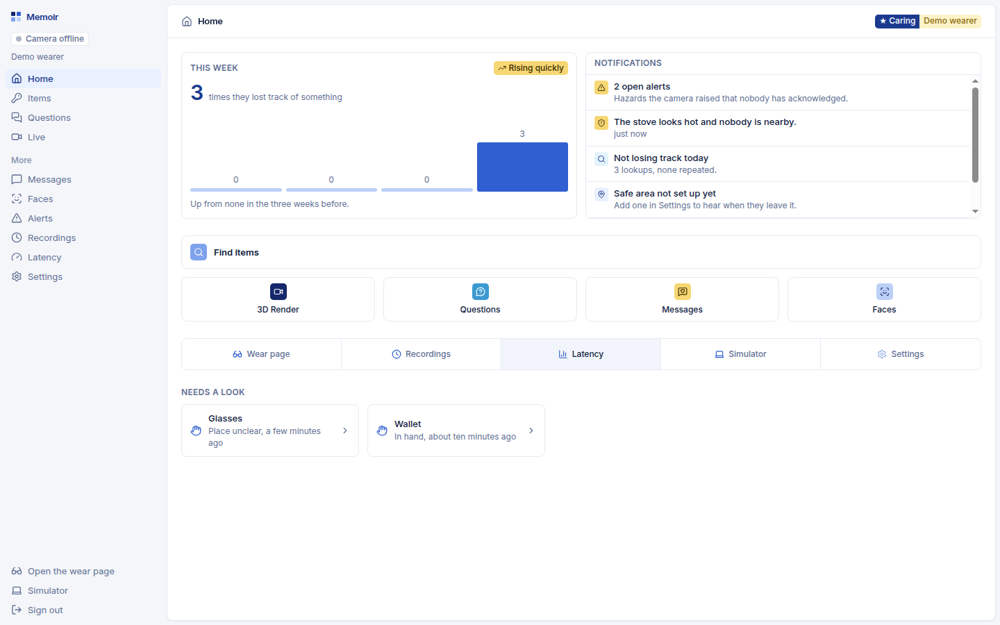
</p>

<table>
  <tr>
    <td width="50%">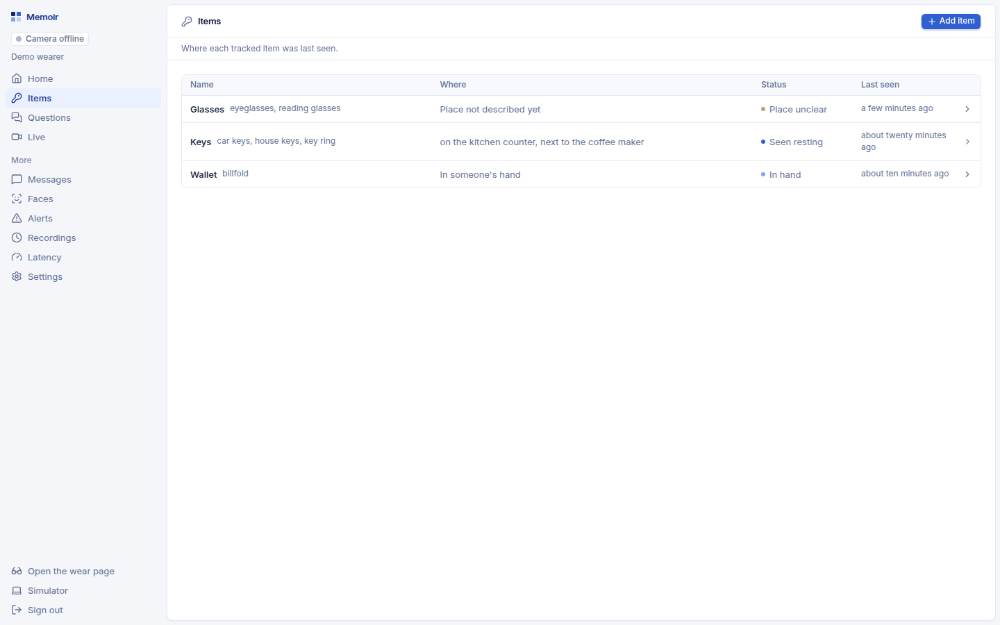</td>
    <td width="50%">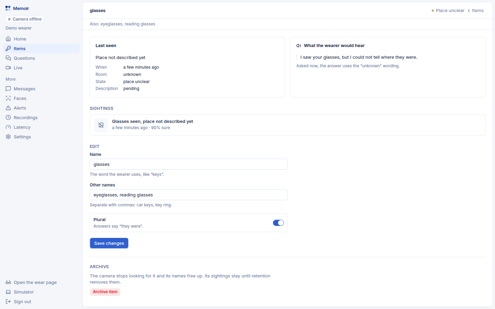</td>
  </tr>
  <tr>
    <td align="center"><b>Items</b> — one card per tracked item: where it was last seen and when.</td>
    <td align="center"><b>Item detail</b> — aliases the wearer uses, usual spots, and a timeline of sightings.</td>
  </tr>
  <tr>
    <td width="50%">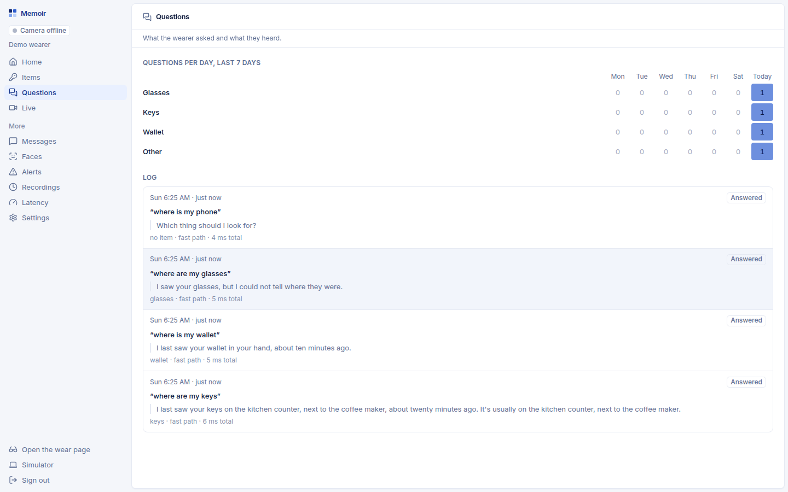</td>
    <td width="50%">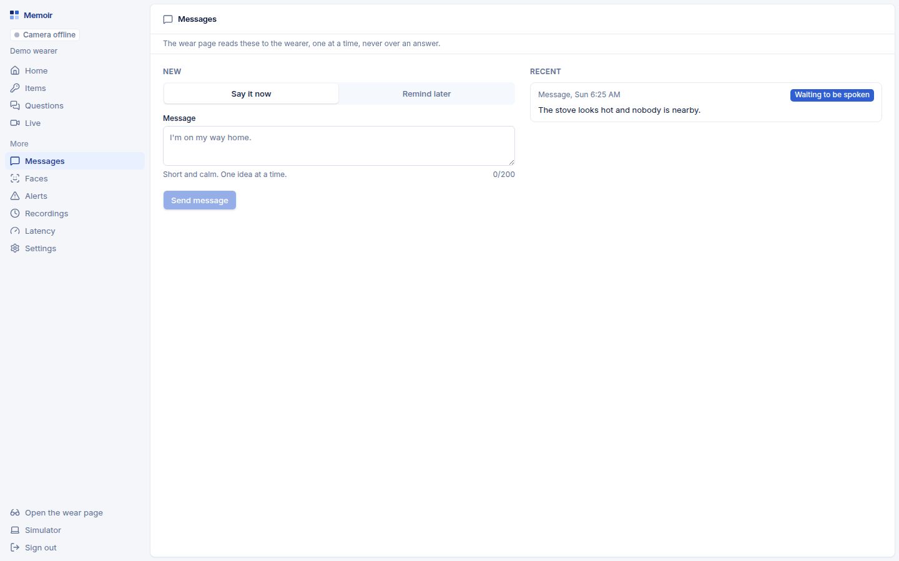</td>
  </tr>
  <tr>
    <td align="center"><b>Questions</b> — every question, the exact answer spoken, and how long it took.</td>
    <td align="center"><b>Messages</b> — type a short message and the wearer hears it read aloud.</td>
  </tr>
  <tr>
    <td width="50%">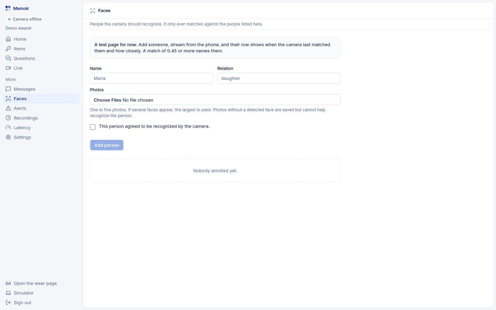</td>
    <td width="50%">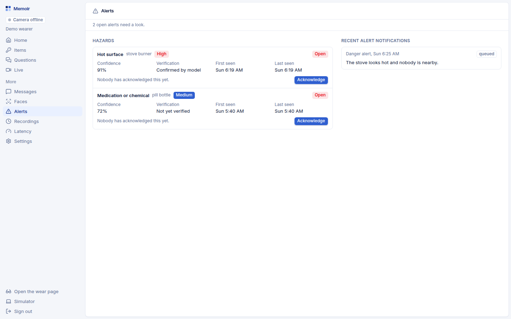</td>
  </tr>
  <tr>
    <td align="center"><b>Faces</b> — enroll family and caregivers from photos so the system knows who's around.</td>
    <td align="center"><b>Alerts</b> — danger and lost-alert log; these also arrive as a push with sound.</td>
  </tr>
  <tr>
    <td width="50%">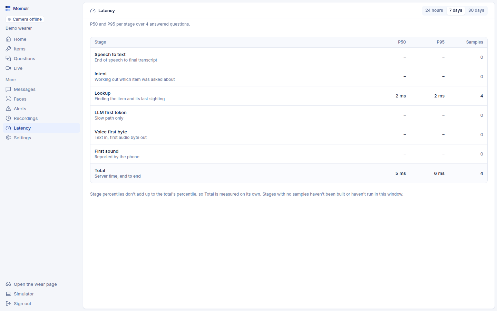</td>
    <td width="50%">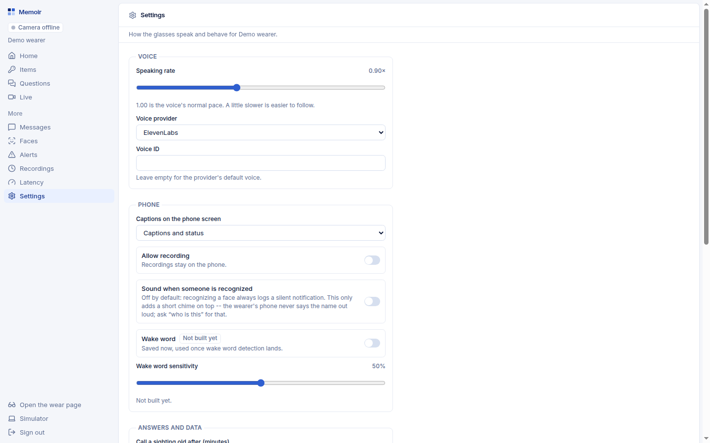</td>
  </tr>
  <tr>
    <td align="center"><b>Latency</b> — P50/P95 per stage, read from real interactions.</td>
    <td align="center"><b>Settings</b> — voice and rate, captions, recording, stale threshold, retention, time zone.</td>
  </tr>
</table>

### Wearer

<table>
  <tr>
    <td width="33%" align="center">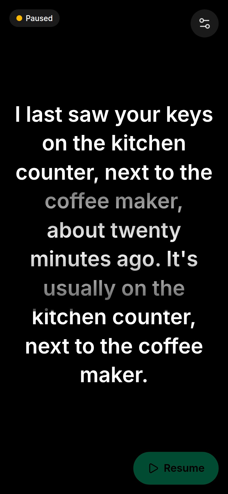</td>
    <td width="33%" align="center">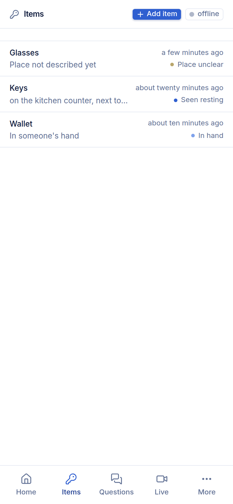</td>
    <td width="33%" align="center">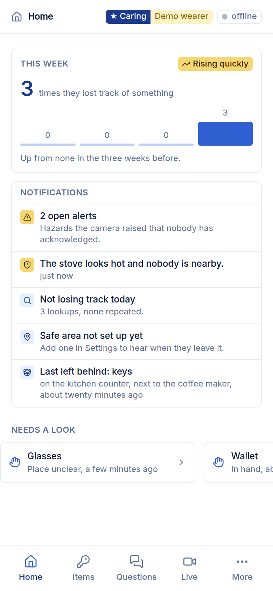</td>
  </tr>
  <tr>
    <td align="center"><b><code>/wear</code></b> — the chest page. Dark, one large caption at a time, tap anywhere to ask.</td>
    <td align="center"><b>Items on a phone</b> — the caregiver's dashboard is built for phones too.</td>
    <td align="center"><b>Dashboard home on a phone</b> — lookups this week, alerts, and what needs a look.</td>
  </tr>
</table>

## How it works

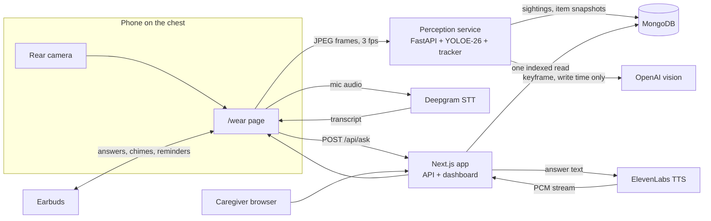

**One design rule makes the latency goal reachable: do the expensive work when an item is *seen*, not
when it's *asked about*.**

1. **See.** The `/wear` page streams 1280 px JPEG frames at 3 fps over a WebSocket to the perception
   service. YOLOE-26, the open-vocabulary YOLO, is prompted with the wearer's own item names (and
   aliases) so it finds keys, wallets, glasses, and pill bottles with no retraining. Stock COCO weights
   know none of those.
2. **Track.** A ByteTrack-style tracker turns per-frame detections into time-bounded *sightings*. A
   confirmed sighting's sharpest keyframe is queued for a background description worker, which asks a
   vision model for room, surface, relation ("next to the coffee maker") and state, and writes that
   sentence onto the sighting and onto the item's denormalized snapshot. Writes are guarded by an
   observation version so a slow job never overwrites newer evidence.
3. **Ask.** A tap starts streaming mic audio to Deepgram. When the turn ends, the transcript goes to
   `POST /api/ask`. The fast path matches "where is my X" against a per-wearer alias map, does one
   indexed `findOne`, and fills a template. No LLM runs.
4. **Answer.** The answer streams back as 24 kHz PCM from ElevenLabs Flash v2.5 and the phone plays it
   chunk by chunk. Without an API key the browser's own speech synthesis speaks it. Either way the text
   shows as a caption on the phone and on the dashboard, and every stage's timing is recorded.

### What the wearer hears

The wording follows standard dementia communication guidance: short sentences, one idea at a time,
never argue, never test. Times are rounded ("about an hour ago", never "47 minutes ago"), and the
answer always describes an observation, not a guaranteed current location.

```text
fresh      I last saw your keys on the kitchen counter, a few minutes ago.
stale      I last saw your keys on the kitchen counter, this morning.
held       I last saw your keys in your hand, a few minutes ago.
moved      I saw your keys being moved. I could not tell where they ended up.
unknown    I saw your keys, but I could not tell where they were.
unseen     I haven't seen your keys in my available history.
ambiguous  Which glasses do you mean?
```

### Latency budget

End of speech to first spoken audio, fast path:

| Stage | Budget |
|---|---|
| End of speech to completed turn | 450 ms |
| Intent match and item resolve (in-memory alias map) | 5 ms |
| MongoDB read (one `findOne`) | 30 ms |
| TTS time to first audio | 300 ms |
| Transport and playback | 200 ms |
| **Total** | **about 985 ms** |

Every interaction records per-stage timings, `pnpm bench:tts` measures the provider from the demo
network, and the Latency tab shows P50/P95 from real questions.

## Beyond finding things

- **Faces.** Caregivers enroll family members and other caregivers from a few photos. The perception
  service matches faces against that patient's own enrolled set only, never anyone else's, and never
  sends the photos to a third party.
- **Danger alerts.** The perception service runs a conservative single-frame hazard pass (a hand near
  a hot stove) and writes `danger_events`, which the Alerts tab lists and which push to the caregiver
  ahead of the dashboard's normal two-second poll.
- **Messages.** The caregiver types a short message; the wearer hears it read aloud.
- **Privacy.** Capture starts paused and the wearer resumes it. Keyframes are the only images that
  leave the phone, retention is a per-wearer setting, and `pnpm db:sweep` deletes everything past it,
  including denormalized snapshots and stored images.
- **Real accounts, isolated families.** Caregivers sign up at `/signup`. Everything is scoped to a
  `patientId`, devices pair with a short-lived code and get their own HMAC-signed token, and
  tenant-isolation tests run on every API route.

**Status.** Item tracking, the voice loop, the dashboard, faces, and hazard events are built.
`/sim` runs the same wearer client on a flat page (hold to ask, or type the question) for laptop
development and as the demo fallback. Two
MVP features are scoped in [`PLAN.md`](PLAN.md) but not yet built: proactive reminders (medication
before bed, keys before the door) and the geofence *lost alert* for when the wearer leaves the approved
area alone. The dashboard's live view also has no video yet; it shows capture state, labels, and the
last answer.

## Architecture

| Piece | Stack | Job |
|---|---|---|
| [`apps/web`](apps/web) | Next.js 16 App Router, React 19, TypeScript, Tailwind 4, shadcn/ui, MongoDB Node driver | `/wear` chest page, `/sim` flat fallback, the caregiver dashboard, the REST API, `POST /api/ask` with streamed TTS |
| [`services/perception`](services/perception) | Python 3.12, FastAPI, pymongo, Ultralytics YOLOE-26, optional face and hazard adapters | Frame socket, detection and tracking, sighting writes, keyframe description jobs, face enrollment and matching |
| [`packages/shared`](packages/shared) | zod 3 | The wire contract: API bodies, the `/ws/frames` protocol, signed tokens, fixtures shared with Python |
| [`packages/db`](packages/db) | zod 4 | Stored-document schemas that become MongoDB validators, the collection registry, repositories, retention |
| [`apps/ios`](apps/ios) | Capacitor 8 | A WKWebView shell that loads the deployed web app and keeps the screen on ([ADR 0004](docs/decisions/0004-ios-shell-with-capacitor.md)) |
| [`scripts`](scripts) | tsx | `db:setup`, `db:seed`, `db:sweep`, `bench:tts`, `replay.py` for feeding recorded frames back in |

Every route handler goes through `withTenant`, which authenticates a caregiver session cookie or a
device token and hands the handler repositories already scoped to one wearer. `patientId` never comes
from a request body. Both services write to the same MongoDB through schemas defined once in zod and
exported as collection validators ([ADR 0002](docs/decisions/0002-mongodb-schema-from-zod.md)).

## Quickstart

You need Node 20+, [pnpm](https://pnpm.io) 11, Docker (for the local MongoDB), and
[uv](https://docs.astral.sh/uv/) for the perception service.

```bash
git clone https://github.com/andrewwbuilds/hackmit26.git
cd hackmit26
pnpm start            # install, env files, MongoDB, schema, demo seed, then web on :3000 and perception on :8000
```

`scripts/start.sh` creates `apps/web/.env.local` and `services/perception/.env` from their examples,
generates the signing secrets and a demo caregiver password, and prints the demo login when it
finishes. Sign in at [http://localhost:3000/login](http://localhost:3000/login) and you'll find three
seeded items, keys, wallet and glasses, with fake sightings. Open `/sim` in another tab to ask about
them with your laptop's mic.

The same steps by hand:

```bash
pnpm install
pnpm db:up            # MongoDB 8 in Docker on :27017
pnpm db:setup         # collections, validators, indexes
pnpm db:seed          # demo caregiver, wearer, and items
pnpm dev              # http://localhost:3000

cd services/perception
uv sync --extra yoloe # drop the extra to run with NullDetector
uv run uvicorn app.main:app --port 8000
```

### API keys

Everything runs without keys, with fallbacks. Add them to `apps/web/.env.local` for the real thing:

| Variable | Without it |
|---|---|
| `DEEPGRAM_API_KEY` | The browser's own speech recognizer transcribes questions |
| `ELEVENLABS_API_KEY`, `ELEVENLABS_VOICE_ID` | The browser's `speechSynthesis` speaks answers; `/api/ask` returns JSON |
| `OPENAI_API_KEY` | Keyframes get a generic "I don't know where" instead of a described location |
| `S3_*` | Keyframes are stored in MongoDB GridFS |

### On a phone

A phone opens the camera and mic only over HTTPS, so tunnel both dev servers:

```bash
pnpm start --tunnel   # cloudflared tunnels for :3000 and :8000, prints the phone URL
```

Open `/wear` from that URL on the phone, sign in once, tap Start, resume capture, and clip the phone
into a chest harness with the rear camera facing forward. On iPhone, Add to Home Screen gives the
page the whole screen, and earbuds are required because Safari routes answer audio to the earpiece
while the mic is open.

## Development

```bash
pnpm lint && pnpm typecheck
pnpm test                                  # vitest: contract fixtures and db tests, against MongoDB
cd services/perception && uv run pytest    # write path, protocol, token, and tracker tests
pnpm bench:tts                             # time to first audio for the configured TTS provider
```

Both test suites use a real MongoDB with the generated validators, so run `pnpm db:up` first.

## Docs

- [`PLAN.md`](PLAN.md) — the full spec: goals, data model, API sketch, perception pipeline, privacy
  and safety, build order, demo script, risks, and open decisions.
- [`docs/decisions/`](docs/decisions) — architecture decision records, including why the phone is on
  the chest instead of in a headset or on Ray-Ban Meta.
- [`docs/research/`](docs/research) — dated research on vision, speech, and embedding models.
- [`CLAUDE.md`](CLAUDE.md) — repo layout, commands, conventions, and gotchas for contributors and agents.
