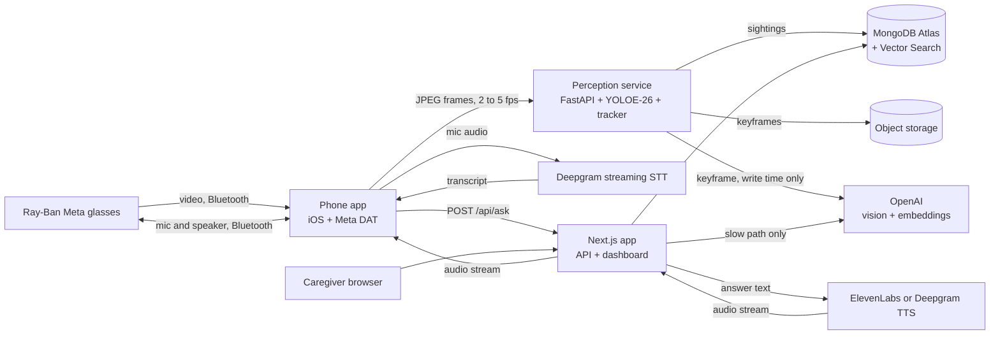

# Memory glasses (working title)

Smart glasses that remember where things are, for people living with dementia.

The wearer asks out loud, "Where are my keys?" About a second later the glasses answer, "I last saw your keys on the kitchen counter, next to the coffee maker, about twenty minutes ago."

**Status: planning.** No code exists yet. This README is the build plan. Edit it freely. Building starts once the plan is signed off.

## The problem

Misplacing things and being unable to retrace steps is one of the Alzheimer's Association's ten early warning signs. It can happen many times a day. It's distressing, and it often turns into suspicion that someone stole the item. The caregiver ends up answering the same question again and again.

A camera that already sits on the person's face can watch where objects end up. The wearer doesn't tag anything, charge a tracker, or open an app. They ask a question out loud and get an answer.

## Goals

1. Answer "where is my X?" out loud in under one second at the median, measured from the moment the wearer stops talking.
2. Track everyday items with no tags and no setup by the wearer.
3. Give caregivers a dashboard that shows where things are, what the wearer asked, and how often.
4. Run the full demo without glasses, using a webcam and a headset, so hardware trouble can't sink the project.

The hackathon MVP is three validated objects, one enrolled instance per category, browser capture, push-to-talk, basic keyframe descriptions, exact item lookup, one TTS provider, and a minimal dashboard. Get this working by hour eight. Glasses integration follows the same contract. Room enrollment, visual enrollment, semantic search, and the LLM question path are optional follow-ons; their sections below describe the roadmap, not requirements for the core demo.

Not in v1:

- Medical claims or diagnosis of any kind.
- Face recognition. It's on the stretch list and needs a consent story first.
- Turn-by-turn guidance to the item.
- Code running on the glasses. Ray-Ban Metas don't run third-party code.
- Languages other than English.

## What the Meta glasses can and can't do

This shapes the whole architecture, so it comes first.

- Ray-Ban Meta glasses don't run third-party code. Everything goes through a phone.
- Meta's Wearables Device Access Toolkit, DAT for short, is a Swift and Kotlin SDK. A phone app uses it to pull a video stream or a photo from the glasses. It's in developer preview, version 0.9 on iOS when this was written. Preview apps can't be published to the public, but they run on our own glasses, which is all a hackathon needs.
- Video tops out at 720p and 30 fps because it travels over Bluetooth. The SDK lowers both when bandwidth drops.
- Audio uses the Bluetooth headset path rather than DAT. Test microphone selection, speaker routing, simultaneous video/audio, permissions, and playback on the actual phone/browser/glasses combination. Pairing alone does not establish that the full capture path works.
- The toolkit docs say nothing about hooking "Hey Meta". Use push-to-talk first; hands-free support would need a local wake word.
- There's no web SDK for the camera. Meta's Web Apps target the Ray-Ban Display model and don't document camera access. A Next.js app alone can't see through the glasses, so we need a thin native app.
- The SDK ships MockDeviceKit, which fakes a pair of glasses. The phone app can be developed with no hardware.
- Access needs a Wearables Developer Center registration, the Meta AI app, developer mode on the glasses, and a supported country. Do this first. It's the one delay we can't code around.

Build the browser demo first. Validate glasses camera and audio routing early, then integrate them after the browser loop works. Record the tested SDK version, glasses model, OS, and browser. Preview capabilities and access requirements remain assumptions until the smoke test passes.

| Capture path | Video from | Audio from | Used when |
|---|---|---|---|
| A. Browser simulator | laptop or phone camera | glasses over Bluetooth, or any headset | from hour one, and as the demo fallback |
| B. iOS app with DAT | glasses camera | glasses over Bluetooth | the real product |
| C. WhatsApp video call (experimental) | glasses camera, via a call to a second account, screen-captured on a laptop | glasses | only if routing and privacy behavior are validated; path A remains the dependable fallback |

All three paths feed the same two endpoints, a frame WebSocket and `POST /api/ask`. Nothing downstream knows which path is live.

## Architecture



Three deployable pieces in the full plan; the browser MVP needs only web and perception:

| Piece | Stack | Job |
|---|---|---|
| `apps/web` | Next.js App Router, TypeScript, Tailwind, shadcn/ui, MongoDB Node driver | Caregiver dashboard, REST API, the `/api/ask` voice endpoint, the browser simulator |
| `services/perception` | Python, FastAPI, Ultralytics YOLOE-26, ByteTrack, pymongo; open_clip later | Takes frames, detects and tracks items, writes sightings, requests scene descriptions |
| `apps/ios` | Swift, Meta DAT, AVAudioEngine; Porcupine later | Streams glasses frames and push-to-talk audio, plays the answer; local wake word later |

One design rule makes the latency goal reachable. **Do the expensive work when an item is seen, not when it's asked about.** Vision descriptions and optional room classification/embeddings happen at write time in the background. Once enrichment finishes, the answer is one indexed read away. Earlier questions get a conservative pending-description answer.

## What happens when the wearer asks a question

1. Push-to-talk starts the mic stream to Deepgram; release requests finalization. A local wake word is optional later. A local chime acknowledges the start of listening.
2. Accumulate finalized transcript segments until the turn ends. For Nova-style streaming, `is_final` alone does not mean the question is complete; handle `speech_final` and explicit finalization separately. A Flux adapter must map its own turn events to the same client state machine.
3. The client posts the completed transcript and a unique `requestId` to `/api/ask`.
4. The intent router matches location questions and resolves an item using a wearer-scoped alias map. Cache misses reload safely; aliases are invalidated after configuration changes.
5. One indexed `findOne` returns the latest item snapshot. A template uses current observation state, description readiness, and uncertainty to produce at most two sentences. No LLM runs.
6. MVP fast-path miss: ask which tracked item the wearer means. Later, an LLM may use read-only `find_item`, `search_sightings`, and `list_recent_items` tools. Tenant authorization comes from the session, never from model-supplied IDs.
7. Answer text goes to the chosen TTS provider. The response starts with an interaction ID header, then streams audio to the client.
8. The client plays buffered audio chunks, reports playback timing, and polls the interaction endpoint for text and final server timings.
9. The server records status, answer, and timing stages. Cancellation and failed or partial playback are explicit outcomes.

## Latency budget

Fast-path planning estimates, end of speech to the first spoken answer in the wearer's ear. Chimes do not count:

| Stage | Budget | Notes |
|---|---|---|
| End of speech to completed turn | 450 ms | Initial hands-free silence window is 400 ms plus an estimated 50 ms for finalization; measure push-to-talk separately |
| Intent match and item resolve | 5 ms | In-memory alias map, no network |
| MongoDB read | 30 ms | One `findOne`, app and cluster in the same region |
| TTS time to first audio | 300 ms | Measure our voice, output format, provider, and network; inference claims are not end-to-end latency |
| Remaining transport and playback | 200 ms | Request upload, audio download, buffering, and headset routing; validate on demo hardware |
| **Total** | **about 985 ms** | Aspirational P50 under 1 s, P95 under 1.5 s; almost no margin until measured |

The optional slow path targets first spoken audio in under 2 s; measure rather than assuming a fixed LLM overhead. Stage percentiles do not add up to an end-to-end percentile.

Also measure capture-to-queryable-observation and capture-to-queryable-description latency. Initial demo targets are P95 under 2 s and 5 s respectively. Return uncertainty while enrichment is pending. Track correct-location answers, wrong-location answers, and abstentions separately: a fast incorrect answer fails the demo. Record capture sequence numbers, server receipt times, and client playback times. Use monotonic clocks for durations and account for clock skew between devices; verify audible onset using a loopback recording on the actual headset.

How we hold the budget:

- Stream every hop. Streaming STT in, streamed LLM tokens, streamed TTS audio out, chunked playback on the phone. Nothing waits for a complete result.
- Skip the LLM on the fast path. Most questions will be "where is my X", and a template answers those.
- Precompute descriptions at sighting time, as described above.
- Denormalize the latest sighting onto the item document so the hot read is a single lookup.
- Reuse MongoDB pools and provider connections where the runtime allows. Caches and warm connections are per process and may disappear. Do not send dummy questions to `/api/ask` to warm it.
- Flush LLM output to TTS at the first clause boundary. Don't wait for the full reply. ElevenLabs and Deepgram both take streamed text over WebSocket.
- Normalize STT input to 16 kHz mono after checking the actual capture format. Bluetooth profiles and sample rates vary by device and OS; do not assume the capture or playback format.
- Put everything in one region. Atlas in `us-east-1`, the Next.js functions in `iad1`, the perception box close by.
- Acknowledge completed turns locally if useful, but log chimes separately from spoken answers.
- Later, speculate on interim transcripts. Once an interim result contains a known item, start the lookup before the wearer finishes the sentence.
- Measure before tuning. Every interaction records per-stage timings, and `pnpm bench:tts` measures the chosen provider from the demo network; compare a second provider only if implemented.

One tension to watch. Short endpointing makes answers fast, but people with dementia often pause mid-sentence. Cut them off and the product fails at its one job. Start at 400 ms of silence and tune it with real speech, per wearer if needed.

## Text to speech: ElevenLabs or Deepgram

| | ElevenLabs Flash v2.5 | Deepgram Aura-2 |
|---|---|---|
| Vendor latency claim | about 75 ms model inference | about 90 ms to first byte, optimized |
| Independent P50 to first audio | about 288 ms | about 313 ms |
| Voice quality | warmer, more natural, large voice library, cloning | clear and a bit businesslike |
| Cost | higher | lower |
| Same vendor as our STT | no | yes |

These published figures are reference points, not a controlled comparison on our hardware. Voice quality is subjective; evaluate intelligibility and an unhurried speaking rate with the selected voice.

Start with ElevenLabs Flash v2.5 behind a small `TTSProvider` interface. Implement one provider for the MVP. Add Deepgram only if testing exposes a concrete problem or time remains. Benchmark identical text and record format, voice, warm/cold connections, sample count, P50, and P95.

Start with Deepgram Nova-3 streaming and push-to-talk. Evaluate Flux later if hands-free pauses are a problem; provider-specific events stay inside the STT adapter.

The fallback if the three-vendor chain gets flaky is OpenAI's Realtime API. `gpt-realtime-2` does STT, reasoning, tool calls and speech over one socket. We don't start there because the fast path needs no LLM at all, and because the voice choice matters.

## Perception pipeline

### Model

Stock YOLO trained on COCO knows 80 classes. It has phone, remote, cup, bottle, book and handbag. It has no keys, wallet, glasses, pill bottle, hearing aid or cane, which are the things people with dementia lose. So stock weights won't do.

We use **YOLOE-26**, the open-vocabulary YOLO in Ultralytics. You give it class names as text and it detects them with no retraining. Prompt preparation and export can reduce overhead, but benchmark our prompt count, input size, and hardware. Pin the package/checkpoint versions and pre-download model assets, including the text encoder, before the demo.

Candidate prompt list. M0 selects three reliable demo objects, one enrolled instance per category, and a small context list. Dashboard editing comes later:

- Tracked items: keys, wallet, phone, eyeglasses, glasses case, TV remote, pill bottle, pill organizer, hearing aid, cane, purse, mug, water bottle, watch, charger.
- Context objects, used to describe location: couch, table, counter, bed, sink, TV, chair, door, refrigerator, microwave, nightstand, desk, shelf.

YOLOE visual prompts can improve recognition of objects resembling an example. They do not establish ownership or persistent identity. Visual enrollment is optional after M3 and requires evaluation with similar-looking objects. Ambiguity triggers clarification or abstention, never silent assignment to the enrolled item.

If small-item detection fails the recorded walkthrough, first try a larger input/model and select reliable demo objects. Fine-tuning is an optional experiment: collection, labeling, training, and held-out evaluation may exceed the hackathon. Neither 200 images nor 30 minutes of training guarantees adequate recall.

### Frame handling

- Sample 2 to 5 fps. Objects at rest don't need 30.
- Drop blurry frames before inference using Laplacian variance. Head-mounted video is full of motion blur.
- Run at image size 960 or higher. Keys at arm's length are a few dozen pixels wide at 720p.
- Benchmark sustained throughput, recall, memory, and thermal behavior on the actual laptop before moving to medium. Upscaling cannot recover detail absent from the source frame.
- Keep at most one pending frame per device, replacing it with the newest frame under load. Log drops and frame age instead of accumulating stale video.
- Use a versioned frame envelope with session ID, sequence number, capture time, dimensions, and byte length. Authenticate the socket, limit sizes/rates, and reject duplicates or expired frames. Reconnect with backoff and a new session; do not replay old camera buffers.

### From detections to sightings

1. ByteTrack IDs are local to a capture session, not persistent identities. Confirm repeated evidence over a configurable window, initially three usable frames within two seconds. Test both 2 and 5 fps with dropped frames.
2. A confirmed track opens a sighting and immediately updates the item's latest-observation snapshot, even while the description is pending. Select a keyframe and enqueue enrichment.
3. Refresh the snapshot while visible, initially every 500 ms when a usable frame arrives. Newer held/moving evidence immediately invalidates confidence in the old resting location; retain that location as history, not the default answer.
4. Close after three seconds without usable observations. Closing is bookkeeping, not the trigger for making a location queryable. Split sightings when the support surface, room, or motion state changes.
5. Do not merge on label, room, and time alone. MVP track breaks preserve separate sightings. Later merging needs evidence of the same instance and unchanged location; uncertainty is acceptable.
6. Apply item updates with an atomic observation-version condition. Order observations using server-normalized capture time and session sequence, not job completion time. Description jobs carry sighting ID, keyframe revision, and observation version. Late results may enrich history but cannot overwrite a newer item snapshot or attach old text to a new frame.

Use unique event IDs and idempotent upserts. Persist description-job state in MongoDB with bounded retries, backoff, worker leases, and terminal failure status; the existing perception worker can process it without another queue service. Bound queued jobs and coalesce obsolete keyframes. Return uncertainty if enrichment fails.

### Description job

Runs in the background and never blocks the frame loop. It sends the keyframe and the item's bounding box to an OpenAI vision model and gets structured output back:

```json
{
  "room": "kitchen",
  "surface": "counter",
  "relation": "next to the coffee maker",
  "state": "resting",
  "sentence": "on the kitchen counter, next to the coffee maker"
}
```

`state` is `resting`, `held`, `moving`, `in_use`, or `unknown`. Room may be `unknown`; surface and relation may be null. A single still image may not establish motion or resting state. Structured output validates shape, not truth: combine temporal evidence with visible context and omit unsupported details. Newer held/moving evidence supersedes the old resting answer.

Basic descriptions are part of M1/M3. Before enrichment finishes, use only independently established details; otherwise say "I saw your keys, but I could not tell where they were." Do not infer a room solely from a nearby object.

In the optional semantic-search phase, embed item name, aliases, room, surface, relation, and state together, for example "keys; car keys; kitchen counter; next to coffee maker; resting". Record the embedding model/version. Location-only sentences lack item semantics needed for fuzzy retrieval.

Vision calls are capped per item per minute so a cluttered desk can't run up the bill.

### Rooms

The MVP vision model may name a room type or return `unknown`. Optional room enrollment stores CLIP reference frames under family-provided names. Evaluate similarity thresholds, margins between competing rooms, and temporal consistency; top-five majority vote alone must not force unfamiliar scenes into known rooms. Classification of uploaded frames is descriptive and cannot enforce pre-upload privacy.

## Data model

Both services derive `patientId` from an authenticated caregiver session or scoped device credential, never an untrusted request body. Every tenant-owned collection and cache is scoped to it. Apply ownership checks to reads, writes, storage URLs, debug streams, configuration, STT token minting, queued jobs, and optional model tools. Rate-limit token minting and inference.

```js
// items: one per tracked thing. The hot path reads only this.
{
  _id, patientId,
  name: "keys",
  aliases: ["car keys", "house keys", "key ring"],
  detectorPrompts: ["keys", "key ring"],
  referenceImages: ["s3://..."],
  nameEmbedding: [/* 1536 */],
  lastSighting: { sightingId, observationVersion, keyframeRevision, sentence, room, state, lastSeenAt, thumbKey, descriptionStatus },
  lastRestingSighting: { /* historical; newer held/moving evidence supersedes it */ },
  locationStatus: "observed" | "moved" | "uncertain",
  usualSpots: [{ sentence: "on the hook by the front door", share: 0.62 }]
}

// sightings: one per continuous period an item stayed in view
{
  _id, patientId, itemId, label: "keys",
  status: "open" | "closed",
  firstSeenAt, lastSeenAt, expiresAt,
  sessionId, eventId, observationVersion, keyframeRevision,
  descriptionStatus: "pending" | "ready" | "failed",
  confidence, bbox: [x, y, w, h], frameSize: [1280, 720],
  room: { id, name: "kitchen", confidence: 0.91 },
  surface, relation, state,
  sentence: "on the kitchen counter, next to the coffee maker",
  nearbyObjects: ["coffee maker", "mug"],
  keyframeKey, thumbKey, // mint signed URLs on authorized reads
  searchText, sentenceEmbedding: [/* 1536; optional */], embeddingModel,
  source: "glasses" | "simulator"
}

// rooms and room_refs: caregiver-enrolled rooms and their CLIP reference frames
{ _id, patientId, name: "the den", private: false }
{ _id, patientId, roomId, embedding: [/* 512 */], imageKey, expiresAt }

// interactions: every question, with timings
{
  _id, patientId, requestId, askedAt, transcript, expiresAt,
  status: "generating" | "streaming" | "complete" | "failed" | "cancelled",
  path: "fast" | "llm", itemId, answerText,
  timingsMs: { stt, intent, db, llmFirstToken, ttsFirstByte, clientFirstPlayback, total },
  playbackReportedAt // absent until client telemetry arrives
}

// patients, caregivers, devices: accounts, settings, device tokens
```

Indexes:

| Collection | Index | Serves |
|---|---|---|
| `items` | `{ patientId: 1, name: 1 }` | fast path lookup |
| `sightings` | `{ patientId: 1, itemId: 1, lastSeenAt: -1 }` | timelines, history |
| `sightings` | vector on `sentenceEmbedding`, filters `patientId`, `itemId`, `lastSeenAt` | open-ended questions |
| `room_refs` | vector on `embedding`, filter `patientId` | room classification |
| `interactions` | `{ patientId: 1, askedAt: -1 }` | question log |
| `sightings` | unique `{ patientId: 1, eventId: 1 }` | idempotent ingestion |
| `interactions` | unique `{ patientId: 1, requestId: 1 }` | request deduplication |
| retained records | indexed `expiresAt`, cleanup worker | coordinated retention; TTL is only a secondary safeguard |

### Where vector search earns its place

"Where are my keys?" doesn't need it. That's an exact lookup, and an exact lookup is faster. Vector search is optional after M3 and does the fuzzy work. The MVP needs no vector indexes.

- Structured room/time questions. "What did I leave in the bedroom?" first uses room/time filters and latest observations per item, excluding items subsequently seen elsewhere. Say "I saw…" unless placement is established.
- Semantic questions. "Where did I put that thing from the pharmacy?" searches enriched item/location text, filtered to the wearer and time window. Weak or closely matched candidates trigger clarification.
- Hybrid search. Combine the vector query with Atlas full-text search over `searchText` using `$rankFusion`. That stage needs MongoDB 8.1 or later. On an older cluster, app-side fusion is optional and requires its own evaluation.
- Room classification against `room_refs`.
- Episodic memory, a stretch goal. Periodic scene captions go in a `memories` collection and answer "what did I do this morning?"

Fuzzy item names skip Atlas entirely. "The thing that opens the car" should resolve to keys, but a wearer has maybe 30 items. Embed the phrase and compare against 30 cached vectors in memory. The local comparison is cheap, but generating a query embedding adds network latency that must be measured. It needs no search index. The free M0 tier caps search indexes, so check the limit before adding a third.

## What the glasses say

The wording matters as much as the speed. These rules follow standard dementia communication guidance: short sentences, one idea at a time, never argue, never test.

- Two sentences at most. Location first, then when.
- Use the family's words. If the caregiver named the room "the den", say "the den".
- Round the time. "A few minutes ago", "about an hour ago", "this morning". Nobody wants to hear "47 minutes ago".
- Never mention repetition. The tenth "where are my keys" gets the same calm answer as the first.
- No quizzing and no correcting. Never "do you remember?", never "you already asked".
- Always describe an observation, not a guaranteed current location. Initially label observations older than 15 minutes as stale; this configurable demo threshold does not establish correctness.
- Offer a usual spot only when explicitly configured or supported by enough history. Omit the suggestion otherwise.
- Newer held/moving evidence supersedes an old resting location. Unknown location, ambiguous identity, and pending descriptions have explicit uncertainty wording.
- Speak slower than the default rate. The rate is a per-wearer setting.

```text
fresh    I last saw your {item} {sentence}, {relative_time}.
stale    I last saw your {item} {sentence}, {relative_time}.
held     I last saw your {item} in your hand, {relative_time}.
moved    I saw your {item} being moved. I could not tell where {it/they} ended up.
unknown  I saw your {item}, but I could not tell where {it/they} {was/were}.
unseen   I haven't seen your {item} in my available history.
ambiguous Which {item} do you mean?
```

An optional second sentence may suggest a known usual spot. `usualSpots` is empty in the MVP unless configured. Later aggregation must retain sample counts and avoid counting fragmented tracks as independent placements; do not infer a usual spot from sparse history.

The LLM path gets the same rules in its system prompt, plus a hard cap on reply length.

## Caregiver dashboard

MVP by M3: read-only item cards, latest question/answer, latency, and capture/pause status. Enrollment, timelines, charts, and room controls are optional later work.

- **Items.** A card per item with a thumbnail, the location sentence and "seen 20 min ago". Click through to a timeline of sightings with keyframes.
- **Add an item.** Name, aliases and a few photos. Saving pushes the new prompt list to the perception service.
- **Rooms.** Enroll a room by walking through it. Mark rooms private for the later on-device privacy gate; do not present server-side labels as a pre-upload privacy guarantee.
- **Questions.** A log of what the wearer asked and what they heard. A chart of questions per day per item. A jump in repeated questions can flag a hard day. The dashboard states it as a count and nothing more. It isn't a diagnostic.
- **Live view.** The current frame with boxes drawn, for debugging and the demo.
- **Latency.** P50 and P95 per stage, read from `interactions`.
- **Settings.** Voice, speaking rate, wake word sensitivity, retention window.
- **`/sim`.** The browser simulator. Webcam and mic in, answer audio out. The same page is the demo fallback.

MVP updates poll authenticated endpoints every two seconds. Later change streams plus SSE require reconnect/resume handling, connection cleanup, and deployment-aware timeouts. Vercel streamed responses still have duration limits; a function is not a permanent relay.

Auth in v1 is one caregiver login and one seeded wearer. Devices send a bearer token that maps to a `patientId`.

## API sketch

Next.js:

| Route | Does |
|---|---|
| `POST /api/ask` | Takes `{ transcript, requestId }`, returns `X-Interaction-Id` before streaming audio; deduplicates by wearer and request ID |
| `GET /api/stt/token` | Mints a short-lived Deepgram key so the client streams audio to Deepgram directly and skips a hop |
| `GET, POST /api/items`, `PATCH /api/items/:id` | Item CRUD and photo enrollment |
| `GET /api/sightings` | Filter by item and time range |
| `GET, POST /api/rooms` | Room CRUD and enrollment |
| `GET /api/interactions` | Question log and latency stats |
| `GET /api/interactions/:id` | Poll authorized answer text, status, and final server timings |
| `POST /api/interactions/:id/playback` | Record client playback/turn timings, labeled as client-reported telemetry |

Perception service:

| Route | Does |
|---|---|
| `WS /ws/frames` | Binary JPEG frames with the versioned session/sequence/timestamp envelope |
| `WS /ws/debug` | Detections and annotated frames for the live view |
| `POST /config/classes` | Reloads the prompt list after a caregiver edits items |
| `GET /health` | Model loaded, current fps, queue depth |

Audio contract: initially stream raw signed 16-bit little-endian PCM, mono, 24 kHz, with format metadata fixed before the response body starts. Normalize provider output on the server. The browser uses a bounded AudioWorklet buffer; iOS schedules PCM buffers with AVAudioEngine. Validate this in M2, including byte alignment, underruns, cancellation, and interruption by a new question. Disconnects cancel upstream work where possible; failed or partial playback is not success. Duplicate requests return the existing interaction ID/status without starting another provider request or replaying a consumed live stream.

Headers cannot contain final slow-path text or end-to-end timings before those values exist. Fetch them by interaction ID. `Server-Timing` may contain only stages completed before headers are sent; client telemetry supplies actual playback timing.

Both services write to MongoDB. Version the shared contract and generate JSON Schema from one canonical definition for cross-language validation. Shared fixtures must pass both Zod and Pydantic validation, avoiding independently drifting schemas. Perception owns sightings and latest-observation fields; web owns caregiver configuration and interactions. Configuration reloads are tenant-scoped and versioned; alias changes invalidate caches.

## Privacy and safety

An always-on camera in someone's home is a serious thing, and the wearer may not be able to give informed consent. The family or a legal proxy has to. The design should deserve their trust.

- The MVP runs in an explicitly approved demo area with a visible capture/pause control. Capture starts paused; reconnects require explicit resumption. Pause before leaving that area. Automatic private-room exclusion is not an MVP capability.
- State the actual flow: raw frames reach the selected perception host in memory. Only selected, downscaled, face-blurred keyframes may reach object storage or the external vision provider. Blurring on that host does not mean raw frames never left the capture device. Exclude raw frames from logs and error reporting.
- A future automatic privacy gate must run on the capture device before any upload, including debug frames and thumbnails. Private or unknown rooms block transmission and storage until cleared locally. Server-side room recognition cannot enforce this. Bathrooms and bedrooms default to private when that gate is implemented.
- Debug live view is authenticated, opt-in, transient, and disabled while paused. Pause stops uploads and cancels/drops queued frames and description work; it cannot retract data already sent externally. Document provider retention settings before any real-home use.
- Retention defaults to 30 days. A retryable cleanup job removes expired sightings, keyframes, thumbnails, embeddings, interactions, and related jobs, clears item snapshots pointing to removed sightings, and recomputes derived usual spots. Apply a stated retention policy to enrollment images too. Exclude expired data from reads immediately rather than relying on delayed TTL deletion. Storage lifecycle rules are a backstop; document backup/provider retention separately.
- Audio leaves the device only during push-to-talk or after a future local wake word fires. Show listening state and provide an immediate stop control.
- The glasses' capture LED stays lit while streaming. We do not try to hide it.
- Store object keys and mint short-lived signed URLs after authorization. Use encrypted transport/storage and server-side provider keys. Device credentials are scoped, revocable, and expiring.
- Test tenant isolation on both services, including writes, sockets, storage URLs, configuration, caches, token minting, and jobs. One seeded wearer does not justify unauthenticated public endpoints.
- Present the demo as an assistive prototype with no diagnosis or medication-adherence conclusions. A pill organizer sighting does not prove medication was taken.

One ethical question stays open. ElevenLabs can clone a family member's voice, and hearing a daughter's voice might be comforting. It might also confuse someone who then looks for her in the room. We don't build this without input from someone who works in dementia care.

## Repo layout

```text
hackmit26/
  README.md
  CLAUDE.md                  written when building starts
  apps/
    web/                     Next.js dashboard, API, /sim
    ios/                     Swift app, Meta DAT, wake word, audio
  services/
    perception/              FastAPI, YOLOE-26, tracker, description jobs
  packages/
    shared/                  zod schemas and types
  scripts/
    create-indexes.ts        Atlas indexes, vector ones included
    seed.ts                  demo wearer, items, fake sightings
    bench-tts.ts             benchmarks the chosen TTS provider; optional comparison
    replay.py                plays a recorded video into /ws/frames
  docs/
    decisions/               ADRs
```

pnpm workspaces for the JavaScript side, uv for Python.

## Environment variables

```bash
# MongoDB
MONGODB_URI=
MONGODB_DB=memory_glasses

# OpenAI. Model IDs live in env so we pick the current small, fast tier at build time
OPENAI_API_KEY=
OPENAI_CHAT_MODEL=
OPENAI_VISION_MODEL=
OPENAI_EMBEDDING_MODEL=text-embedding-3-small

# Speech
DEEPGRAM_API_KEY=
DEEPGRAM_STT_MODEL=
TTS_PROVIDER=elevenlabs          # or deepgram
ELEVENLABS_API_KEY=
ELEVENLABS_VOICE_ID=
ELEVENLABS_MODEL=eleven_flash_v2_5
DEEPGRAM_TTS_MODEL=
PICOVOICE_ACCESS_KEY=

# Storage for keyframes, any S3-compatible bucket
S3_ENDPOINT=
S3_BUCKET=
S3_ACCESS_KEY_ID=
S3_SECRET_ACCESS_KEY=

# Wiring
PERCEPTION_WS_URL=
DEVICE_TOKEN_SECRET=
AUTH_SECRET=
```

## Running it

Planned commands. None of them exist yet.

```bash
pnpm install
pnpm db:indexes                  # create Atlas indexes
pnpm db:seed                     # demo wearer and items
pnpm dev                         # Next.js on :3000
pnpm bench:tts                   # chosen-provider latency benchmark

cd services/perception
uv sync
uv run uvicorn app.main:app --port 8000
uv run python ../../scripts/replay.py fixtures/kitchen.mp4
```

## Testing

- Unit tests for intent routing, answer templates, relative time, and the sighting state machine using Vitest and pytest.
- Replay annotated walkthroughs with expected identity, location changes, and uncertainty. Cover pickup from a resting spot, similar objects, questions while an item remains visible, pending/failed descriptions, unknown rooms, dropped frames, reconnects, duplicate events, and jobs finishing out of order. Assert that old jobs never overwrite newer evidence. Record wrong-location answers and abstentions, not just detection counts.
- A golden set of about 30 questions, including aliases, unknown items, and ambiguous references. Recorded speech cases include slow speech and mid-sentence pauses.
- Report P50/P95 and sample count on a fixed replay/speech set, separating cold/warm and push-to-talk/hands-free runs. Measure speech-end to spoken answer and capture to queryable observation/description. Seeded reads isolate API performance but do not prove end-to-end success. Keep network-dependent benchmarks separate from deterministic unit-test gates.
- Audio integration checks cover finalized segments versus complete turns, browser/iOS playback, interruption, provider failures, and no chime counted as answer audio.
- Tenant isolation checks on API routes, sockets, background jobs, caches, and storage access.
- Privacy/retention checks cover pause, queued-job cancellation, expiry filtering, deletion retries, and removal of denormalized snapshots and images.
- Contract fixtures validate identical payloads in Python and TypeScript. Pin dependencies/model assets and run a clean startup before rehearsal.

## Build order

Hours assume a 24-hour hackathon and three or four people. Edit to fit the team.

| Milestone | Hours | Work | Done when |
|---|---|---|---|
| M0 Setup and feasibility | 0 to 1 | Accounts, repo skeleton, auth, model downloads. Record a walkthrough and select three reliable objects. Start DAT access and camera/audio smoke tests | Browser capture and inference run; chosen objects and hardware assumptions are recorded |
| M1 Perception and descriptions | 1 to 6 | Bounded ingestion, tracker, versioned sightings, immediate item updates, basic keyframe descriptions, privacy/pause flow | A real object has a queryable location; pickup invalidates its old resting answer |
| M2 Voice and minimal dashboard | 1 to 6, parallel | Push-to-talk `/sim`, one STT/TTS provider, exact lookup, PCM playback, interaction polling, cards and timings | Seeded questions produce audible answers and client playback timings |
| M3 Join | 6 to 8 | Real sightings/descriptions answer real questions; test movement and immediate queries | Three objects work on a laptop with honest uncertainty and measured accuracy/latency |
| M4 Reliability | 8 to 12 | Dropped frames, retries, late jobs, ambiguous items, privacy/retention checks, pause and failure UX | Replay checks pass; stale evidence never replaces newer observations |
| M5 Glasses | feasibility from hour 1 with an iOS teammate; integration 8 to 16 | DAT sample, authenticated frame transport, audio routing, push-to-talk | The tested browser contract works through glasses, or path A remains the demo |
| M6 Optional extension | 12 to 18, only after core checks pass | Choose one: semantic questions, visual enrollment, or richer dashboard. Wake word and room enrollment compete for this time | The chosen feature passes an evaluation without destabilizing M3 |
| M7 Polish | 18 to 24 | Freeze features, measure accuracy/latency, demo script, backup recording, docs | Two clean rehearsals including browser fallback |

M3 is the cut line. If it slips, drop M6. Do not try to build every roadmap feature. Reserve the final six hours for reliability and rehearsal. The subsecond target is aspirational until measured; do not shorten endpointing at the expense of understanding the question.

### Demo script

1. Resume capture in the approved demo area. Put a validated object on a counter using glasses if integration passed, otherwise the browser.
2. Ask where it is, including once while it remains visible. Hear "I last saw…" with a time and show the description/thumbnail.
3. Pick it up and ask again. Confirm the system does not confidently send the wearer back to the counter. Put it on a new surface and ask after enrichment.
4. Ask about an unseen item to demonstrate uncertainty. Show an enrolled alias; demonstrate semantic matching only if that optional feature passed evaluation.
5. Show the question log, speech/sighting latency, and pause control. Rehearse the same sequence on the browser fallback.

## Risks

| Risk | Plan |
|---|---|
| Meta DAT access is slow or the SDK fights us | Paths A and C exist. Path A gets built first regardless |
| Open-vocabulary detection misses small items | Bigger image size, medium model, visual prompts, then the fine-tune fallback. Pick demo items that detect well |
| Bluetooth video is choppy, glasses battery drains fast | Low frame rate. Test DAT photo capture every few seconds as an alternative to continuous video. Measure battery on day one |
| Hackathon Wi-Fi blocks device-to-device traffic | Phone hotspot, or a Cloudflare tunnel in front of the perception service |
| Endpointing cuts off slow speakers | Tune the silence window, try Flux end-of-turn detection |
| Vision model invents a location | Ground details in visible evidence, allow unknown fields, evaluate wrong-location answers, and abstain when unsupported. Structured output alone is not factual validation |
| Someone else moved the item | Answers always carry the time. Stale sightings trigger the stale template |
| iOS suspends the stream in the background | Keep the app in the foreground for the demo. Look at background modes after |
| Two items share a label | One instance per category in the controlled MVP scene; ambiguity triggers clarification. Visual prompts require independent identity evaluation |
| Atlas free tier limits | MVP needs no vector indexes. Check limits and supported operators before optional search work |
| Backlogs yield stale answers | Drop old frames, coalesce jobs, and guard item updates by observation version |
| Room classifier misses private areas | MVP uses manual pause; automatic exclusion requires an on-device pre-upload gate |

## Stretch goals

- Run YOLO on the phone with Core ML. Frames never leave the device and only sighting events go upstream. This is the right production design for privacy, bandwidth and battery.
- "Who is this?" for enrolled family members, with consent.
- Medication-related object location only. Do not infer ingestion or adherence from organizer sightings or hand interaction.
- Put-down detection. Hand and object overlap marks the moment an item gets set down, which beats "last seen".
- Episodic memory. "What did I do this morning?"
- Caregiver alerts, for example when the wallet hasn't been seen in two days.
- Guidance. "You're getting closer."
- Reminders spoken at set times.

## Open decisions

Things to settle before building. Edit this list.

1. Product name. If wake word work is selected later, test candidate phrases for false and missed activations.
2. Team size and skills. Does anyone know Swift? If not, keep the browser as the committed demo; path C is only an experiment.
3. Which glasses we have, and whether developer mode is already on.
4. Where the perception service runs. A teammate's laptop, or a cloud GPU such as Modal.
5. ElevenLabs or Deepgram as the default voice. The benchmark informs it, but the voice itself should decide.
6. Whether a local wake word fits after M3. Push-to-talk is the MVP decision.
7. Auth implementation for one caregiver and scoped devices. Use environment/secrets, never committed passwords or unauthenticated public endpoints.
8. Keyframe storage. S3-compatible bucket is the plan, GridFS is the no-new-account fallback.
9. Deploy target for the web app. Vercel is the default. MongoDB Atlas is also available through the Vercel Marketplace.

## References

- [Meta Wearables Device Access Toolkit announcement](https://developers.meta.com/blog/introducing-meta-wearables-device-access-toolkit/)
- [Meta wearables developer FAQ](https://developers.meta.com/wearables/faq/)
- [DAT for iOS](https://github.com/facebook/meta-wearables-dat-ios) and [DAT for Android](https://github.com/facebook/meta-wearables-dat-android)
- [UploadVR on the DAT preview, with the 720p and 30 fps limits](https://www.uploadvr.com/meta-wearables-device-access-toolkit-public-preview/)
- [Meta on Web Apps for display glasses](https://developers.meta.com/blog/build-for-display-glasses/)
- [Ultralytics YOLOE docs](https://docs.ultralytics.com/models/yoloe) and the [YOLO26 paper](https://arxiv.org/abs/2606.03748)
- [TTS latency benchmark covering ElevenLabs and Deepgram](https://gradium.ai/content/tts-latency-benchmark-2026)
- [Deepgram's own comparison with ElevenLabs](https://deepgram.com/learn/deepgram-vs-elevenlabs)
- [Deepgram endpointing and turn completion](https://developers.deepgram.com/docs/endpointing)
- [Vercel function limits, including streamed response duration](https://vercel.com/docs/functions/limitations)
- [MongoDB hybrid search with `$rankFusion`](https://www.mongodb.com/docs/atlas/atlas-vector-search/hybrid-search/vector-search-with-full-text-search/)
- [OpenAI Realtime API guide](https://developers.openai.com/api/docs/guides/realtime)
